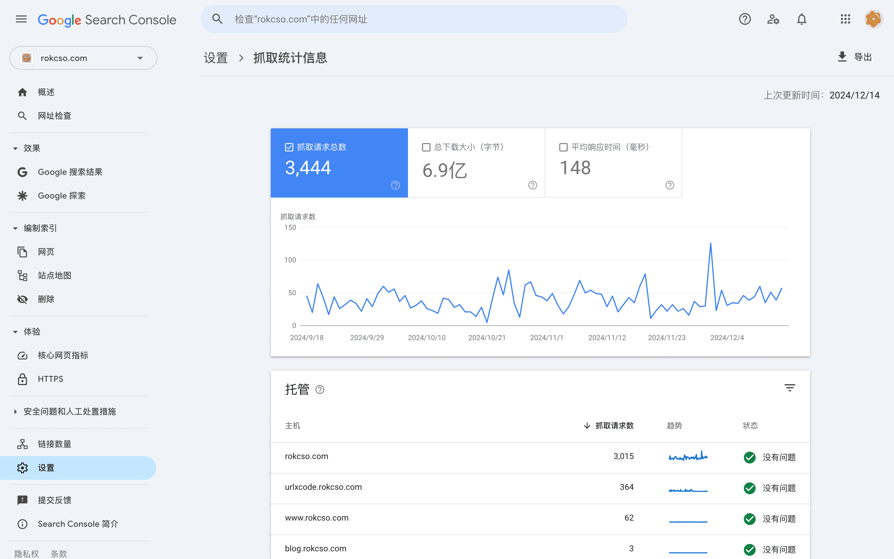
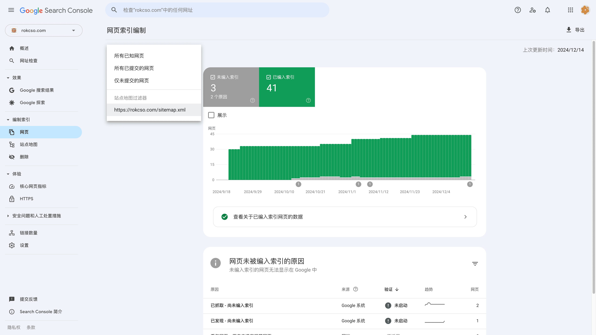

🔄 [简体中文](/p/crawl-budget/)

## What is Crawl Budget

Crawl budget refers to the number of pages a search engine crawls on a website within a certain time period. These pages can include user-visible webpages, as well as files behind the scenes such as CSS, HTML, and more.

The crawling resources and capabilities of a search engine are not unlimited (or rather, they come at a cost), and there are millions of websites that need to be crawled every day on the internet. Therefore, search engines have established a mechanism to set different crawling budgets for each website in order to reasonably control the allocation of crawling resources.

When our website has new pages or page content is updated, if search engines can discover these changes more quickly and index these pages earlier, we can benefit faster. However, in general, large websites (such as websites with tens of thousands of pages) need to pay more attention to crawl budget.

## Main factors affecting the Crawl Budget

The crawl budget is mainly influenced by crawl limits and crawl demand.

**Crawl limit**

The safe crawling frequency that a website can withstand, an excessively high crawling frequency may cause damage to the website's service. Search engines aggressively avoid overloading website services due to their crawling. Search engines mainly determine the safe crawling frequency based on certain website performance metrics.

If your website frequently experiences timeouts, slow responses, and frequent errors, it will reduce the security frequency. The security frequency is determined at the server host level, so websites deployed on shared hosting will also share the security frequency of the host.

**Crawl demand**

It is the value of the content (URL) on a website as judged by search engines, mainly based on its popularity and update frequency. For example, having more external inbound links, internal inbound links, or frequent updates to the page content, etc.

It is worth noting that search engine crawlers should not be forced to recrawl a page when there has not been a meaningful update to the content. Search engine crawlers can determine whether the content update is significant. The best practice is to focus on optimizing the page content to make it more comprehensive, important, and useful, thereby naturally recalling the crawler to recrawl.

## Check how much Crawl Budget my website has

In Google Search Console, select a verified website, go to "Settings" - "Crawling" - "Crawl Stats" to view the website's crawling status by search engine bots.

The figure below shows the crawl status of my blog for the past 90 days on 2024-12-17:

In addition, using the website's server logs is also a way to analyze the visits of search engine crawlers to the site.

## How to optimize Crawl Budget

Optimizing a website's crawl budget mainly involves avoiding the waste of the crawl budget, which means preventing search engine crawlers from crawling pages that are unlikely to be indexed after being crawled. For example:

- The same page, but its URL contains different parameters
- Duplicate or highly similar pages
- Low-quality content
- Slow loading, timeout, abnormal pages
- A very long chained redirect page
- Other pages that cannot be indexed (status codes 3xx, 4xx, 5xx, or explicitly marked as do not index)

These pages (URLs) appear as different URLs to search engine crawlers, so they may attempt to crawl them, but after crawling, they find that the pages are no different and will not index them again, resulting in a wasted crawl.

For these pages that we do not want search engine crawlers to crawl, we can specify them in the robots.txt or set them in Google Search Console.

Additionally, search engines heavily rely on sitemaps to discover pages, so do not include non-indexable pages in the sitemap. You can go to "Indexing" - "Pages" in Google Search Console, and then filter by the sitemap in the upper left corner to view the indexing status of pages contained in the sitemap.

Optimizing internal website links is extremely important. The principle remains to help search engine crawlers discover valuable content. Therefore, do not pursue a highly distinct hierarchy of internal links. Instead, make the internal links more complex. This complexity only refers to the ability of internal pages to link to each other, but the overall hierarchical structure of the pages should remain flat.

Pages that have been crawled more recently typically have better rankings in search results. Therefore, if a page is highly popular, you can add more internal links pointing to this page to help it maintain its crawl freshness.

The crawl budget is roughly proportional to the PageRank, so optimizing the crawl budget can also increase the crawl budget by increasing the page weight.

## Reference

- [When Should You Worry About Crawl Budget?](https://ahrefs.com/blog/crawl-budget/)
- [Crawl budget for SEO: the ultimate reference guide](https://www.conductor.com/academy/crawl-budget/)
- [Crawl Budget: What Is It and Why Is It Important for SEO?](https://www.semrush.com/blog/crawl-budget/)
- [What is Crawl Budget? And Why Does It Matter for SEO?](https://backlinko.com/hub/seo/crawl-budget)