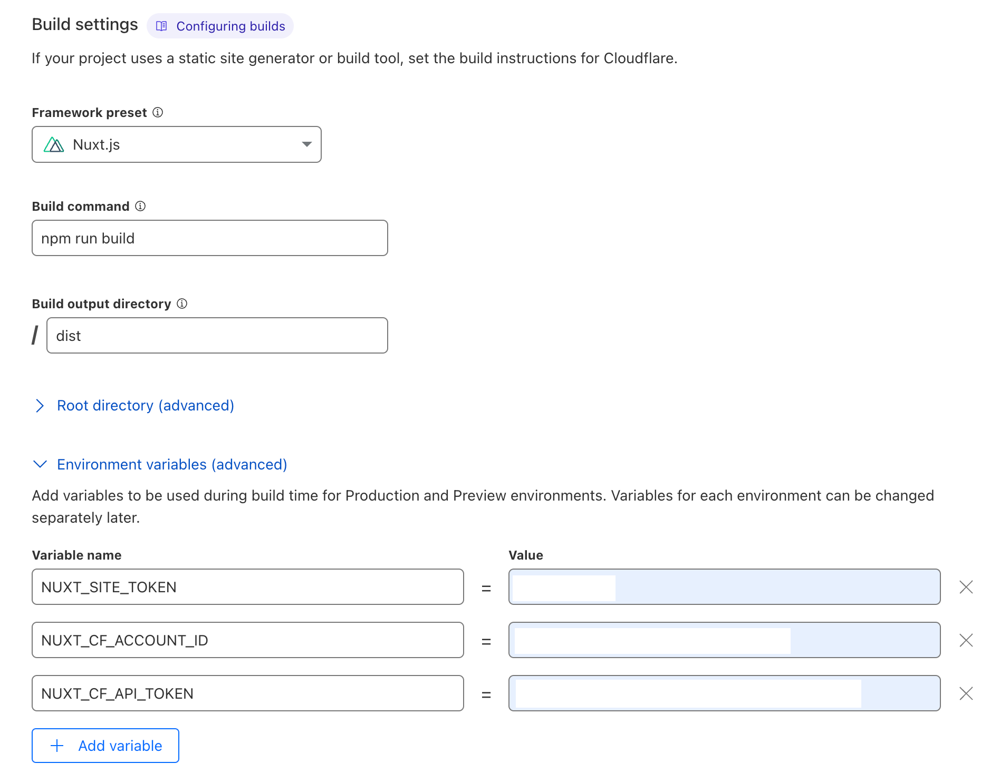
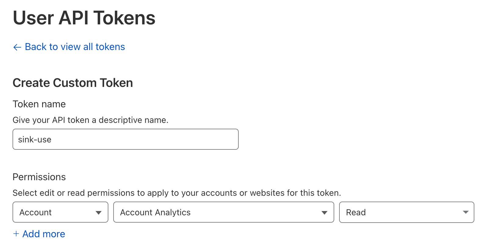
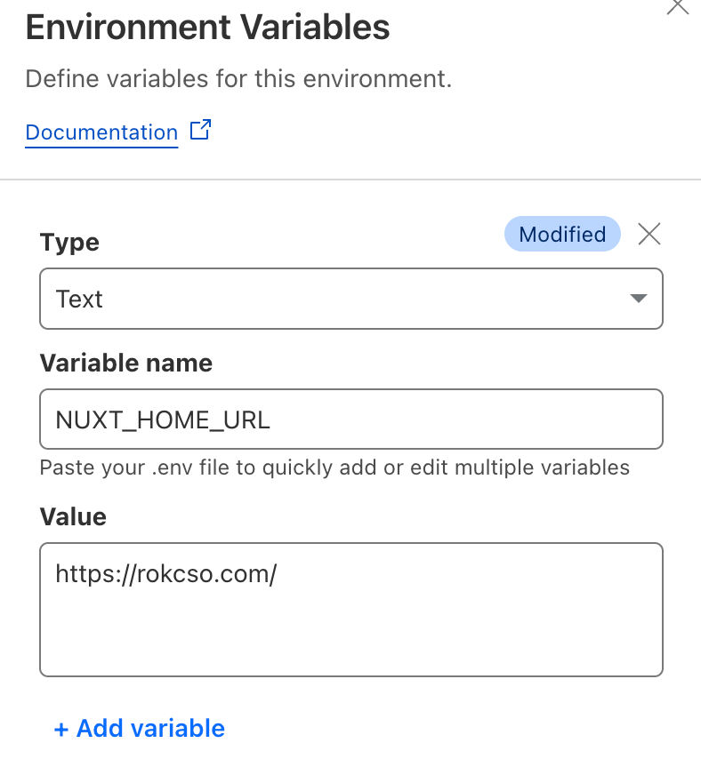

> 注意：本文存在时效性，文章所述内容不一定符合最新情况。

半年前注册 rokcso.com 这个域名的时候就一起注册了 rok.ink 这个域名用来作为个人短链接服务域名。最开始我也尝试过自己开发一套短链接服务，实现了最基本的超链接重定向功能，但是稳定性、响应速度都不够好，链接管理麻烦，还缺乏基本的访问统计。

后来发现了 [@ccbikai](https://x.com/ccbikai) 开源的 [Sink](https://github.com/ccbikai/Sink)，一个完全基于 Cloudflare 的带访问统计的短链接服务，对我来说非常完美！于是开始部署，Sink 的 README 文档中关于如何部署写得比较简洁，但是有提供一个详细的 [视频演示](https://www.youtube.com/watch?v=MkU23U2VE9E)，下文是我的部署全过程。

## 部署过程

首先将 [Sink 官方仓库](https://github.com/ccbikai/Sink) Fork 到自己的 GitHub 中，然后登录 Cloudflare 前往 Workers & Pages -> Overview，点击 Create -> Pages -> Connect to Git，选择刚刚 Fork 的 Sink 仓库（需要在 Cloudflare 上添加 GitHub 账户授权），随后点击 Begin setup 开始进行一些基础的项目配置（参考本文 [项目基础配置](/p/deploy-sink#项目基础配置) 章节），配置完成后点击 Save and deploy 等待项目部署。

项目部署完成后 Cloudflare 会给这个项目分配一个域名（非常建议给该项目设置一个自定义域名，参考 [Custom domains](https://developers.cloudflare.com/pages/configuration/custom-domains/) 进行），访问该域名就是我们部署的 Sink 首页，点击 Dashboard 进入登录页面，在 Site Token 处输入刚刚配置的 `NUXT_SITE_TOKEN` 的值即可登录 Sink 后台。但是现在我们部署的 Sink 还不能正常工作，还有一些配置没有完成。

接下来前往 Cloudflare 中的 Workers & Pages -> KV，点击 Create a namespace，自定义一个 Namespace Name 后点击 Add 即可。然后前往 Workers & Pages -> Overview 进入刚刚部署的 Sink 项目，选择 Settings -> Bindings -> Add -> KV namespace，输入 Variable name 为 `KV`，选择刚刚创建的 KV namespace，点击 Save。

继续选择该项目的 Settings -> Bindings -> Add -> Workers AI，输入 Variable name 为 `AI`，点击 Save。

然后在 Workers & Pages -> Overview 页面右侧的 Account details 中找到 Analytics Engine，点击 Set up -> Enable Analytics Engine。回到该项目的 Settings -> Bindings -> Add -> Analytics engine，输入 Variable name 为 `ANALYTICS`，输入 Dataset 为 `sink`，点击 Save。

最后回到该项目的 Deployments 页面，选择最新的一个部署记录点击 View details，页面右上角点击 Manage deployment -> Retry deployment，等待项目重新部署完成。

至此，Sink 就自部署完成 🎉，访问 Cloudflare 为该项目分配的域名或者我们为该项目设置的自定义域名，即可开始使用。

### 项目基础配置

项目基本信息（名称、分支）默认即可，Build Settings 中的 Framework preset 选择 Nuxt.js。然后开始配置环境变量，一共有 3 个环境变量：

| 环境变量 | 描述   |
| -- | ---- |
| `NUXT_SITE_TOKEN`  | 该值可完全自定义，不少于 8 个字符即可，是作为登录部署好的 Sink 后台的密码。 |
| `NUXT_CF_ACCOUNT_ID` | Cloudflare 的 Account ID，参考 [Find zone and account IDs](https://developers.cloudflare.com/fundamentals/setup/find-account-and-zone-ids/) 获取。 |
| `NUXT_CF_API_TOKEN`  | Cloudflare 的 API Token，参考 [Create API token](https://developers.cloudflare.com/fundamentals/api/get-started/create-token/) 获取。|

获取 API Token 官方的指南比较全面、复杂，简单的步骤就是：前往 Cloudflare 中的 My Profile -> API Tokens，点击 Create Token，选择页面底部的 Create Custom Token，然后开始配置 API 权限。Token name 自定义，其他默认，只需要保证 Permissions 项选择 `Account - Account Analytics - Read` 即可。

## 自定义 Sink 首页

部署的 Sink 首页默认为 Sink 官方介绍页，可以通过配置环境变量 `NUXT_HOME_URL` 将 Sink 首页指定为任意网址。

前往 Cloudflare 上该项目的 Settings -> Variables and Secrets -> Add，选择 Type 为 `Text`，输入 Variable name 为 `NUXT_HOME_URL`，输入 Value 为想要设定的 Sink 首页的 URL。比如我将 Value 设定为我的博客 URL，当访问我部署的 Sink 首页（`rok.ink`）时就会被重定向到我的博客。

注意：

1. 新增/修改环境变量之后需要在 Cloudflare 重新执行一次部署才会生效。
2. 更换 Sink 首页后，要访问 Sink 后台就直接在 Sink 首页 URL 后拼接一个 `/dashboard` 访问即可。