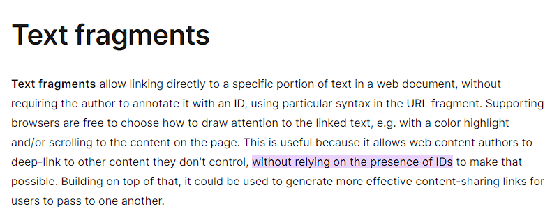
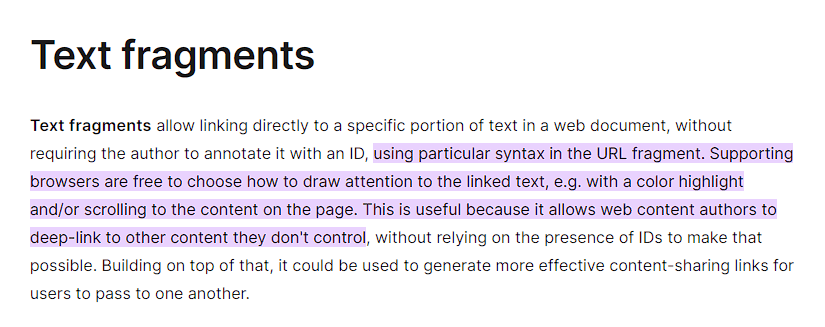
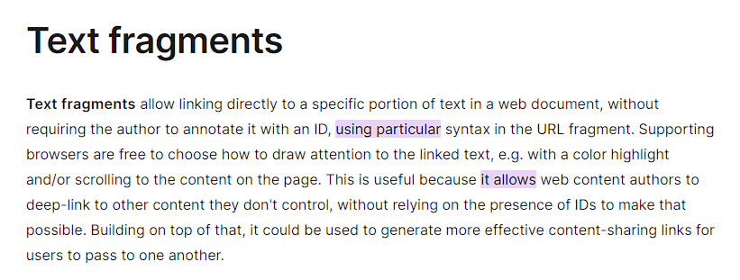
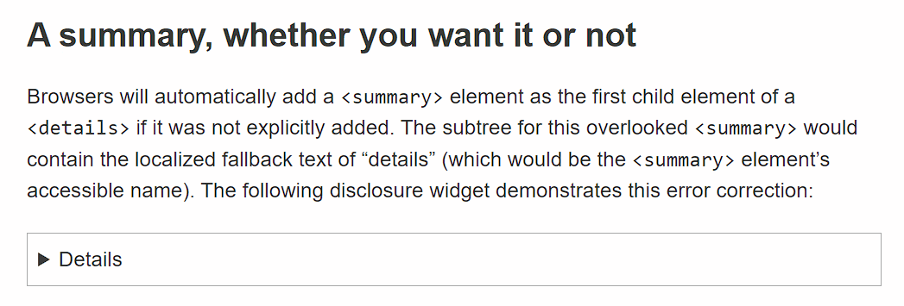
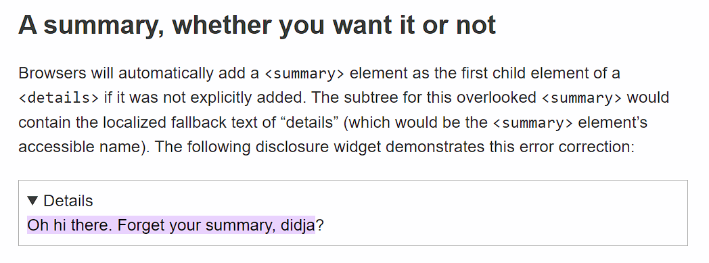
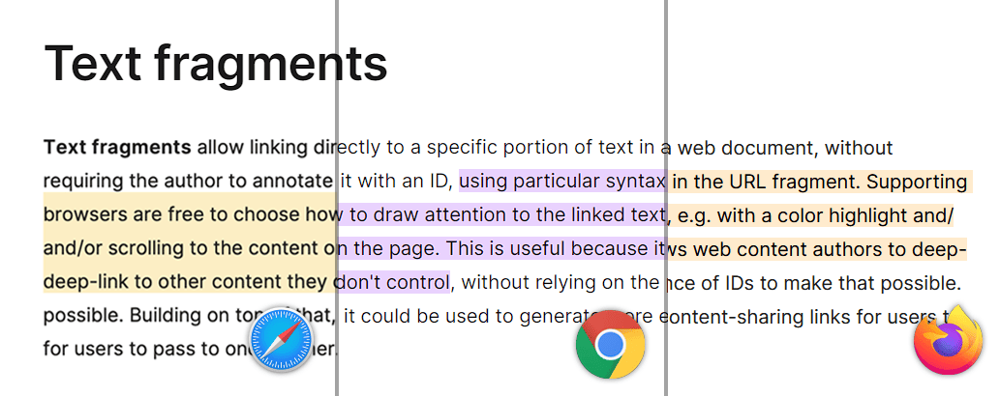

> 本文由 AI 翻译，[rokcso](https://rokcso.com/) 修正。
>
> 原文链接：[https://alfy.blog/2024/10/19/linking-directly-to-web-page-content.html](https://alfy.blog/2024/10/19/linking-directly-to-web-page-content.html)

Historically, we could link to a certain part of the page only if that part had an ID. All we needed to do was to link to the URL and add the document fragment (ID). If we wanted to link to a certain part of the page, we needed to anchor that part to link to it. This was until we were blessed with the [Text fragments](https://wicg.github.io/scroll-to-text-fragment/)!

历史上，我们只能链接到页面中具有 ID 的某部分。我们只需要链接到 URL 并添加文档片段（ID）即可。如果我们要链接到页面的某部分，就需要为该部分设置锚点以进行链接。直到我们迎来了 [文本片段](https://wicg.github.io/scroll-to-text-fragment/)！

## What are Text fragments?

## 什么是文本片段？

Text fragments are a powerful feature of the modern web platform that allows for precise linking to specific text within a web page without the need to add an anchor! This feature is complemented by the `::target-text` CSS pseudo-element, which provides a way to style the highlighted text.

文本片段是现代网页平台的一项强大功能，它允许精确链接到网页中的特定文本，而无需添加锚点！此功能由 `::target-text` CSS 伪元素补充，该伪元素提供了一种为高亮文本设置样式的方法。

Text fragments work by appending a special syntax to the end of a URL; just like we used to append the ID after the hash symbol (`#`). The browser interprets this part of the URL, searches for the specified text on the page, and then scrolls to and highlights that text if it supports text fragments. If the user attempts to navigate the document by pressing tab, the focus will move on to the next focusable element after the text fragment.

文本片段通过在 URL 末尾添加特殊语法来工作；就像我们过去在井号（`#`）后添加 ID 一样。浏览器会解析 URL 的这一部分，搜索页面上的指定文本，并在支持文本片段的情况下滚动到该文本并突出显示它。如果用户尝试通过按 Tab 键导航文档，焦点将移动到文本片段之后的下一个可聚焦元素。

## How can we use it?

## 我们如何使用它？

Here’s the basic syntax for a text fragment URL:

以下是文本片段 URL 的基本语法：

```
https://example.com/page.html#:~:text=[prefix-,]textStart[,textEnd][,-suffix]
```

Following the hash symbol, we add this special syntax `:~:` also known as fragment directive then `text=` followed by:

在井号之后，我们添加这个特殊语法 `:~:`，也称为片段指令，然后是 `text=`，接着是：

1. prefix-: A text string preceded by a hyphen specifying what text should immediately precede the linked text. This helps the browser to link to the correct text in case of multiple matches. This part is not highlighted.
    prefix-：前面带有连字符的一个文本字符串，指定链接文本前应紧跟什么文本。这有助于浏览器在多个匹配项的情况下链接到正确的文本。此部分不会被高亮显示。
2. textStart: The beginning of the text you’re highlighting.
    textStart：你所高亮显示的文本的起始位置。
3. textEnd: The ending of the text you’re highlighting.
    textEnd：你所高亮显示的文本的结尾。
4. -suffix: A hyphen followed by a text string that behaves similarly to the prefix but comes after the text. Aslo helpful when multiple matches exist and doesn’t get highlighted with the linked text.
    -suffix：连字符后面跟着一个文本字符串，其行为类似于前缀，但出现在文本之后。在存在多个匹配项时也很有帮助，并且不会与链接文本一起高亮显示。

For example, the following link:

例如，以下链接：

```
https://developer.mozilla.org/en-US/docs/Web/URI/Fragment/Text_fragments#:~:text=without%20relying%20on%20the%20presence%20of%20IDs
```

This text fragment we are using is “without relying on the presence of IDs” but it’s [encoded](https://developer.mozilla.org/en-US/docs/Web/JavaScript/Reference/Global_Objects/encodeURIComponent). If you follow [this link](https://developer.mozilla.org/en-US/docs/Web/URI/Fragment/Text_fragments#:~:text=without%20relying%20on%20the%20presence%20of%20IDs), it should look like the following:

我们使用的文本片段是「without relying on the presence of IDs」，但它已被 [编码](https://developer.mozilla.org/en-US/docs/Web/JavaScript/Reference/Global_Objects/encodeURIComponent)。如果你跟随 [此链接](https://developer.mozilla.org/en-US/docs/Web/URI/Fragment/Text_fragments#:~:text=without%20relying%20on%20the%20presence%20of%20IDs)，它应该看起来像以下内容：



We can also highlight a range of text by setting the `startText` and the `endText`. Consider the following example from the same URL:

我们可以通过设置 `startText` 和 `endText` 来高亮显示一段文本。考虑以下来自同一 URL 的示例：

```
https://developer.mozilla.org/en-US/docs/Web/URI/Fragment/Text_fragments#:~:text=using%20particular,don't%20control
```

The text fragment we are using is “using particular” followed by a comma then “don’t control”. If you follow [this link](https://developer.mozilla.org/en-US/docs/Web/URI/Fragment/Text_fragments#:~:text=using%20particular,don't%20control), it should look like the following:

我们使用的文本片段是「using particular」，后跟逗号，然后是「don’t control」。如果你跟随 [此链接](https://developer.mozilla.org/en-US/docs/Web/URI/Fragment/Text_fragments#:~:text=using%20particular,don't%20control)，它应该看起来像以下内容：



We can also highlight multiple texts by using ampersands. Consider the following:

我们可以通过使用和号（&）来突出显示多个文本。请考虑以下示例：

```
https://developer.mozilla.org/en-US/docs/Web/URI/Fragment/Text_fragments#:~:text=using%20particular&text=it%20allows
```

If you follow [this link](https://developer.mozilla.org/en-US/docs/Web/URI/Fragment/Text_fragments#:~:text=using%20particular&text=it%20allows), it should look like the following:

如果你跟随 [此链接](https://developer.mozilla.org/en-US/docs/Web/URI/Fragment/Text_fragments#:~:text=using%20particular&text=it%20allows)，它应该看起来像以下内容：



One of the interesting behaviors about text fragments, is if you’re linking to hidden content that’s discoverable through find-in-page feature (e.g. children of element with hidden attribute set to `until-found` or content of a closed details element), the hidden content will become visible. Let’s look at this behavior by linking to [this article](https://www.scottohara.me/blog/2022/09/12/details-summary.html) from Scott O’Hara’s blog. The blog contains the details element that is closed by default.

关于文本片段的一个有趣行为是，如果你链接到通过页面内查找功能可发现的隐藏内容（例如，具有 hidden 属性且设置为 `until-found` 的元素的子元素或关闭的 details 元素的内容），隐藏的内容将变得可见。让我们通过链接到 Scott O’Hara 的博客上的 [这篇文章](https://www.scottohara.me/blog/2022/09/12/details-summary.html) 来查看此行为。该博客包含默认情况下关闭的 details 元素。



If we [linked to the text fragment](https://www.scottohara.me/blog/2022/09/12/details-summary.html#:~:text=Oh%20hi%20there.%20Forget%20your%20summary,%20didja) inside the details element, it will open automatically:

如果我们链接到 details 元素内的 [文本片段](https://www.scottohara.me/blog/2022/09/12/details-summary.html#:~:text=Oh%20hi%20there.%20Forget%20your%20summary,%20didja)，它将自动打开：

```
https://www.scottohara.me/blog/2022/09/12/details-summary.html#:~:text=Oh%20hi%20there.%20Forget%20your%20summary,%20didja
```



**Note** that this behavior is **only available in Google Chrome** as it’s the only browser to support discoverable content.

**请注意**，此行为**仅在 Google Chrome 中可用**，因为它是唯一支持可发现内容的浏览器。

## Styling highlighted fragments

## 样式化高亮片段

If the browser supports text fragments, we can change the style of the highlighted text by using the `::target-text` pseudo-element:

如果浏览器支持文本片段，我们可以使用 `::target-text` 伪元素来更改高亮文本的样式：

```css
::target-text {
    background-color: yellow;
}
```

Note that we are only allowed to change the following properties:

请注意，我们仅被允许更改以下属性：

- color
- background-color
- text-decoration and its associated properties (including text-underline-position and text-underline-offset)
    text-decoration 及其相关属性（包括 text-underline-position 和 text-underline-offset）
- text-shadow
- stroke-color, fill-color, and stroke-width
- custom properties
    自定义属性

## Browser support and fallback behaviour

## 浏览器支持和降级行为

Text fragments are currently [supported in all the browsers](https://caniuse.com/mdn-html_elements_a_text_fragments). The pseudo-element `::target-text` is not yet supported is Safari but it’s now available in the Technology Preview version. If this feature is not supported in the browser, it will degrade gracefully and the page will load without highlighting or scrolling to the text.

文本片段目前 [在所有浏览器中都受支持](https://caniuse.com/mdn-html_elements_a_text_fragments)。伪元素 `::target-text` 在 Safari 中尚未支持，但它现在可以在 Technology Preview 版本中使用。如果浏览器不支持此功能，它将优雅降级，页面将加载而不高亮显示或滚动到文本。

The default style for the highlight is different based on the browser. The color of the highlight is different across the different browsers. The highlighted area is bigger in Safari spanning the whole line-height. In Firefox and Chrome, only the text is highlighted and the spaces between the lines are empty.

默认的高亮样式因浏览器而异。不同浏览器中高亮的颜色各不相同。在 Safari 中，高亮区域较大，覆盖整个行高。而在 Firefox 和 Chrome 中，只有文本被高亮，行与行之间的空白部分未被填充。



We can detect if the feature is supported or not using `document.fragmentDirective`. It will return an empty FragmentDirective object, if supported or will return undefined if it’s not.

我们可以使用 `document.fragmentDirective` 来检测该功能是否受支持。如果受支持，它将返回一个空的 FragmentDirective 对象，如果不受支持，则返回 undefined。

## Closing thoughts

## 结束语

My first encounter with text fragments was through links generated by Google Search results. Initially, I assumed it was a Chrome-specific feature and not part of a broader web standard. However, I soon realized that this functionality was actually built upon the open web, available to any browser that chooses to implement it.

我第一次接触文本片段是通过 Google 搜索结果生成的链接。最初，我以为这是 Chrome 特有的功能，而不是更广泛的网络标准的一部分。然而，我很快意识到，这一功能实际上是建立在开放网络上的，任何浏览器都可以选择实现它。

I’d love to see this feature used more broadly, particularly by responsible generative AI systems. Imagine AI that can provide direct, context-sensitive links to the exact content you’re interested in, using text fragments for precise references. This would not only increase transparency but also improve the user experience when navigating AI-generated content.

我希望看到这一功能被更广泛地使用，特别是由负责任的生成式 AI 系统来使用。想象一下，AI 可以提供直接的、与上下文相关的内容链接，精确地指向你感兴趣的内容，使用文本片段进行精确引用。这不仅会增加透明度，还会改善用户在浏览 AI 生成内容时的体验。

Looking ahead, it would be fantastic if text fragments were more accessible to all users, not just those with technical knowledge. What if browsers offered built-in features that allowed non-technical users to highlight text and generate links to specific paragraphs with ease? This could be through a native browser feature or even a simple browser extension—either way, it would make deep linking a breeze for everyone.

展望未来，如果文本片段对所有用户都更加易于访问，而不仅仅是对那些具备技术知识的人，那就太好了。如果浏览器提供内置功能，允许非技术用户轻松高亮文本并生成指向特定段落的链接，会怎么样？这可以通过原生浏览器功能甚至一个简单的浏览器扩展来实现 —— 无论哪种方式，这都将让使用深度链接对每个人来说都变得轻而易举。

Finally, I’d like to express my sincere thanks to [Hannah Olukoye](https://hannaholukoye.com/) and [Jens Oliver Meiert](https://meiert.com/) for the time they’ve taken to share their invaluable feedback and corrections.

最后，我要向 [Hannah Olukoye](https://hannaholukoye.com/) 和 [Jens Oliver Meiert](https://meiert.com/) 表达我诚挚的感谢，感谢他们抽出时间分享宝贵的反馈和修正意见。

## Update, 20th Oct, 2024

## 更新，2024 年 10 月 20 日

It turns out that the ability to generate a link to a specific piece of text is already built into Chromium-based browsers, as [Hostam Sultan](https://x.com/HosamSultan_) [clarified on X](https://x.com/HosamSultan_/status/1847768998349328553) (formerly Twitter). If you’re using Chrome, simply highlight some text, right-click, and you’ll find the “Copy link to highlight” option in the context menu.

事实上，生成指向特定文本片段的链接的功能已经内置于基于 Chromium 的浏览器中，正如 [Hostam Sultan](https://x.com/HosamSultan_) [在 X（前身为 Twitter）上澄清](https://x.com/HosamSultan_/status/1847768998349328553) 的那样。如果你使用的是 Chrome 浏览器，只需高亮显示一些文本，右键单击，你就会在上下文菜单中找到「复制指向突出显示的内容的链接」选项。

## Additional resources

## 附加资源

- URL Fragment Text Directives - [W3C Draft Community Group Report](https://wicg.github.io/scroll-to-text-fragment/)
    URL 片段文本指令 - [W3C 草案社区组报告](https://wicg.github.io/scroll-to-text-fragment/)
- Text Fragments: [MDN](https://developer.mozilla.org/en-US/docs/Web/URI/Fragment/Text_fragments)
    文本片段：[MDN](https://developer.mozilla.org/en-US/docs/Web/URI/Fragment/Text_fragments)
- Style Highlights: [CSSWG Draft](https://drafts.csswg.org/css-pseudo/#highlight-styling)
    风格亮点：[CSSWG 草案](https://drafts.csswg.org/css-pseudo/#highlight-styling)
- Support for Text Fragments: [CanIUse](https://caniuse.com/mdn-html_elements_a_text_fragments)
    支持文本片段：[CanIUse](https://caniuse.com/mdn-html_elements_a_text_fragments)