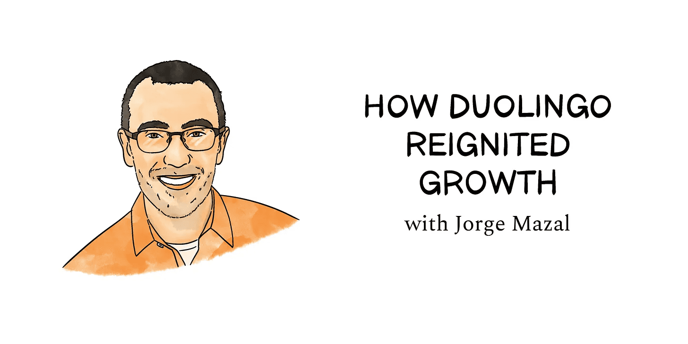
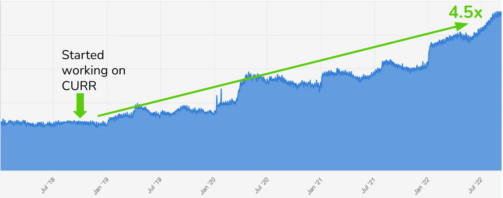
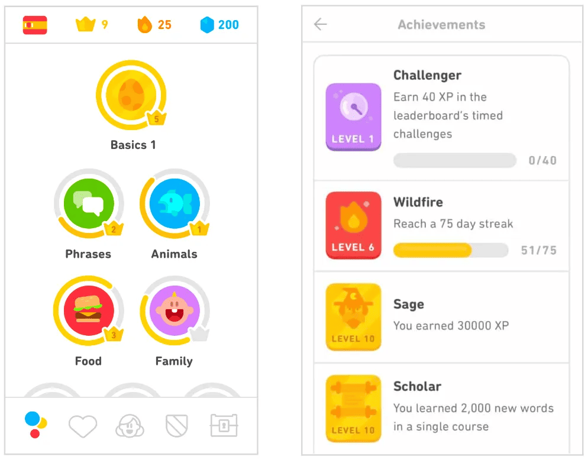
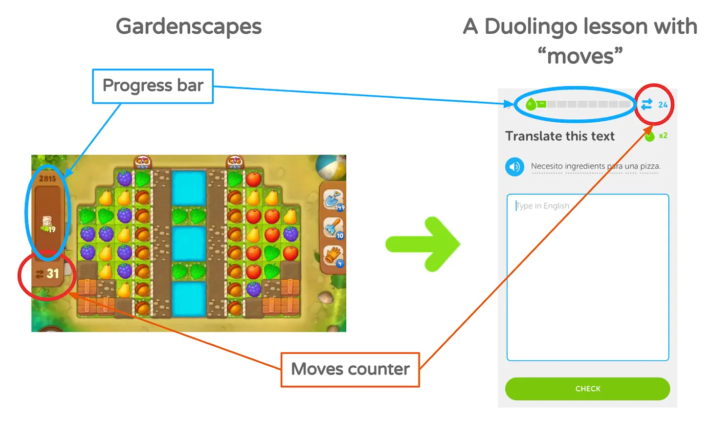
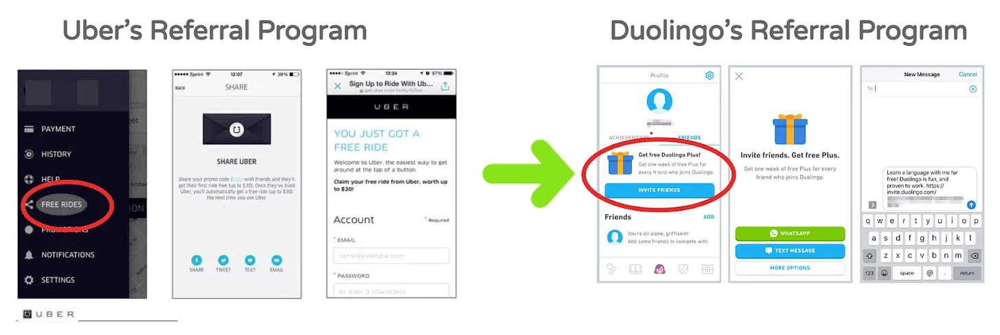
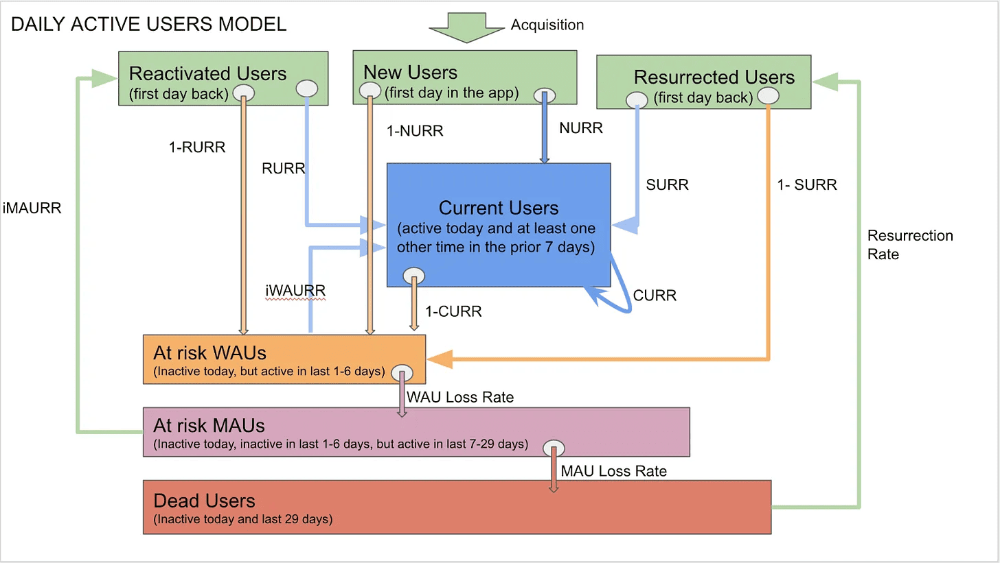
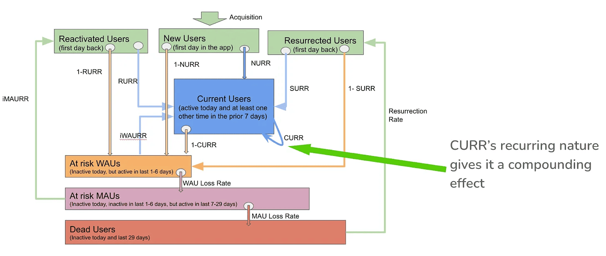
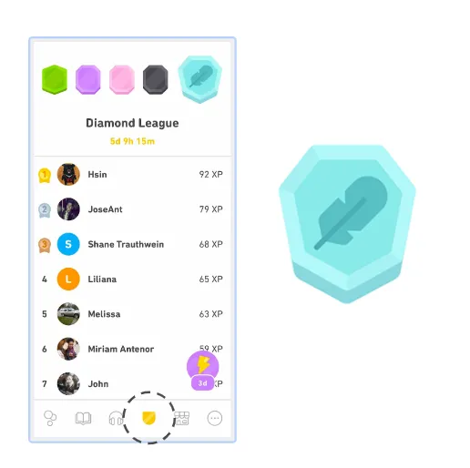
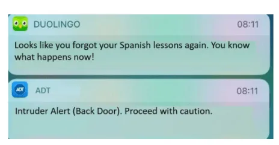

> 本文由 AI 翻译，人工修正。
>
> 原文链接：[https://www.lennysnewsletter.com/p/how-duolingo-reignited-user-growth](https://www.lennysnewsletter.com/p/how-duolingo-reignited-user-growth)

I was at a small event a few months back where [Jorge Mazal](https://www.linkedin.com/in/jorgemazal/) (former CPO of Duolingo) shared the story behind Duolingo’s growth reaccelerating. I was captivated. I’ve never seen a growth story like this before—4.5x growth for a mature product, driven by a small handful of product changes, rooted in an innovative growth model, and explained in such actionable detail. I asked Jorge if he’d be willing to share (and expand on) the story with a broader audience, and I’m so happy he agreed. Many products already look to Duolingo for inspiration, and I suspect this story will only increase that trend. Enjoy!

在我几个月前参加的一个小活动上，[Jorge Mazal](https://www.linkedin.com/in/jorgemazal/)（Duolingo 的前 CPO）分享了他关于 Duolingo 增长重新加速的故事。我被深深吸引。我从未见过这样的增长故事：一个成熟产品的增长达到了之前的 4.5 倍，这仅仅得益于一小部分产品变化，而这些变化根植于一个创新的增长模型，Jorge 的分享解释得如此详细，以至于可以直接付诸行动。我问 Jorge 是否愿意将这个故事分享给更广泛的听众，并对此进行扩展，我非常高兴他同意了。许多产品已经以 Duolingo 为灵感，我认为这个故事只会增加这一趋势。接下来请尽情享受吧！

---

I joined Duolingo as the Head of Product in late 2017. Duolingo was already the most downloaded education app in the world, with hundreds of millions of users, fulfilling its mission to “develop the best education in the world and make it universally available.” However, user growth was slowing down. By mid-2018, daily active users (DAU) were growing at a single-digit rate year-over-year, which was troubling, given the explosive growth the company had seen in the past. This was a problem for a startup with investors anxious to see fast monetization growth.

我于 2017 年底加入 Duolingo，担任产品部门负责人。当时，Duolingo 已是全球下载量最大的教育应用，拥有数以亿计的用户，正致力于实现其「打造世界一流教育，并使之普及」的使命。然而，用户增长开始放缓。到 2018 年年中，日活跃用户（DAU）的同比增长率降至个位数，这对于一家曾见证过快速增长的初创公司而言，无疑是一个令人担忧的信号。这一情况也让那些期待看到快速货币化增长的投资者感到忧虑。

In this post I’ll cover some of our early failures and then our first big wins that helped us turn around growth, including launching leaderboards, refocusing on push notifications, and optimizing the “streak” feature. These, together with several other efforts across Product and Marketing, helped us grow DAU by 4.5x over four years. Robust organic user growth supercharged Duolingo toward its 2021 IPO.

在本文中，我将分享我们早期的一些失败经历，并介绍帮助我们实现增长逆转的首次重大成功，包括推出排行榜、重新聚焦于推送通知以及优化「连胜」功能。这些措施，加上产品和营销方面的其他努力，共同帮助我们实现了日活跃用户数在四年内增长 4.5 倍的成就。这种强劲的自然用户增长为 Duolingo 在 2021 年的 IPO 提供了强劲动力。

This article is an in-depth look into that journey. It is my hope that sharing this work will help others find their own growth breakthroughs faster.

这篇文章详细探讨了这段旅程。我希望通过分享这些内容，能够帮助其他人更快地实现自己的增长突破。

## Phase 1: Increasing gamification

## 第一阶段：增加游戏化

Our first attempt at reigniting growth was focused on improving retention, i.e. fixing our “leaky bucket” problem. We prioritized working on retention over new-user acquisition because all of our new-user acquisition was organic, and, at the time, we didn’t have an obvious lever to pull to supercharge that. Also, some of us had a suspicion that we could improve retention through gamification. There were two main reasons why this felt like the right approach to me. First, Duolingo had already implemented several gamification mechanics successfully, such as the progression system on the home screen, streaks, and an achievements system. And second, top digital games at the time had much higher retention rates than our product, which I took as evidence that we hadn’t yet reached the ceiling for gamification’s impact. 

我们第一次尝试重新点燃增长的重点是解决留存率问题，即修复我们的「漏桶」。我们优先考虑留存率而不是新用户获取，因为我们的新用户获取是自然的，而且当时我们没有明显的杠杆可以撬动来加速这一进程。此外，我们中的一些人认为可以通过游戏化来提高留存率。这对我来说感觉是正确的做法，有两个主要原因。首先，Duolingo 已经成功实施了多种游戏化机制，比如主屏幕上的进度系统、连胜和成就系统。其次，当时最受欢迎的数字游戏比我们的产品有更高的留存率，这表明我们还没有达到游戏化的极限。

Armed with a short presentation I co-created with our chief designer, we were able to get just enough buy-in from the rest of the executive team to create a new team, the Gamification Team. The team consisted of an engineering manager, an engineer, a designer, an APM, and me.

拿着与我们的首席设计师合作制作的一个简短演示，我们成功说服了其他执行团队成员，从而组建了一个新的团队：游戏化团队。这个团队由一名工程经理、一名工程师、一名设计师、一名 APM 和我组成。

But there was one small issue: we had no idea which incremental gamification mechanics would work for Duolingo.

但有一个小问题：我们完全不知道哪种渐进式游戏化机制对 Duolingo 有效。

Our team at the time was hooked on a game called Gardenscapes, a mobile, match-3 puzzle game similar to Candy Crush. This mobile game became our first inspiration.

我们当时团队沉迷于一款名为 Gardenscapes 的移动端三消游戏，类似于 Candy Crush。这款移动游戏成为了我们的第一个灵感来源。

As we looked at the different game mechanics in Gardenscapes, we didn’t really know what we were looking for—we just knew that Gardenscapes seemed stickier than Duolingo, and we saw several parallels. A three-minute Duolingo lesson felt similar to a Gardenscapes match-3 level, and Duolingo and Gardenscapes both used progress bars to provide visual feedback on how close the user was to completing the session. Gardenscapes, however, paired its progress bar with a moves counter, which Duolingo didn’t do. The moves counter allowed users only a finite number of moves to complete a level, which added a sense of scarcity and urgency to the gameplay. We decided to incorporate the counter mechanic into our product. We gave our users a finite number of chances to answer questions correctly before they had to start the lesson over.

当我们研究 Gardenscapes 中的各种游戏机制时，我们并不清楚我们在寻找什么，我们只是感觉到 Gardenscapes 比 Duolingo 更有吸引力，我们发现了几个相似之处。一个三分钟的 Duolingo 课程体验类似于 Gardenscapes 的一个游戏关卡，Duolingo 和 Gardenscapes 都使用进度条来显示用户完成当前任务的进度。然而，Gardenscapes 在进度条旁边加入了移动次数的显示，这是 Duolingo 所没有的。移动次数的限制让用户在完成关卡时感到时间的紧迫和资源的稀缺。因此，我们决定在我们的产品中加入这种计数器机制。 我们给了用户有限的机会来正确回答问题，失败之后他们不得不重新开始课程。

It took our team a couple of months of work to add the counter. With the release of the update, I expectantly waited for an unmitigated success. Depressingly, the result of all that effort was completely neutral. No change to our retention. No increase in DAU. We hardly got any user feedback at all. I was deflated. The greatest effect the initiative had was on our team. After the results came out, we quickly fell into dissension. Some wanted to continue iterating on the idea, while others wanted to pivot. The team almost immediately (and dramatically) disbanded, and the idea was abandoned. It was pretty awful. The one silver lining of this failure was that I learned a lot about the company culture and about how to improve my personal leadership style—though that’s for a different article.

我们的团队花了几个月的时间来添加计数器。随着更新的发布，我满怀期待地等待着一个无可指责的成功。令人沮丧的是，所有这些努力的结果是完全中性的。我们的留存率没有变化。日活跃用户数没有增加。我们几乎没有任何用户反馈。我感到非常沮丧。这个举措最大的影响是我们的团队。结果出来后，我们很快就陷入了分歧。一些人想继续对这个想法进行迭代，而另一些人则想转向其他方向。团队几乎立即（并且戏剧性地）解散了，这个想法也被放弃了。这相当糟糕。这次失败的唯一积极之处是我学到了很多关于公司文化和如何改进我的个人领导风格的知识，尽管那是另一篇文章的内容。

## Phase 2: Referrals

## 第二阶段：推荐计划

Feeling burned after our gamification effort, we completely pivoted away from improving retention and put together a new product team focused on acquiring new users, called the Acquisition Team. At the time, Uber was doing well with user acquisition and had reputedly grown largely because of its referral program. Inspired by this, we created a referral program similar to Uber’s. The reward was a free month of our premium subscription, Super Duolingo (at the time, it was called Duolingo Plus). Seemed like a pretty good offer to us! 

我们的游戏化努力失败后，我们完全放弃了提高留存率，组建了一个新的产品团队，专注于获取新用户，称为获取团队。当时，Uber 在用户获取方面做得很好，据报道，它的用户增长主要得益于其推荐计划。受到启发，我们创建了一个类似于 Uber 的推荐计划。奖励是免费提供一个月我们的高级订阅，超级 Duolingo（当时，它被称为 Duolingo Plus）。对我们来说，这似乎是一个相当不错的提议！

We implemented the feature and hoped our second attempt would be more successful. Instead, new users increased by only 3%. It was positive, but not the type of breakthrough we needed. Still, the team doubled down and pushed through, shipping iterations to the referral program and making some other bets, but no avail.

我们实现了这个功能，并希望我们的第二次尝试会更加成功。然而，新用户只增加了 3%。这是一个积极的结果，但不是我们所需要的突破性进展。尽管如此，团队还是加倍努力并坚持到底，将推荐计划持续迭代，并进行了其他一些尝试，但都没有成功。

While the team continued to iterate, it became clear to me that we had to find a different approach to tackle our growth problem.

当团队继续迭代时，我清楚地意识到我们必须找到一种不同的方法来解决我们的增长问题。

## Time to regroup

## 总结时间

The aftermath of these back-to-back failures in only a few months was a period of reflection for me about making better product bets. 

这些连续的失败在短短几个月内发生，让我反思如何做出更好的产品决策。

In hindsight, it became clear why the Gardenscapes moves counter was not a good fit for our product. When you are playing Gardenscapes, each move feels like a strategic decision, because you have to outmaneuver dynamic obstacles to find a path to victory. But strategic decision-making isn’t required to complete a Duolingo lesson—you mostly either know the answer to a question or you don’t. Because there wasn’t any strategy to it, the Duolingo moves counter was simply a boring, tacked-on nuisance. It was the wrong gamification mechanic to adopt into Duolingo. I realized that I had been so focused on the similarities between Gardenscapes and Duolingo that I had failed to account for the importance of the underlying differences. 

事后看来，很明显为什么 Gardenscapes 的移动计数器不适合我们的产品。当你玩 Gardenscapes 时，每一次移动都感觉像是一个战略决策，因为你必须智取动态障碍物，找到通往胜利的道路。但是完成一个 Duolingo 课程并不需要战略决策，你大多要么知道问题的答案，要么不知道。因为没有策略，Duolingo 的移动计数器只是一个无聊的、附加的麻烦。这是错误的游戏化机制，不适合 Duolingo 采用。我意识到我一直在专注于 Gardenscapes 和 Duolingo 之间的相似之处，以至于我未能考虑到基础差异的重要性。

It also did not take long to understand why our referral program did not produce Uber-like success. Referrals work for Uber because riders are paying for rides on a never-ending pay-as-you-go system. A free ride is a constant incentive. For Duolingo, we were trying to incentivize users by offering a free month of Super Duolingo. However, our best and most active users already had Super Duolingo, and we couldn’t give them a free month when they were already in a plan. This meant that our strategy, which needed to rely on our best users, actually excluded them.

很快我们就明白了为什么我们的推荐计划没有取得像 Uber 那样的成功。推荐机制在 Uber 有效，是因为在需要支付费用才能使用的按需系统中，免费乘车是一个持续的激励。对于多邻国来说，我们试图通过提供一个月免费的超级 Duolingo 来激励用户。然而，我们最优质和最活跃的用户已经有了超级 Duolingo，我们不能在他们已经订阅的情况下给他们一个免费月。这意味着我们的策略，本应该依赖于我们最好的用户，实际上却排除了他们。

In both of these situations, we had borrowed successful features from other products, but the wrong way. We had failed to account for how a change in context can impact the success of a feature. I came away from these attempts realizing that I needed a better understanding of how to borrow ideas from other products intelligently. Now when looking to adopt a feature, I ask myself:

在这两种情况下，我们都从其他产品中借用了其成功功能，但方式不对。我们没有考虑到环境变化如何影响功能的成功。我从这些尝试中意识到，我需要更好地理解如何智能地从其他产品中借鉴想法。现在，当我想采用一个功能时，我会问自己：

- Why is this feature working in that product?
- Why might this feature succeed or fail in our context, i.e. will it translate well?
- What adaptations are necessary to make this feature succeed in our context?
> 
- 为什么这个功能在那个产品中有效？
- 为什么这个功能在我们的环境中可能成功或失败，也就是说，它能很好地转换吗？
- 为了使这一功能在我们的环境中取得成功，需要哪些适应性改变？

In other words, we needed to use better judgment in adapting when adopting. Being more systematic in just this area would have made a big difference in what gamification mechanics we chose to pursue. And we would have probably been dissuaded from focusing on referrals altogether. I was committed to making sure our next attempts would be more methodical. We needed to be better at basing our decisions on data, insights, and foundational principles. 

换句话说，我们需要在采纳时做出更好的判断。在这个领域更加系统化，将会对我们选择追求的游戏化机制产生很大的影响。我们可能就不会被说服去专注于推荐计划了。我致力于确保我们的下一次尝试会更加有条不紊。我们需要在基于数据、洞察和基础原则做出决策方面做得更好。

## Phase 3: Using data and models

## 第三阶段：使用数据和模型

Duolingo has always excelled at collecting data, especially in support of A/B testing. But there hadn’t been much effort put into using the data for insights generation. Having seen from the inside how Zynga and MyFitnessPal used data, I felt we could use Duolingo’s data to find a North Star metric and get the breakthrough we needed. 

Duolingo 一直擅长收集数据，特别是在支持 A/B 测试方面。但是，在利用数据生成洞察力方面并没有投入太多努力。从内部看到了 Zynga 和 MyFitnessPal 如何使用数据，我觉得我们可以利用 Duolingo 的数据找到一个北极星指标，并获得我们需要的突破。

My time at Zynga and MyFitnessPal gave us inspiration on how to segment and model our users by engagement level. Zynga separated their users and measured retention based on the following weekly retention metrics:

Zynga 和 MyFitnessPal 给了我们关于如何根据参与度水平对用户进行细分和建模的灵感。Zynga 将他们的用户分开，并根据以下每周保留指标测量保留率：

- Current users retention rate (CURR): The chance a user comes back this week if they came to the product each of the past two weeks
- New users retention rate (NURR): The chance a user comes back this week if they were new to the product last week 
- Reactivated user retention rates (RURR): The chance a user comes back this week if they reactivated last week
> 
- 当前用户留存率（CURR）：用户在过去两周内每周都访问产品的情况下，本周返回产品的概率
- 新用户留存率（NURR）：如果用户上周是新产品的新用户，他们这周返回产品的几率
- 激活用户留存率（RURR）：用户如果上周激活，本周返回的概率

Later, when I worked at MyFitnessPal, I found that they had adopted and expanded Zynga’s retention work. They not only used CURR, NURR, and RURR to measure growth but also to model future scenarios. They also added SURR:

后来，当我为 MyFitnessPal 工作时，我发现他们采纳并扩展了 Zynga 的留存。他们不仅使用 CURR、NURR 和 RURR 来衡量增长，而且还用来建模未来场景。他们还添加了 SURR：

- Resurrected user retention rate (SURR): The chance a user comes back this week if they resurrected (from a longer absence) last week
> 
- 复活用户留存率（SURR）：如果用户上周重新活跃（从较长时间的流失），他们这周回来的几率

I hypothesized that we could use these metrics at Duolingo as a starting point to create a more sophisticated model, and use that model to identify a North Star metric. Working with the data scientist and the engineer manager in the Acquisition Team, we came up with the model below. We used the same retention rates as Zynga and MyFitnessPal, but we tweaked from a weekly view to a daily view and we added several more metrics.

我假设我们可以将这些指标作为 Duolingo 的起点，创建一个更复杂的模型，并使用该模型来确定一个北极星指标。与获取团队的数据科学家和工程师经理合作下，我们提出了以下模型。我们使用了与 Zynga 和 MyFitnessPal 相同的留存率，但我们从每周视图调整到每日视图，并添加了几个其他指标。

The blocks, *or buckets*, represent different user segments with different levels of engagement. And every single user who has ever used the product is in one, and only one, bucket on any given day. That means the buckets in the model are MECE (mutually exclusive, collectively exhaustive) in representing the entire base of users who have ever used Duolingo. The arrows measure the movement of users between the buckets (these include CURR, NURR, RURR, and SURR, but evolved into daily retention rates rather than weekly). Combining the buckets and the arrows, the model creates an almost closed-circuit system, with new users being the only break. 

块（或者桶）代表不同参与度的不同用户细分市场。而且，在任何给定的一天，每个曾经使用过产品的用户都只在一个块中。这意味着模型中的块在代表曾经使用过 Duolingo 的所有用户方面是 MECE（相互排斥，完全穷尽）的。箭头代表用户在块之间的流动（这些包括 CURR、NURR、RURR 和 SURR，但已经演变成每日留存率而不是每周）。结合块和箭头，模型创建了一个几乎封闭的循环系统，新用户是唯一的突破。

Conveniently, the top four buckets of the model add up to DAU. Those buckets are defined as: 

方便的是，模型的前四个块加起来等于 DAU。这些块被定义为：

- New users: first day of engagement ever in the app
- Current users: engaged today and at least one other time in the prior 6 days
- Reactivated users: first day of engagement after being away for 7-29 days
- Resurrected users: first day of engagement after being away for 30 days or longer
> 
- 新用户：在应用中活跃的第一天
- 当前用户：今日活跃，且过去 6 天内至少活跃过一次
- 重新激活的用户：在离开 7-29 天后后重新活跃的第一天
- 复活用户：在离开 30 天或更长时间后重新活跃的第一天

The remaining three buckets represent users who were not active today and have different degrees of inactivity.

剩余的三个块代表今天不活跃的用户，并且具有不同程度的不活跃。

- At-risk WAU: inactive today, but active in at least one of the prior 6 days
  - At-risk WAU + DAU = WAU
- At-risk MAU: inactive in the past seven days, but active in at least one of the prior 23 days 
  - At-risk MAU + WAU = MAU
- Dormant users: inactive in the past 31 days or longer 
  - MAU + dormant users =  Total user base
>
- 高危 WAU：今天不活跃，但前 6 天中至少有一天活跃
  - 高危 WAU + DAU = WAU
- 高危 MAU：过去 7 天不活跃，但在过去 23 天中至少有一天活跃
  - 高危 MAU + WAU = MAU
- 休眠用户：过去 31 天或更长时间内不活动
  - MAU + 休眠用户 = 总用户群

The fact that DAU, WAU, and MAU can easily be calculated from these buckets made it easy to model them over time. This is a key feature of the model. Additionally, by manipulating the rates represented by the arrows, we can model the compounding and cumulative impact of moving these rates over time; in other words, the rates are the levers product teams can pull to grow DAU.

这些桶中的 DAU、WAU 和 MAU 很容易计算，这使得在时间上建模变得容易。这是模型的一个关键特性。此外，通过操纵由箭头表示的比率，我们可以模拟这些比率随时间的复合和累积影响；换句话说，比率是产品团队可以拉动以增长 DAU 的杠杆。

With the model created, we started taking daily snapshots of data to create a history of how all of these user buckets and retention rates had evolved on a day-by-day basis over the past several years. With this data, we could create a forward-looking model and then perform a sensitivity analysis to predict which levers would have the biggest impact on DAU growth. We ran a simulation for each rate, where we moved a single rate 2% every quarter for three years, holding all the other rates constant. 

模型创建后，我们开始每天对数据进行快照，以创建一个历史记录，记录过去几年中所有这些用户块和留存率是如何逐日演变的。有了这些数据，我们能够创建一个前瞻性模型，然后进行敏感性分析，以预测哪些杠杆将对 DAU 增长产生最大的影响。我们对每个比率运行了一个模拟，其中我们将单一比率每季度移动 2%，为期三年，保持所有其他比率不变。

Below are the results of our first simulation. It shows how those small 2% movements on each lever impacted forecasted MAU and DAU.

以下是我们的第一次模拟结果。它显示了每个操纵杆上 2% 的小幅度移动如何影响了预测的 MAU 和 DAU。

We immediately saw that CURR had a gigantic impact on DAU—5 times the impact of the second-best metric. In hindsight, the CURR finding made sense, because the Current User bucket has an interesting characteristic: current users who stay active return to the same bucket.

我们立即看到 CURR 对 DAU 产生了巨大的影响：其影响是第二好指标的 5 倍。事后看来，CURR 的发现是有道理的，因为当前用户块有一个有趣的特性：保持活跃的当前用户会返回到同一个块中。

This produces a compounding effect, which means that CURR is much harder to move, but when it does, it will have a greater impact. Based on this analysis, we knew that CURR was the metric we had to move in order to get that strategic breakthrough we wanted. We decided to create a new team, the Retention Team, with CURR as its North Star metric.

这会产生一个复合效应，这意味着 CURR 更难移动，但当它发生时，它将产生更大的影响。基于这一分析，我们知道我们必须移动 CURR 才能获得我们想要的战略突破。我们决定创建一个新的团队，即留存团队，以 CURR 作为其北极星指标。

One of the biggest benefits of focusing on CURR was deciding not to work on things that seemed paramount before, especially new-user retention. This was a huge mindset shift for a company that had tremendous success spending years running the bulk of its growth experiments on new users first. 

专注于 CURR 的最大好处之一是决定不从事那些之前看似至关重要的项目，特别是新用户留存。对于一家多年来一直在新用户身上进行大部分增长实验并取得巨大成功的公司来说，这是一个巨大的思维转变。

Another big lesson was seeing the massive gap between how a metric could impact DAU vs. MAU; for example, CURR’s impact on DAU was 6 times its impact on MAU. iWAURR (inactive WAU reactivation rate) was the second-best lever for moving DAU but a distant fourth for moving MAU, behind increasing new and resurrected users. This meant that, at some point, we would still need to figure out new growth vectors for new-user acquisition if we wanted to see substantial MAU improvements. But for the time being, our focus was only on moving DAU, so we prioritized CURR over all other growth levers. And it turned out to be the right choice.

另一个重要教训是看到了一个指标对 DAU 与 MAU 的影响之间的巨大差距；例如，CURR 对 DAU 的影响是其对 MAU 影响的 6 倍。iWAURR（不活跃 WAU 再激活率）是推动 DAU 的第二大杠杆，但对于推动 MAU 来说，却是排在增加新用户和复活用户之后的第四大杠杆。这意味着，在某个时候，如果我们想要看到 MAU 的显著改善，我们仍然需要找到新的增长方向来获取新用户。但目前，我们的重点只是推动 DAU，所以我们优先考虑 CURR 超过所有其他增长杠杆。事实证明，这是一个正确的选择。

## Leaderboards vector

## 排行榜

With this clear directive, we looked at our historical model data and at our A/B tests going back a few years to see if we had inadvertently done anything that had moved CURR in the past. Surprisingly, we hadn’t. In fact, CURR had not moved in years. We had to figure out our first steps to move CURR based on first principles. 

有了这个明确的指示，我们查看了历史模型数据和几年前的 A/B 测试，以查看我们是否无意中做了任何事情，在过去推动了 CURR。令人惊讶的是，我们没有。事实上，CURR 已经多年没有移动了。我们必须基于第一性原理找出推动 CURR 的第一步。

I still thought gamification was a good place to start when trying to improve retention. Our failure with the Gardenscapes-style moves counter hadn’t actually disproved any of the original reasons why we believed gamification still had upside for Duolingo—we had only learned that the moves counter was a clumsy attempt at it. This time, we would be more methodical and intelligent about features we added or borrowed. We made sure to apply the lessons from our prior efforts with gamification.

我仍然认为游戏化是一个开始的好地方，当试图提高保留率时。我们在 Gardenscapes 风格的动作计数器上的失败并没有真正驳斥我们相信游戏化仍然对 Duolingo 有积极作用的想法，我们只是明白了动作计数器是一次笨拙的尝试。这一次，我们将更加有条不紊、更加明智地处理添加或借用的功能。我们确保借鉴之前游戏化工作的经验教训。

After some consideration, we decided to bet on leaderboards. Here’s why and how. Duolingo already had a leaderboard for users to compete with their friends and family, but it wasn’t particularly effective. Based on my experience at Zynga, I felt that there was a better way. When I started working on Zynga’s FarmVille 2 game, it included a leaderboard similar to Duolingo’s existing leaderboard, where users competed with their friends. I had hypothesized based on my personal experience as a player that the closeness of the competitor’s engagement would be more important than the closeness of personal relationships. I thought this would be especially true in a mature product where many users’ friends weren’t active anymore. From our testing at Zynga, that idea turned out to be true. Based on this, I felt a leaderboard system, similar to what I had helped design at Zynga, would succeed in the context of our product.

经过一番考虑，我们决定押注排行榜。以下是原因和做法。Duolingo 已经有一个排行榜，让用户与朋友和家人竞争，但它并不是特别有效。根据我在 Zynga 的经验，我觉得有更好的方法。当我开始在 Zynga 的 FarmVille 2 游戏中工作时，它包含了一个类似于 Duolingo 现有排行榜的排行榜，用户与他们的朋友竞争。基于我作为玩家的个人经验，我假设竞争对手的参与度比个人关系的亲密程度更重要。我认为这一点在许多用户的朋友不再活跃的成熟产品中尤其正确。根据我们在 Zynga 的测试，这个想法被证明是正确的。基于这一点，我认为一个类似于我在 Zynga 设计的排行榜系统，将在我们的产品环境中取得成功。

FarmVille 2’s leaderboard also included a “league” system. Beyond getting to the top of a weekly leaderboard, users had the opportunity to move through a series of league levels (e.g. from the Bronze league to the Silver league to the Gold league). Leagues provided users with a greater sense of progress and reward, an integral element in game design. They also increased engagement over time, since engaged users move up to more competitive leagues week after week. We felt this feature would translate well to Duolingo’s existing product because it tapped directly into the common human motivators of competitiveness and progression. 

FarmVille 2 的排行榜还包含了一个「联赛」系统。除了每周排行榜的榜首，用户还有机会获得一系列的联赛等级（例如从青铜到白银再到黄金）。联赛为用户提供了更强烈的进步和奖励感，这是游戏设计中的一个重要元素。它们也随着时间的推移增加了参与度，因为参与度高的用户每周都会上升到更具有竞争力的联赛。我们认为这个功能可以很好地转换到 Duolingo 现有的产品中，因为它直接触及了人类共同的竞争和进步动力。

Not all aspects of the FarmVille 2 leaderboards would translate well to Duolingo, though. We had to use our judgment to adapt this gaming mechanic to Duolingo’s context. In FarmVille 2, competing in the leaderboard required completing additional kinds of tasks on top of the core gameplay. That was something that we purposefully left out. In the Duolingo context, more tasks would only add unnecessary complexity to language learning. We deliberately made our leaderboard as casual and frictionless as possible; users were automatically opted in and could progress to the top of the first league by merely engaging consistently in their regular language study. By keeping the game mechanic exciting, but making it simpler than in FarmVille 2, we felt like we had struck the right balance of adopting and adapting.

并不是 FarmVille 2 排行榜的所有方面都能很好地转换到 Duolingo。我们不得不使用我们的判断力来让这种游戏机制适应 Duolingo 的环境。在 FarmVille 2 中，要在排行榜上竞争需要完成核心游戏玩法之外的其他类型的任务。这是我们故意省略的内容。在 Duolingo 的环境中，更多的任务只会给语言学习增加不必要的复杂性。我们故意使我们的排行榜尽可能休闲和无摩擦；用户会自动加入，并且只需定期参与语言学习就能进步到第一个联赛的顶端。通过保持游戏机制的趣味性，但使其比 FarmVille 2 更简单，我们觉得我们已经找到了采用和适应之间的正确平衡。

The leaderboards feature had a huge and almost immediate impact on our metrics. Overall learning time increased by 17%, and the number of highly engaged learners (users who spend at least 1 hour a day for 5 days a week) tripled. At this time, we hadn’t yet figured out how to calculate statistical significance for CURR, but we saw that our traditional retention metrics (D1, D7, etc.) improved materially and with statistical significance. Going forward, the leaderboards feature became a vector for improving metrics, and teams continue to optimize the feature to this day. Also importantly, the leaderboard was the Retention Team’s first breakthrough! 

排行榜功能对我们的指标产生了巨大且几乎即时的影响。总体学习时间增加了 17%，高度参与学习者的数量（每天至少花费 1 小时，每周 5 天）增加了 3 倍。当时，我们还没有弄清楚如何计算 CURR 的统计显著性，但我们看到我们的传统留存指标（D1、D7 等）有了实质性的提高，并且具有统计显著性。展望未来，排行榜功能成为改善指标的一个途径，团队至今仍在优化这一功能。同样重要的是，排行榜是留存团队的首个重大突破！

## Push notifications vector

## 推送通知

The Retention Team was completely energized to find more mechanics to keep current users engaged and motivated to practice every day. One area they started to look into was push notifications. Based on substantial A/B testing in prior years, Duolingo had established that notifications can be a big vector for growth, but that impact had plateaued for us over the years. With a re-energized team full of new ideas, we felt it was the right time to revisit this vector.

留存团队非常充满活力的寻找更多机制来保持现有用户的参与度，并激励他们每天练习。他们开始关注的领域之一是推送通知。根据过去几年大量的 A/B 测试，Duolingo 已经确定通知可以是一个巨大的增长因素，但这种影响多年来在我们这里已经达到了平台期。由于这支充满新想法的充满活力的团队，我们觉得是时候重新审视这个因素了。

As we started diving into this, there was one principle that became paramount. It came from a cautionary tale from Groupon’s CEO. He explained to Luis von Ahn, our CEO, that for a long time, Groupon stuck to one email notification per day. But their team started wondering whether sending more emails would improve metrics. The CEO eventually gave in and allowed his team to test sending one more email to each user each day. This test resulted in a big increase to their target metrics. Encouraged, Groupon kept experimenting, sending more emails, even as many as five a day. Then, in what felt like a change from one day to the next, their email channel lost most of its effectiveness. Over time, the accumulation of Groupon’s aggressive email tests had basically destroyed their channel. One often underappreciated risk with aggressively A/B testing emails and push notifications is that it results in users opting out of the channel; and even if you kill the test, those users remain opted out forever. Do this many times, and you’ve destroyed your channel. This was the outcome to avoid. For our push notifications, we established one foundational rule: protect the channel.

当我们开始深入研究这个问题时，有一个原则至关重要。这个原则来自于 Groupon CEO 的一个警示故事。他向我们的 CEO Luis von Ahn 解释说，很长一段时间，Groupon 坚持每天只发送一封电子邮件通知。单后来他们的团队开始猜想，发送更多的电子邮件是否能够改善指标。最终，CEO 让步了，允许他的团队测试每天向每个用户多发送一封电子邮件。这个测试导致他们的目标指标大幅增加。受到鼓舞，Groupon 继续进行实验，发送更多的电子邮件，甚至一天多达五封。然后，感觉就在一夜之间，他们的电子邮件渠道失去了大部分效果。随着时间的推移，Groupon 激进的电子邮件测试基本上摧毁了他们的渠道。经常被低估的一个风险是，激进地 A/B 测试电子邮件和推送通知会导致用户选择退出该渠道；即使你停止了测试，那些用户也会永远选择退出。这样做很多次，你就摧毁了你的渠道。这是我们需要避免的结果。对于我们的推送通知，我们建立了一条基本规则：保护渠道。

With this constraint in mind, we decided to give the team a lot of freedom to optimize on dimensions like timing, templates, images, copy, localization, etc., but they could not increase the quantity of notifications without strong justification and CEO approval. Over time, through countless iterations, A/B testing, and a bandit algorithm, the team was able to generate dozens of small- and medium-size wins that have amounted to substantial gains in DAU year after year. 

考虑到这一点，我们决定给予团队在时间、模板、图片、文案、本地化等方面进行优化的极大自由度，但他们不能在不提供充分理由和 CEO 批准的情况下增加通知的数量。随着时间的推移，经过无数次的迭代、A/B 测试和算法，团队能够取得数十个小型和中型胜利，这些胜利累积起来，年复一年地为 DAU 带来了显著的增长。

## The streak vector

## 连胜

In the search for even more growth vectors, the APM on the Retention Team started exploring whether there was a strong correlation between retention and usage of particular Duolingo features. He discovered that if a user reached a 10-day streak, their chances of dropping off were reduced substantially. Clearly, a lot of this was simply correlation and selection bias, but we felt the insight was interesting enough to start investing in improving this feature again. 

在寻找更多的增长方向时，留存团队中的 APM 开始探索留存率和使用特定 Duolingo 功能的用户之间是否存在强相关性。他发现，如果用户达到了 10 天的学习连贯性，他们放弃学习的可能性会大大降低。显然，这很大程度上只是相关性和选择性偏差，但我们认为这个洞察足够有趣，值得重新开始投入改善这个功能。

The concept of a streak is really quite simple: show users the number of consecutive days they’ve done any activity on the app. But it turns out that there is a surprisingly large number of optimization opportunities around streaks. 

连胜天数的概念其实非常简单：向用户展示他们在应用上连续完成活动的天数。但事实证明，围绕连胜天数的优化机会非常多。

We got our first big win with the streak-saver notification—a notification that alerts users with streaks if they are about to lose their streak. This late-night notification proved that indeed there was considerable upside to doubling down on streak optimizations. After this, several improvements followed: calendar views, animations, changes to streak freezes, and streak rewards, among others. Each helped improve upon the original streak idea and generated substantial improvements to retention. 

我们首次大获全胜，就是连胜挽救通知（这是一种通知，如果用户即将失去他们的连胜，就会提醒有连胜的用户）发挥了作用。这种深夜通知证明确实有相当大的好处，可以加倍努力进行连胜优化。在此之后，几个改进随之而来：日历视图、动画、连胜冻结的变化和连胜奖励等。每项改进都完善了原始的连胜理念，并对留存率产生了实质性的改进。

To date, the streak feature is one of Duolingo’s most powerful engagement mechanics. When people talk about their Duolingo experience, they often bring up their streak. I recently met one user who told me, “I have a 1,435-day streak!” and added, “with no streak freezes!” His bragging rights were well-earned, as he had been studying his chosen language daily for almost four years.

截至目前，连胜功能是 Duolingo 最强大的参与机制之一。当人们谈论他们的 Duolingo 体验时，他们经常提到他们的连胜。我最近遇到了一个用户，他告诉我：「我有 1435 天的连胜！」并补充说：「没有使用连胜冻结！」。他炫耀的权利是应得的，因为他已经几乎四年每天都在学习他选择的语言。

Streaks work for a number of reasons. One of those is that a streak increases user motivation over time; the longer the streak is, the greater the impetus to keep the streak going. When it comes to user retention, this is the exact behavior we want in our users. Each day that a learner comes to Duolingo, they care a bit more about coming back the next day than they did the day before, hence increasing retention and DAU. As a meta-lesson, our success with the streak mechanic further showed us that we could squeeze major wins from existing features. We could see the value in both big breakthroughs and in fast optimizations. And an A+ team often has a mix of both.

连胜对用户留存有好处，因为连胜可以提高用户的积极性。连胜越长，用户保持连胜的动力就越强。这种行为正是我们希望用户表现出来的。每天学习者使用 Duolingo，他们就会比前一天更关心第二天是否继续使用，从而提高留存率和日活跃用户数。作为一个元教训，我们通过连胜机制的成功进一步认识到，我们可以从现有功能中获得重大收益。我们可以看到重大突破和快速优化的价值。一个优秀的团队通常会同时具备这两种能力。

## Growth beyond CURR

## 增长超越当前用户留存

We didn’t stop at CURR; there was a very healthy paranoia that at some point CURR would hit a ceiling, so sooner or later we would have to figure out growth vectors for new user acquisition. The Retention Team stayed focused on increasing CURR, but as a company, we consistently increased our investment in growth by creating more and more Product and Marketing teams to find new vectors (for both retention and acquisition). Luckily, several of these bets worked, including expanding internationally, building social features (this is what the Acquisition eventually team pivoted to, with great success), accelerating course content creation, working with influencers, increasing our presence in schools, investing (a little bit) in paid UA, and going crazy viral on TikTok. Each of these merits its own case study.

我们没有停留在 CURR 上；有一种非常健康的偏执，认为在某个点上 CURR 会达到天花板，所以我们迟早得找出新的用户增长方向。留存团队专注于提高 CURR，但作为一个公司，我们也不断增加对增长的投入，创建了越来越多的产品和营销团队来寻找新的增长点（对于留存和获取用户）。幸运的是，其中一些赌注成功了，包括国际扩张、构建社交功能（这是获取团队最终转向的，并且取得了巨大成功）、加速课程内容创作、与高影响者合作、增加我们在学校的存在感、在付费用户获取上进行投入（一点点）以及在 TikTok 上疯狂传播。每一点都值得单独进行案例研究。

## Overall results

## 整体结果

Through our efforts over four years, we were able to increase CURR by 21%, which represents a reduction in the daily churn of our best users by over 40% and, together with our other successful bets, led to an increase in our DAU of 4.5x. Last year was one of the fastest growth rates in Duolingo’s history. The quality of the user base also improved; the share of our DAU with a streak of 7 days or longer increased almost 3 times to more than half of our DAU. This means that not only does Duolingo have a much higher number of active users now, but also that those users are much more likely to keep coming back, refer their friends, and subscribe to Super Duolingo. This growth was key to Duolingo’s successful IPO. 

通过四年的努力，我们成功地将 CURR 提高了 21%，这表示我们最佳用户的每日流失率减少了超过 40%，再加上我们其他成功的投入，我们的 DAU 增长了 4.5 倍。去年是 Duolingo 历史上增长最快的一年。用户群体的质量也得到了提升；我们的 DAU 中有 7 天或更长时间连胜的用户份额增加了近 3 倍，超过了我们 DAU 的一半。这意味着 Duolingo 不仅现在拥有更多的活跃用户，而且这些用户更有可能继续活跃，推荐他们的朋友，并订阅 Super Duolingo。这种增长是 Duolingo 成功 IPO 的关键。

## Parting thoughts

## 离别时的想法

I hope that this article gives you the inspiration you need to find new vectors of growth for your product. If you adopt anything from my experience at Duolingo, I hope you adapt it to your own context using your best judgment. Don’t blindly trust what Duolingo or any other company did. Certainly that didn’t work for me. Happy experimenting!

我希望这篇文章能给你带来所需的灵感，帮助你为你的产品找到新的增长方向。如果你从我在 Duolingo 的经验中学到了什么，我希望你能根据你自己的情况，运用你的最佳判断力进行适应。不要盲目地相信 Duolingo 或其他任何公司所做的事情。当然，那对我并不适用。祝你实验愉快！