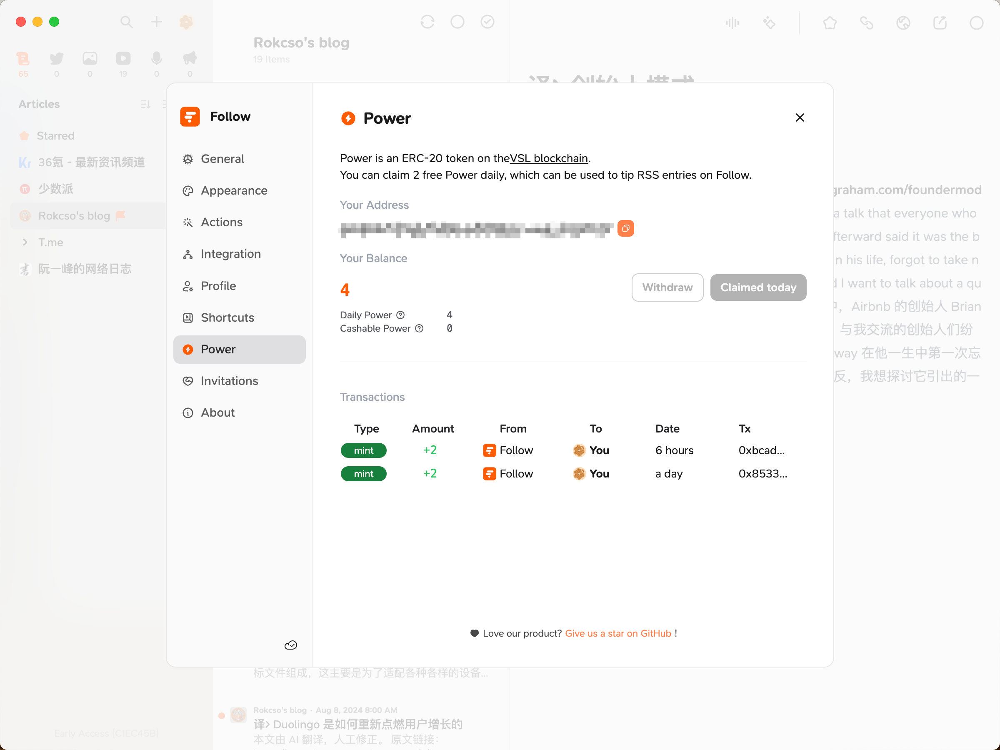
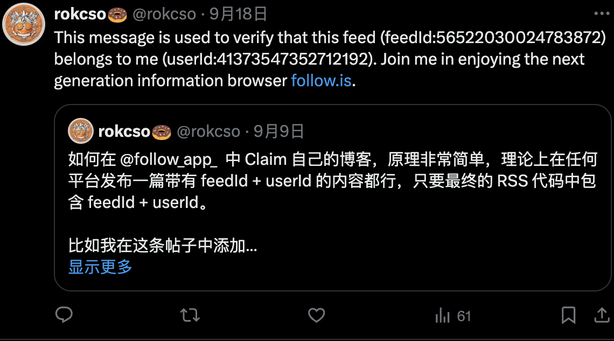
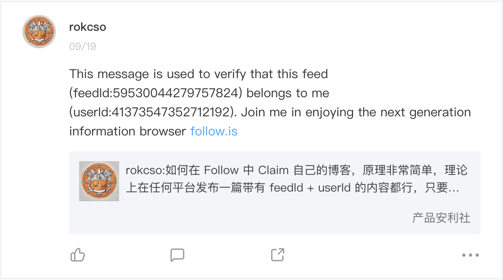

🔄 [简体中文](/p/follow-claim-feed/)

[Follow](https://github.com/RSSNext/Follow) is an RSS reader that, in addition to providing most of the functions that all RSS readers have, also does something very groundbreaking.

## $POWER

Power is an ERC-20 token on the [VSL blockchain](https://scan.rss3.io/token/0xE06Af68F0c9e819513a6CD083EF6848E76C28CD8).



Power has two types:

**Daily Power**

- Source: 2 Daily Powers can be claimed for free each day.
- Use: Can only be used for tipping.

**Cashable Power**

- Source: User recharge or receive tips.
- Use: Used for tipping or withdrawing to the wallet for transactions.

Followers can reward the subscribed RSS feeds with Power, and the Power rewards received by the creators of the RSS feeds will become Cashable Power, becoming the creators' actual income.


Follow has created a completely new (I'm not sure, but I haven't seen it before) content consumption and creator revenue model. If you are a content creator, you can claim your own Feed on Follow to collect Power that others have rewarded you with.

If you do not claim your feed, all Power tips received by the feed will be safely stored in the blockchain contract until the feed is claimed.

## Feed Claim

Follow provides 3 types of feed claim verification schemes. The three schemes are all alike in their approach, which is to add feedId and userId to the RSS code of the feed. Choose one of them.

To obtain the feedId and userId, you just need to first subscribe to the RSS feed you want to claim in the Follow, and then right-click on the feed and select claim.

**Scheme I: Content**

By publishing an article with a feedId and userId, the content can use what is provided by Follow:

```markdown
This message is used to verify that this feed (feedId:00000000000000000) belongs to me (userId:00000000000000000). Join me in enjoying RSS on the next generation information browser https://follow.is.
```

For example, I directly posted a post with the corresponding feedId and userId on both X and Jike, thus completing the claim verification for my X and Jike accounts.





Ensure that this article is rendered into the final generated RSS file (this can be determined by checking the content of the final generated RSS file), so it is best not to hide this article.

**Scheme II: Description**

Directly add the feedId and userId to the `<description>` tag in the RSS code. The content contained in the `<description>` tag in the RSS code is generally the feed main content, so essentially, feedId and userId are still being added to the published content (similar to the Content scheme).

For example, you can directly add at the end of the content of the published article:

```markdown
feedId:00000000000000000+userId:00000000000000000
```

For most blogs, RSS files are generally automatically generated (even if modified, they will be regenerated and overwritten during the next deployment), or it is not desired to directly expose the feedId and userId on the blog's front-end page.

所以建议采取第 3 种方式，直接修改 RSS 生成器，保证每次博客内容更新生成的 RSS 文件中都带有 feedId 和 userId。

So it is recommended to adopt the 3rd scheme, directly modify the RSS generator to ensure that each RSS file generated during the update of the blog content includes feedId and userId.

**Scheme III: RSS Tag**

My blog is built using the [Hugo](https://gohugo.io/) framework, so this article uses it as an example.

It is recommended to first read Hugo's instructions for its [RSS templates](https://gohugo.io/templates/rss/), as the RSS generation of blogs built with Hugo depends on this template code.

Create an `rss.xml` file under the `layouts/_default` folder of your Hugo blog source code, copy and paste the provided [RSS Template code](https://github.com/gohugoio/hugo/blob/master/tpl/tplimpl/embedded/templates/_default/rss.xml) into it, and add the provided XML code to the `<channel>` tag.

```xml
<follow_challenge>
    <feedId>00000000000000000</feedId>
    <userId>00000000000000000</userId>
</follow_challenge>
```

In fact, it can also be added in the `<description>` tag, which is equivalent to adding feedId and userId to each article, while adding it to `<channel>` is equivalent to adding it to the entire site.

Note: If the Hugo theme you are using already provides `rss.xml`, directly modify the theme's `rss.xml` to avoid conflicts.

After the final deployment of Hugo, checking the `index.xml` under the `public` folder will show that feedId and userId have correctly appeared in the final generated RSS code.

Feeds that have been successfully claimed will be marked with a flag in Follow.


Note: If you use the RSS Template code provided by the Hugo official, please pay attention to its minimum requirement for the Hugo version.

After using the RSS Template code provided by the Hugo official, I redeployed my blog. The local test was normal, but an error message indicating an exception in the `transform.XMLEscape` method was reported when deployed to Cloudflare Pages. After checking the [Hugo Functions documentation](https://gohugo.io/functions/), I found that the `transform.XMLEscape` method was updated in version `v0.121.0`.

And the Hugo version I use deployed on Cloudflare Pages is `v0.118.0`, adding an environment variable `HUGO_VERSION` in the Cloudflare Pages project settings will solve the issue.


## Follow invitation code

24 Oct, 2024: Follow has opened public beta, and you can register and use it without an invitation code.

~~Here, new invitation codes will be released irregularly. If you don't have an invitation code, you can come back to check occasionally; if you have already started using Follow, welcome to [subscribe to my blog on Follow](https://app.follow.is/list/60574567261826048) and tip it, so that I can get more $Power and generate more invitation codes faster. 😊~~

| **Code** | **Generation Time** | **Status** |
| - | -  | - |
| JddA1_Obmg | 27 Nov, 2024 | ✅ |
| pwKf_itEi_ | 24 Nov, 2024 | ❌ |
| iISSmD2M3F | 22 Nov, 2024 | ✅ |
| own_O2EZYZ | 20 Nov, 2024 | ❌ |
| FrfG4ns6UN | 18 Nov, 2024 | ❌ |
| E623mjwF73 | 7 Nov, 2024 | ❌ |
| GI9yoogKaq | 23 Oct, 2024 | ❌ |
| tkW0gLlrQT | 21 Oct, 2024 | ❌ |
| HdJ17EqyLy | 30 Sep, 2024 | ❌ |
| 98gmNhxZGz | 26 Sep, 2024 | ❌ |
| oxt4yJZXcJ | 26 Sep, 2024 | ❌ |
| Rf1IQXvt0r | 18 Sep, 2024 | ❌ |
| dVnq8wr3wq | 13 Sep, 2024 | ❌ |