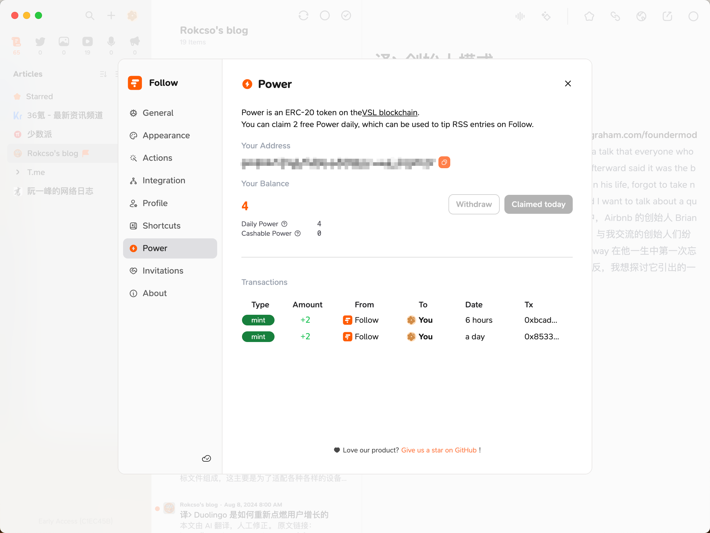
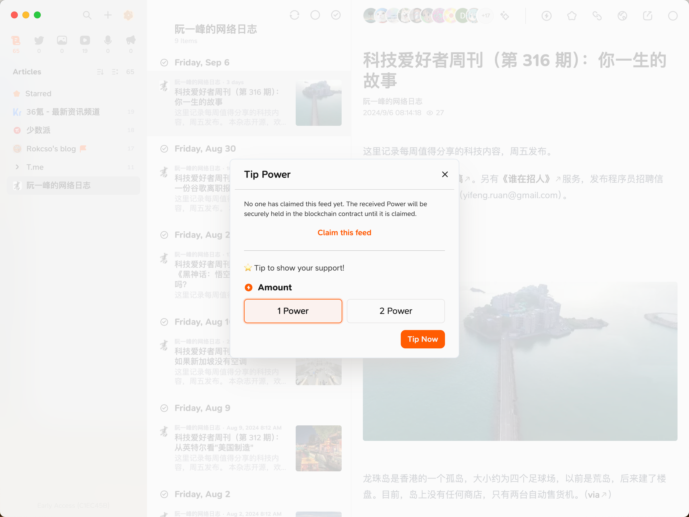
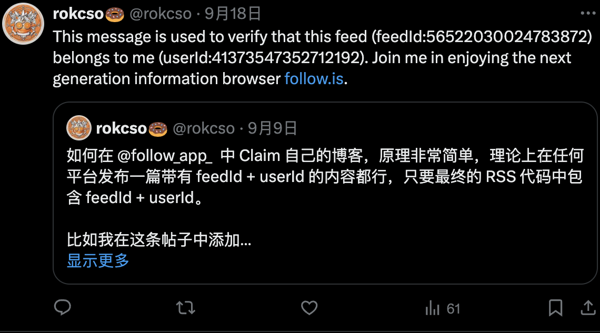
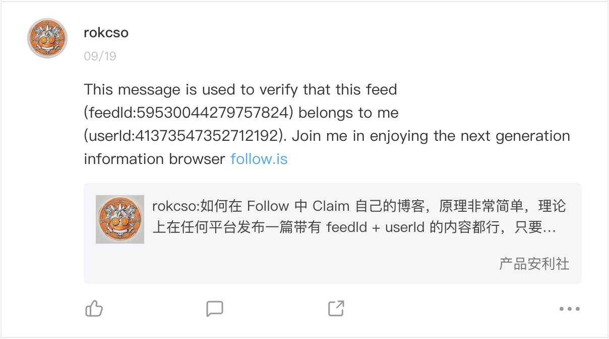
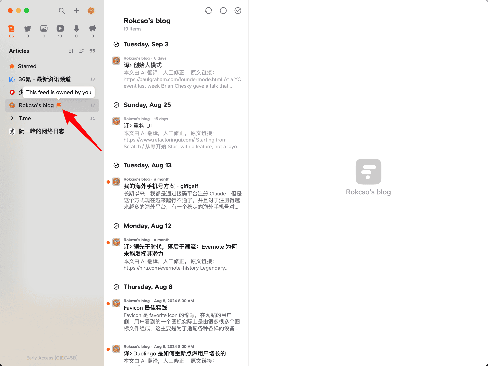
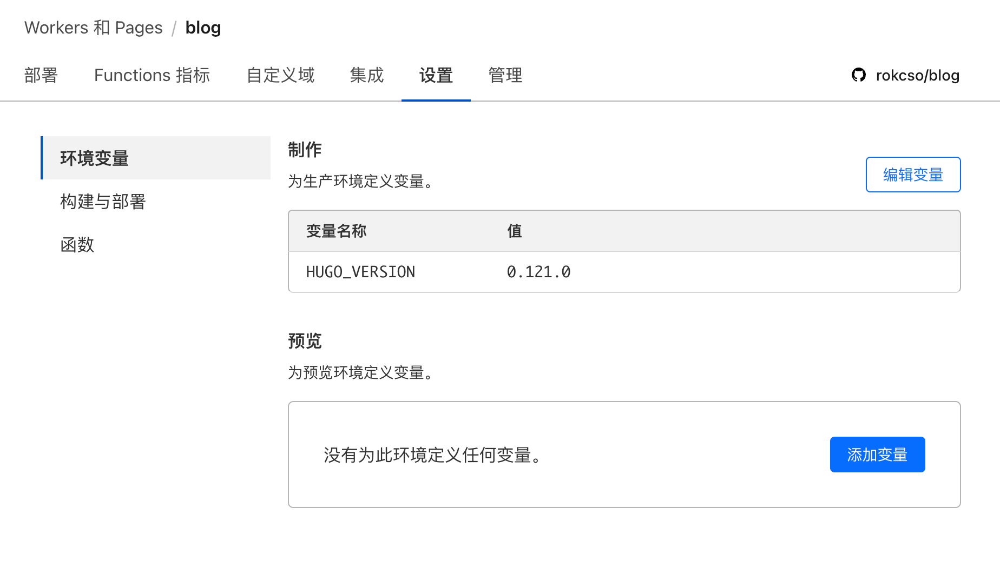

🔄 [English](/p/follow-claim-feed-en/)

[Follow](https://github.com/RSSNext/Follow) 是一个 RSS 阅读器，除了提供绝大多数 RSS 阅读器都具备的功能之外，Follow 还做了一件非常划时代的事情。

## $POWER

Power 是 [VSL 区块链](https://scan.rss3.io/token/0xE06Af68F0c9e819513a6CD083EF6848E76C28CD8) 上的 ERC-20 代币。



Power 有两种类型：

**Daily Power**

- 来源：每天可以免费领取 2 个 Daily Power
- 用处：只能用于打赏

**Cashable Power**

- 来源：用户充值或收到打赏
- 用处：用于打赏或者提取到钱包中进行交易


Follow 用户可以通过 Power 对订阅的 RSS Feed 进行打赏，而 RSS Feed 的创作者所获得的 Power 打赏将变成 Cashable Power 成为创作者实实在在的收益。



Follow 创造了一种全新的（我不确定，但我之前没见过）内容消费和创作者收益模式。如果你是一名内容创作者，你可以通过在 Follow Claim 自己的 Feed 以领取别人给你打赏的 Power。

如果你没有 Claim 你的 Feed，该 Feed 所收到的所有 Power 打赏都将被安全地保存在区块链合同中，直到 Feed 被 Claim。

## Feed Claim

Follow 提供了 3 种 Feed Claim 验证方案，三种方案异曲同工，都是将 feedId 和 userId 添加到 Feed 的 RSS 代码中。选择其中一种即可。

要拿到 feedId 和 userId 只需要先在 Follow 订阅你想 Claim 的 RSS Feed，然后右键点击该 Feed 后选择 Claim 即可。

**方案一：Content**

通过发布一篇带有 feedId 和 userId 的文章，内容可以使用 Follow 提供的：

```markdown
This message is used to verify that this feed (feedId:00000000000000000) belongs to me (userId:00000000000000000). Join me in enjoying RSS on the next generation information browser https://follow.is.
```

比如我直接在 X 和即刻中分别发布了一条带有对应 feedId 和 userId 的帖子，就完成了对我 X 和即刻的 Claim 验证。





注意要保证这篇文章能够被渲染到最终生成的 RSS 文件中（可以通过检查最终生成的 RSS 文件内容来确定），所以最好不要将这篇文章隐藏。

**方案二：Description**

直接把 feedId 和 userId 加入到 RSS 代码的 `<description>` 标签中，RSS 代码中的 `<description>` 标签包含的内容一般是 Feed 正文内容，所以本质上还是在发布的内容中添加 feedId 和 userId（类似 Content 方案）。

比如可以直接在发布的文章内容末尾加上：

```markdown
feedId:00000000000000000+userId:00000000000000000
```

对于大多数博客来说，RSS 文件一般是自动生成的（即使修改后下次部署依然会重新生成覆盖），或者不希望将 feedId 和 userId 直接暴露在博客前端页面中。

所以建议采取第 3 种方式，直接修改 RSS 生成器，保证每次博客内容更新生成的 RSS 文件中都带有 feedId 和 userId。

**方案三：RSS Tag**

我的博客使用 [Hugo](https://gohugo.io/) 框架搭建，所以本文以此为例。

建议先查看 Hugo 对于其 [RSS templates](https://gohugo.io/templates/rss/) 的说明，使用 Hugo 搭建的博客的 RSS 生成依赖于该 Template 代码。

在自己 Hugo 博客源代码的 `layouts/_default` 文件夹下创建一个 `rss.xml`，将 Hugo 提供的 [RSS Template 代码](https://github.com/gohugoio/hugo/blob/master/tpl/tplimpl/embedded/templates/_default/rss.xml) 复制粘贴进去，在 `<channel>` 标签中添加 Follow 提供的 XML 代码即可。

```xml
<follow_challenge>
    <feedId>00000000000000000</feedId>
    <userId>00000000000000000</userId>
</follow_challenge>
```

其实也可以添加在 `<description>` 标签中，相当于给每篇文章都添加了 feedId 和 userId，而添加到 `<channel>` 则相当于对整个站点进行添加。

注意：如果使用的 Hugo 主题已经提供了 `rss.xml` 就直接修改主题的 `rss.xml`，以免发生冲突。

最后重新部署 Hugo，检查 `public` 文件夹下的 `index.xml` 可以发现 feedId 和 userId 已经正确的出现在最终生成的 RSS 代码中了。

成功 Claim 的 Feed 在 Follow 中将被标上旗帜：



注意：如果你使用 Hugo 官方提供的 RSS Template 代码，请务必注意其对于 Hugo 版本的最低要求。

我在使用了 Hugo 官方提供的 RSS Template 代码后重新部署博客，在本地测试正常，部署到 Cloudflare Pages 就报错提示 `transform.XMLEscape` 方法异常，检查了 [Hugo Functions 说明文档](https://gohugo.io/functions/) 后发现 `transform.XMLEscape` 方法在 `v0.121.0` 版本进行了更新。

而我部署在 Cloudflare Pages 上使用的 Hugo 版本为 `v0.118.0`，在 Cloudflare Pages 项目设置中添加一个 `HUGO_VERSION` 的环境变量即可解决。



## Follow 邀请码

24 Oct, 2024：Follow 已经开放公测，无需邀请码即可注册使用。

~~这里会不定期放出新的邀请码，如果你还没有邀请码，可以时不时回来看看；如果你已经使用上 Follow 了，欢迎 [在 Follow 订阅我的博客](https://rokcso.com/index.xml) 并对其进行 Tip，从而让我获得更多 $Power 然后更快生成更多邀请码。😊~~

| **Code** | **生成时间** | **状态** |
| - | -  | - |
| WYut5gs1eh | 16 Dec, 2024 | ✅ |
| viDFbQ8oSv | 11 Dec, 2024 | ❌ |
| 3VQD0bNjCw | 28 Nov, 2024 | ❌ |
| JddA1_Obmg | 27 Nov, 2024 | ❌ |
| pwKf_itEi_ | 24 Nov, 2024 | ❌ |
| iISSmD2M3F | 22 Nov, 2024 | ❌ |
| own_O2EZYZ | 20 Nov, 2024 | ❌ |
| FrfG4ns6UN | 18 Nov, 2024 | ❌ |
| E623mjwF73 | 7 Nov, 2024 | ❌ |
| GI9yoogKaq | 23 Oct, 2024 | ❌ |
| tkW0gLlrQT | 21 Oct, 2024 | ❌ |
| HdJ17EqyLy | 30 Sep, 2024 | ❌ |
| 98gmNhxZGz | 26 Sep, 2024 | ❌ |
| oxt4yJZXcJ | 26 Sep, 2024 | ❌ |
| Rf1IQXvt0r | 18 Sep, 2024 | ❌ |
| dVnq8wr3wq | 13 Sep, 2024 | ❌ |