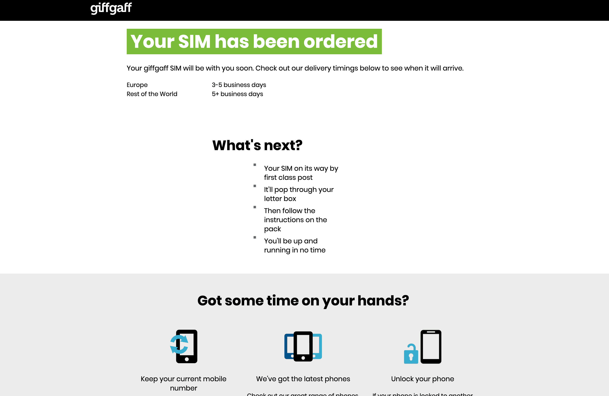

长期以来，我都是通过接码平台注册 Claude，但是这个方式现在越来越行不通了，并且对于注册得越来越多的海外平台，有一个稳定的海外手机号对我来说变得非常重要。

我选择的方案是注册 giffgaff 英国卡（实体卡），免月租（但是激活需要充值 10 英镑话费），接收短信免费，每半年发送一次短信保号（成本 0.3 英镑/条短信）。

由于我的需求就是「接码」，稳定的「接码」，所以使用这个方案对我来说性价比最高。

## 申请

### 官网途径

通过官网申请 SIM 卡是完全免费的，SIM 卡到手之后激活号卡才需要充值 10 英镑话费。

访问 [giffgaff 官网](https://www.giffgaff.com/)，点击「Order your free SIM」。

❌ 如果点击后跳转的 URL 是 [https://www.giffgaff.com/free-sim-cards](https://www.giffgaff.com/free-sim-cards)，那么后续订购填写邮寄地址时将只能选择英国的地址。

✅ 如果要将 SIM 卡邮寄国内（非英国），则需要通过 [https://www.giffgaff.com/freesim-international](https://www.giffgaff.com/freesim-international) 订购，如果访问该 URL 后报错，则是代理问题。

可邮寄国内（非英国）的订购页面如下：

这里忽略页面上方选择国家，继续下划页面到「Choose your plan」，这里点击「No thanks, I just want a free SIM」。

然后会弹出「Your details」页面，如图提示填写即可。

填写完成后点击「Order you free SIM」，页面提示「Your SIM has been ordered」，即表示订购成功。

接下来就是等待邮寄，是通过平邮到国内，能不能顺利收到纯看一路上的快递员了。

## 开箱

等收到快递后再写。

## 参考

- https://www.maizimi.com/oversea/oversea-tel-giffgaff/
- https://fast.v2ex.com/t/971919
- https://telegra.ph/Giffgaff-SIM-Card-in-China-Channel-10-29