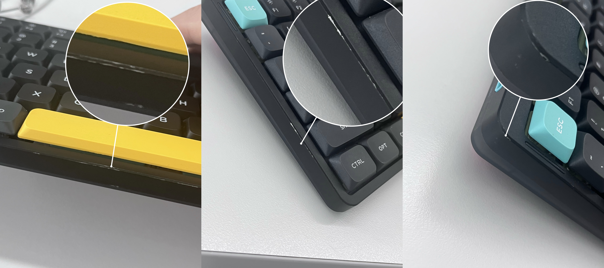
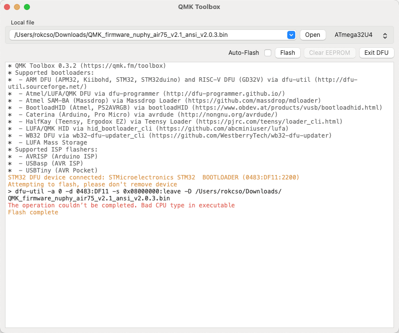
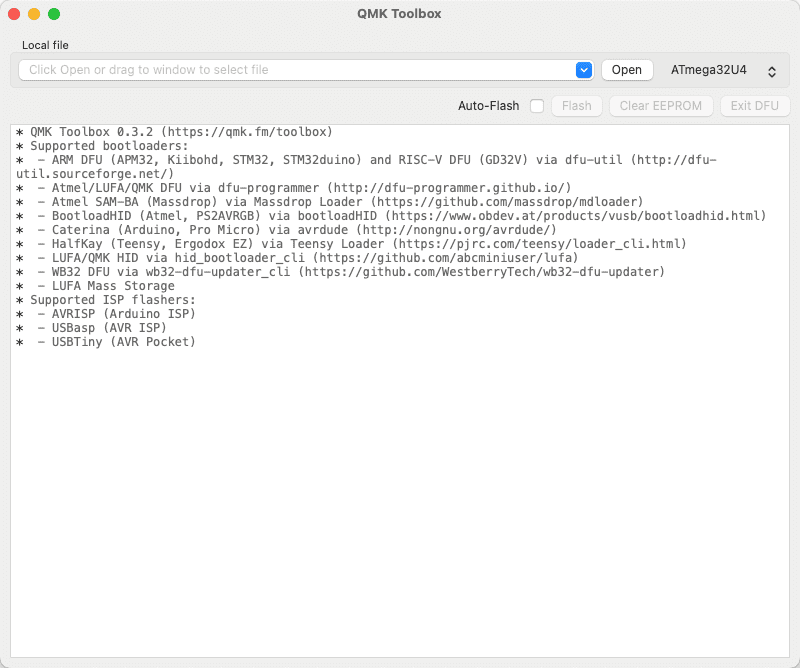
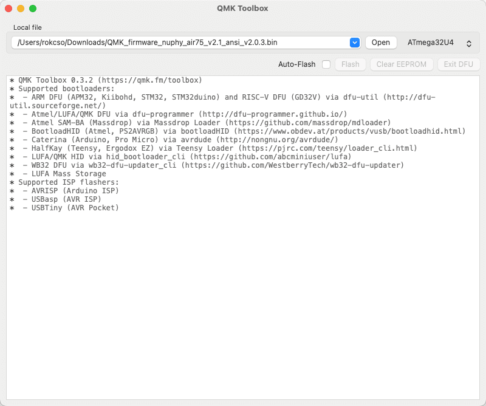
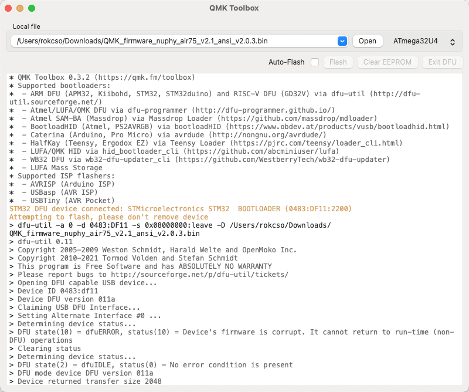
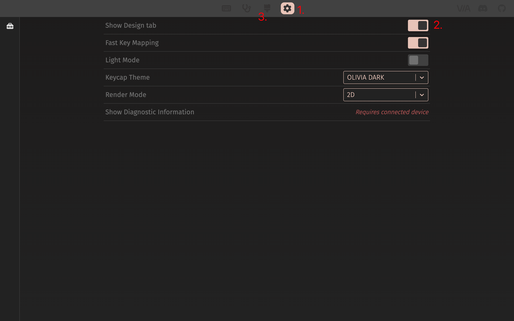
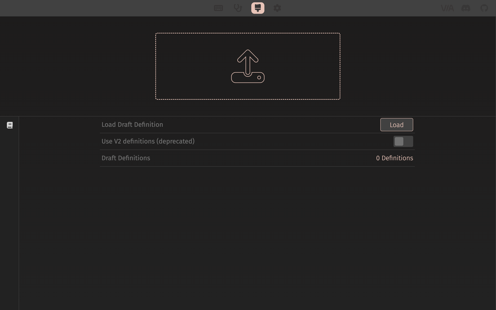
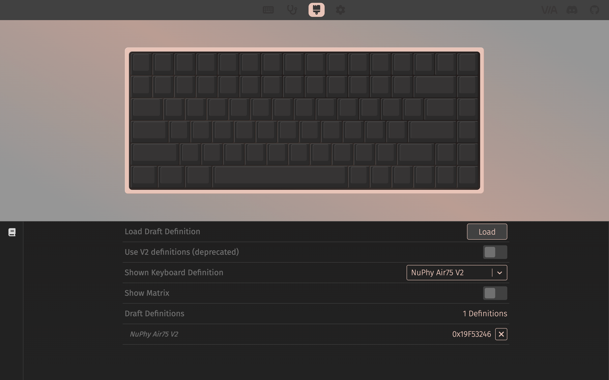
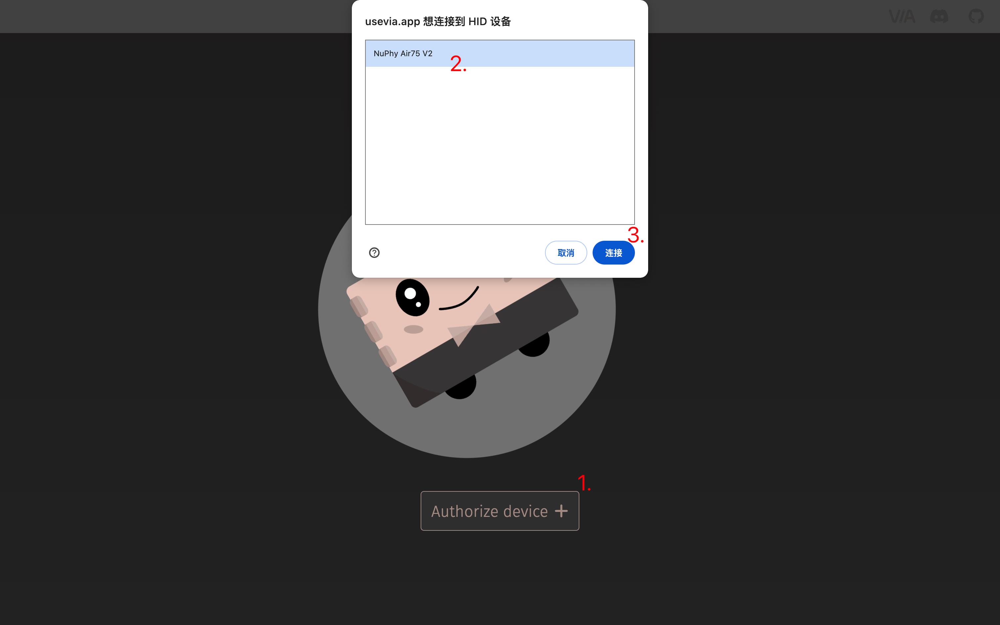
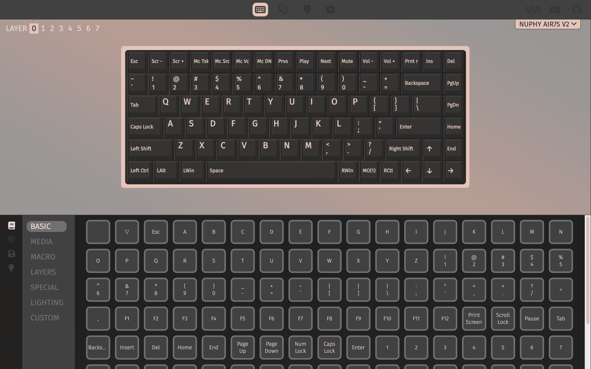

🔄 [简体中文](/p/nuphy-air75-v2-use-guide/)

## Quick Guide

⬇️ PDF：[NuPhy Air75 V2 Quick Guide](https://cdn.shopify.com/s/files/1/0268/7297/1373/files/NuPhy_Air75_V2_Quick_Guide.pdf?v=1696498123)

## FAQ 😅

### Special Announcement 🚫

My NuPhy Air75 V2 has noticeably chipped after 5 months of use in an office setting. It must have been chipping for a while, and I only noticed it today (2024.10.16). It's heartbreaking, and I deeply regret spending ¥749 on it. I will be more cautious about spending big money on small manufacturers in the future. 💔



Additionally: This is not an isolated case; other users have encountered the same issue (some even experienced severe chipping after just one month of use). After I provided feedback to customer service, they offered to replace the top cover for free, but I would have to pay for the return shipping myself.

### Device Connection/Switching

For switching between devices, Bluetooth pairing, and 2.4G connections, use the FN key plus **the number keys** 1-4, not the FN key plus F1-F4.

### Keyboard Auto-Sleep Mode

When the keyboard auto-sleep mode is enabled, if there is no operation for 6 consecutive minutes, the keyboard will enter sleep mode (keyboard backlight turns off).

Note: The default auto-sleep time is 6 minutes, and it is currently unclear how to customize this auto-sleep time.

Use the shortcut `FN + ]` to toggle the keyboard auto-sleep mode. After pressing `FN + ]`, if the RGB light bar at the top right corner of the keyboard flashes 3 times with red, it means the auto-sleep mode is turned off. If it flashes 3 times with green, it means the auto-sleep mode is turned on.

## Firmware Update

> Reference: [https://nuphy.com/pages/qmk-firmwares](https://nuphy.com/pages/qmk-firmwares)

### Preparation

1. Install QMK Toolbox

Go to the [GitHub QMK Toolbox repository](https://github.com/qmk/qmk_toolbox) to download the software for your operating system.

For macOS, you can install it using Homebrew:

```bash
brew install qmk-toolbox
```

⚠️ Note: QMK Toolbox does not seem to have a specific adaptation for Macs with M chips (ARM architecture) yet.

My M1 Mac encountered an error when trying to Flash firmware with the Homebrew-installed QMK Toolbox, stating `The operation couldn’t be completed. Bad CPU type in executable`, ultimately failing to update the firmware.



However, the QMK Toolbox installed via QMK Toolbox Installer successfully Flashed the firmware without any CPU type errors. This might be because Macs with M chips, when installing Intel programs via QMK Toolbox Installer, are prompted to install Rosetta, which allows Intel programs to run better on M chips.

2. Download Firmware

Go to the [Nuphy firmware release page](https://nuphy.com/pages/qmk-firmwares) to download the firmware for your keyboard model. Note: The firmware file extension is `.bin`.

### Start Updating

1. Open QMK Toolbox



2. Click "Open" to select the downloaded firmware file



3. Switch the NuPhy Air75 V2 to wired connection mode by holding the ESC key while plugging in the USB-C to connect the keyboard to the computer

⚠️ Note: The order of this operation is very important. First, disconnect the keyboard from the computer, then hold the ESC key while plugging in the USB-C to connect the keyboard to the computer.

When QMK Toolbox displays the yellow text in the image (indicating the device is connected), it means the keyboard has been successfully connected.


4. Click "Flash" to start updating the firmware

⚠️ Note: Do not, absolutely do not, disconnect the keyboard from the computer during the update process.

If everything goes well, QMK Toolbox will start a series of Erase and Download operations. When the firmware update is complete, QMK Toolbox will actively disconnect from the keyboard.

When QMK Toolbox displays the last line of yellow text in the image (Flash complete), it means the firmware update is complete.




## Configure Keyboard

> Reference: [https://nuphy.com/pages/via-usage-guide-for-nuphy-keyboards](https://nuphy.com/pages/via-usage-guide-for-nuphy-keyboards)

The NuPhy Air75 V2 requires [VIA](https://github.com/the-via) to configure keyboard keys and record macros, etc. NuPhy officially stated that they have submitted code to VIA to enable VIA to directly auto-detect the basic configuration of NuPhy keyboards. However, as of now (2024.09.03), it is not yet possible and we have to wait.

### Preparation

1. Download Official Configuration File

Download the configuration file (`.json` file) for your keyboard on the [NuPhy official configuration file release page](https://nuphy.com/pages/json-files-for-nuphy-keyboards).

2. Import Official Configuration File into VIA

Visit [usevia.app](https://usevia.app/) using a browser (officially recommended to use a browser with the Chrominum kernel).

Click the "Settings" icon at the top of the page, and in the settings page, enable the "Show Design tab" option; after enabling it, the "Design" page icon will appear at the top of the page.



Go to the "Design" page and upload the NuPhy official configuration file downloaded in step 1.


> Before uploading 👆


> After uploading 👆

3. Connect Keyboard to Computer

Switch the keyboard to wired mode (Wired) and connect the keyboard to the computer using a USB cable.

Then go to the "Configure" page and click the "Authorize device" button; at this point, the browser will pop up a dialog box with the following prompt. In the device list of the pop-up window, select the target device and click "Link".



At this point, the page will display the keyboard's detailed configuration information, and you can start customizing keys and recording macros.



### Custom Configuration

On the configuration page, select any key in the upper half (the key will flash when selected), and then click the key value in the lower half of the configuration page to map the selected key's value to the target key value.

At this point, the keyboard key configuration has been updated. There is no need to save it manually. Even if the keyboard is disconnected from the computer afterward, the key configuration will remain updated.

If you want to share your configuration with others or use a configuration shared by others, you can click on "Save + Load" in the left sidebar of the lower half of the configuration page to save your current configuration as a file or import a configuration file shared by others.

**What Did I Configured?**

The NuPhy Air75 V2 provides a "Screenshot" key, which by default calls the system's native screenshot tool when pressed. However, the screenshot tool I use daily is [Snipaste](https://www.snipaste.com/), whose shortcut key is `F1`.

So I mapped the key value `F1` to the keyboard's "Screenshot" key.

More advanced operations for custom configurations are not elaborated here, and I do not know how to do them.