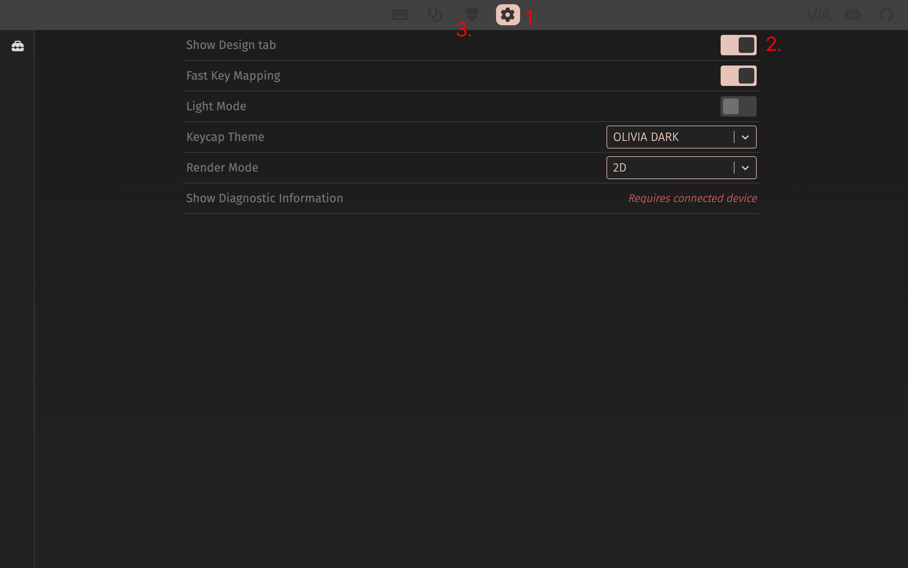

🔄 [English](/p/nuphy-air75-v2-use-guide-en/)

## 使用手册

⬇️ PDF：[NuPhy Air75 V2 Quick Guide](https://cdn.shopify.com/s/files/1/0268/7297/1373/files/NuPhy_Air75_V2_Quick_Guide.pdf?v=1696498123)

## 常见问题 😅

### 插播一则消息 🚫

我的 NuPhy Air75 V2 在办公场景下使用 5 个月后明显掉漆啦，应该掉了有一段时间了，今天（2024.10.16）突然看见，心痛，现在非常后悔花了这 ¥749，以后谨慎给这种小厂花大钱。💔


另外：这不是个例，也有其他网友遇到了同样的情况（甚至使用 1 个月就严重掉漆的）；我找客服反馈后客服提出可以免费为我更换上盖，不过寄回售后的邮费自理。

### 设备连接/切换

关于无限连接切换设备、蓝牙匹配、2.4G 连接等操作，使用 FN 键加**数字键** 1~4，而不是 FN 键加 F1～F4。

### 键盘自动休眠模式

开启键盘自动休眠模式后，若键盘连续 6 分钟没有任何操作，将进入休眠模式（键盘背光关闭）。

注：自动休眠时间默认 6 分钟，暂时不清楚如何自定义这个自动休眠时间。

使用快捷键 `FN + ]` 开关键盘自动休眠模式，按下 `FN + ]` 后，如果键盘右上角 RGB 灯条闪烁 3 次红灯，意味着关闭自动休眠模式，如果闪烁 3 次绿灯，意味着开启自动休眠模式。

## 更新固件

> 参考：[https://nuphy.com/pages/qmk-firmwares](https://nuphy.com/pages/qmk-firmwares)

### 准备工作

1. 安装 QMK Toolbox

前往 [GitHub QMK Toolbox 仓库](https://github.com/qmk/qmk_toolbox) 下载对应操作系统的软件。

macOS 可以使用 Homebrew 进行安装：

```bash
brew install qmk-toolbox
```

⚠️ 注意：QMK Toolbox 似乎还没有专门为 M 芯片（ARM 架构）的 Mac 提供适配。

我的 M1 Mac 使用 Homebrew 安装的 QMK Toolbox 在后续 Flash 固件时会提示 `The operation couldn’t be completed. Bad CPU type in executable` ，最终固件更新失败。


而通过 QMK Toolbox Installer 安装的 QMK Toolbox 则能成功 Flash 固件，不会提示 CPU 类型异常。 可能是由于 M 芯片的 Mac 在通过 QMK Toolbox Installer 安装 Intel 程序时会要求安装 Rosetta，而 Rosetta 可以让 Intel 程序在 M 芯片上更好的运行。

2. 下载固件

前往 [Nuphy 固件发布页面](https://nuphy.com/pages/qmk-firmwares) 下载对应键盘型号的固件。注：固件文件后缀为 `.bin` 。

### 开始更新

1. 打开 QMK Toolbox


2. 点击「Open」选择已下载好的固件文件


3. 将 Nuphy Air75 V2 切换到有线连接模式，按住 ESC 键然后再插入 USB-C 以连接键盘和电脑

⚠️ 注意：这一步操作的顺序非常重要，先断开键盘和电脑的连接，然后按住 ESC 键的同时插入 USB-C 来连接键盘和电脑。

当 QMK Toolbox 显示如图中黄色文本（提示设备已连接）时则意味着键盘已经成功连接。


4. 点击「Flash」开始更新固件

⚠️ 注意：更新的过程中千万、一定、绝对不要断开键盘和电脑的有线连接。

如果一切正常，QMK Toolbox 会开始执行一系列 Erase 和 Download，当固件更新完成，QMK Toolbox 会主动断开和键盘的连接。

当 QMK Toolbox 显示如图中最后一行黄色文本（Flash complete）即意味着固件更新完成。


## 配置键盘

> 参考：[https://nuphy.com/pages/via-usage-guide-for-nuphy-keyboards](https://nuphy.com/pages/via-usage-guide-for-nuphy-keyboards)

NuPhy Air75 V2 需要使用 [VIA](https://github.com/the-via) 来配置键盘键位以及录制宏等操作，NuPhy 官方说他们已经向 VIA 提交代码以使 VIA 可以直接自动检测到 NuPhy 键盘的基础配置。但是现在（2024.09.03）还不行，得等。

### 准备工作

1. 下载官方配置文件

在 [NuPhy 官方配置文件发布页面](https://nuphy.com/pages/json-files-for-nuphy-keyboards) 下载对应键盘的配置文件（`.json` 文件）。

2. 将官方配置文件导入 VIA

使用浏览器（官方推荐使用 Chrominum 内核的浏览器）访问 [usevia.app](https://usevia.app/)。

点击页面顶部「Settings」图标，在设置页面开启「Show Design tab」选项；开启之后页面顶部会出现「Design」页面的图标。



前往「Design」页面，将步骤 1 下载的 NuPhy 官方配置文件上传。


> 上传前 👆


> 上传后 👆

3. 连接键盘至电脑

将键盘调为有线模式（Wired）并使用 USB 线缆连接键盘和电脑。

然后前往「Configure」页面，点击「Authorize device」按钮；这时浏览器会弹出对话框提示如下，在弹窗的设备列表中选中目标设备，点击「链接」。


此时页面会显示键盘详细配置信息，就可以开始自定义键位以及录制宏等操作了。


### 自定义配置

在配置页面上半方选中任意按键（按键高亮闪烁即为选中），然后点击配置页面下半方的按键值即可将选中按键的键值映射为目标键值。

至此键盘键位配置就已经更新了，不需要手动保存，后续即使断开键盘与电脑的有线连接，键位也是更新后的配置。

如果想将自己的配置分享给别人或者使用别人分享的配置，可以点击配置页面下半方左侧边栏中的「Save + Load」，选择将自己当前的配置另存为配置文件或者导入别人分享的配置文件。

**我改了什么配置？**

NuPhy Air75 V2 提供了一个「截图」按键，默认情况下点击该按键会调用系统原生截图工具进行截图，而我日常使用的截图工具是 [Snipaste](https://www.snipaste.com/)，其快捷键为 `F1`。

所以我将键值 `F1` 映射到了键盘「截图」按键。

关于自定义配置的更多高级操作不在此展开，我也不会。