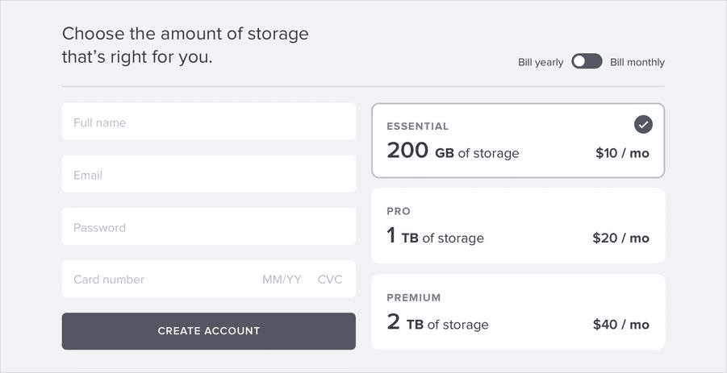
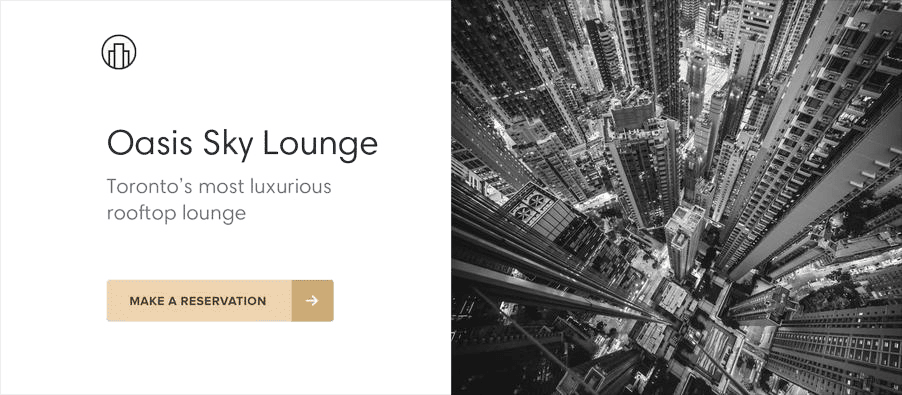

> 本文由 AI 翻译，人工修正。
>
> 原文链接：[https://www.refactoringui.com/](https://www.refactoringui.com/)

## Starting from Scratch / 从零开始

### Start with a feature, not a layout / 始于功能，而非布局

When you start the design for a new app idea, what do you design first? If it's the navigation bar at the top of the page, you're making a mistake.

在开始设计一个新应用时，如果你首先着手于页面顶部的导航栏，这其实是一个误区。

The easiest way to find yourself frustrated and stuck when working on a new design is to start by trying to “design the app.” When most people think about “designing the app”, they’re thinking about the shell.

在着手新设计项目时，一个常见的陷阱是直接尝试去构建应用的整体外观。实际上，许多人在谈论「设计应用」时，他们实际上在考虑的是应用的框架或外壳。

- *Should it have a top nav, or a sidebar?*
- *Should the navigation items be on the left, or on the right?*
- *Should the page content be in a container, or should it be full-width?*
- *Where should the logo go?*
>
- *是否应该设置顶部导航栏或侧边栏？*
- *导航项应该置于左侧还是右侧？*
- *页面内容是否应该限制在容器内，或者应该采用全宽布局？*
- *Logo 应放置于何处？*

The thing is, an “app” is actually a collection of features. Before you’ve designed a few features, you don’t even have the information you need to make a decision about how the navigation should work. No wonder it’s frustrating!

实际上，一个「应用」是由多个功能组成的。在设计了一些功能之前，我们并没有足够的信息来决定导航的最佳方式。这正是让人感到挫败的原因。

Instead of starting with the shell, start with a piece of actual functionality.

与其从应用的框架和外壳着手，不如先从具体的功能点开始设计。

For example, say you’re building a flight booking service. You could start with a feature like “searching for a flight”.

以构建航班预订服务为例，你可以首先着手开发「搜索航班」的功能。

Your interface will need:

- A field for the departure city
- A field for the destination city
- A field for the departure date
- A field for the return date
- A button to perform the search

你的用户界面应当包含以下元素：

- 出发城市的输入框
- 目的地城市的输入框
- 出发日期的输入框
- 返回日期的输入框
- 搜索按钮

Start with that.

就从这里着手。

Hell, you might not even need that other stuff anyways — it worked for Google.

事实上，你或许根本无需那些额外的功能 —— 正如谷歌所证明的那样，它已经足够有效了。

### Details comes later / 细节可以稍后再考虑。

In the earliest stages of designing a new feature, it’s important that you don’t get hung up making low-level decisions about things like typefaces, shadows, icons, etc.

在设计新功能之初，重要的是不要过早深入到字体选择、阴影效果、图标设计等细节层面的决策中。

That stuff will all matter eventually, but it doesn’t matter right now.

这些细节最终会显得重要，但目前并不是关注的重点。

If you have trouble ignoring the details when working in a high fidelity environment like the browser or your favorite design tool, one trick Jason Fried of Basecamp likes to use is to design on paper using a thick Sharpie.

如果你在高保真环境，比如浏览器或你偏爱的设计软件中工作时，难以忽视细节，Basecamp 的 Jason Fried 推荐的一个方法是使用粗记号笔在纸上进行设计。

Obsessing over little details just isn’t possible with a Sharpie, so it can be a great way to quickly explore a bunch of different layout ideas.

由于使用记号笔难以专注于小细节，这成为了一种快速探索多种布局概念的有效方法。

**Hold the color / 暂不考虑颜色**

Even when you’re ready to refine an idea in higher fidelity, resist the temptation to introduce color right away.

即便你已经准备好在更高保真度下对想法进行细化，也要避免立即引入颜色。

By designing in grayscale, you’re forced to use spacing, contrast, and size to do all of the heavy lifting.

采用灰度色彩进行设计，你将不得不依赖于空间、对比度和尺寸来承担所有关键的视觉任务。

It’s a little more challenging, but you’ll end up with a clearer interface with a strong hierarchy that’s easy to enhance with color later.

这种方法虽然更具挑战性，但最终能够创造出一个结构清晰、层级分明的界面，这在稍后用颜色进行美化时会变得更加容易。

**Dont't over-invest / 不要过度投资**

The whole point of designing in low-fidelity is to be able to move fast, so you can start building the real thing as soon as possible.

采用低保真度设计的核心在于能够迅速推进，以便尽早开始构建实际的产品。

Sketches and wireframes are disposable — users can’t do anything with static mockups. Use them to explore your ideas, and leave them behind when you’ve made a decision.

草图和线框图是临时的，用户无法与静态原型互动。但你可以利用它们来探索你的概念，并在决策确定后将它们搁置一旁。

### Dont't design too much / 不要过度设计

You don’t need to design every single feature in an app before you move on to implementation; in fact, it’s better if you don’t.

在进入实现阶段之前，没有必要设计出应用中的每一个功能；实际上，不这么做反而更有利。

Figuring out how every feature in a product should interact and how every edge case should look is really hard, especially in the abstract.

确定产品中每个功能之间的交互方式以及每个特殊情况的呈现形式是一项极具挑战性的任务，尤其是在缺乏具体情境的抽象阶段。

- *How should this screen look if the user has 2000 contacts?*
- *Where should the error message go in this form?*
- *How should this calendar look when there are two events scheduled at the same time?*
>
- *用户联系人达到 2000 个时，这个界面应如何设计？*
- *在表单中，错误提示应该放置在什么位置？*
- *当有两个事件被安排在同一时间时，日历界面中应如何展示？*

You’re setting yourself up for frustration by trying to figure this stuff out using only a design tool and your imagination.

如果只依靠设计工具和你自己的想象来解决这些问题，你很可能会陷入挫败。

**Work in cycles / 持续迭代**

Instead of designing everything up front, work in short cycles. Start by designing a simple version of the next feature you want to build.

与其一开始就设计所有内容，不如持续迭代。首先，从设计你接下来想要开发的功能的简化版开始。

Once you’re happy with the basic design, *make it real*.

当你对基础设计感到满意时，*就将其实现出来*。

You’ll probably run into some unexpected complexity along the way, but that’s the point — it’s a lot easier to fix design problems in an interface you can actually use than it is to imagine every edge case in advance.

在实现过程中，你可能会遇到一些未预见的复杂情况，但这正是关键所在 —— 与提前设想所有可能的特殊情况相比，在实际可用的界面中解决设计问题要简单得多。

Iterate on the working design until there are no more problems left to solve, then jump back into design mode and start working on the next feature.

对现行设计进行迭代改进，直至所有问题都得到解决。之后，再切换回设计模式，着手下一个功能。

Don’t get overwhelmed working in the abstract. Build the real thing as early as possible so your imagination doesn’t have to do all the heavy lifting.

避免在抽象概念的工作中感到压力过大。尽可能早地构建实际产品，让你的想象力不再承担所有重任。

**Be a pessimist / 做个悲观主义者**

Don’t imply functionality in your designs that you aren’t ready to build.

避免在设计中展示那些你尚未准备好实现的功能。

For example, say you’re working on a comment system for a project management tool. You know that one day, you’d like users to be able to attach files to their comments, so you include an attachments section in your design.

以项目管理工具中的评论系统为例，你设想未来用户可以在评论中附上文件，因此你在设计中加入了附件区域。

You get deep into implementation only to discover that supporting attachments is going to be a lot more work than you anticipated. There’s no way you have time to finish it right now, so the whole commenting system sits on the backburner while you take care of other priorities.

当你深入实现阶段，才意识到添加附件支持的工作量远超预期。你目前肯定没有足够的时间来完成这项工作，导致整个评论系统不得不暂时搁置，转而处理其他更紧急的任务。

The thing is, a comment system with no attachments would still have been better than no comment system at all, but because you planned to include it from day one you’ve got nothing you can ship.

实际上，即使是一个不能附加文件的评论系统，也比没有评论系统要好。但由于你最初就计划要加入这个功能，结果导致你现在无法发布任何可用的版本。

When you’re designing a new feature, **expect it to be hard to build.** Designing the smallest useful version you can ship reduces that risk considerably.

在设计新功能时，**应预料到构建过程的困难**。通过设计一个能够发布且功能最小的版本，你可以显著降低开发过程中的风险。

If part of a feature is a “nice-to-have”, **design it later**. Build the simple version first and you’ll always have something to fall back on.

对于那些属于「锦上添花」的功能部分，**应选择稍后设计**。首先开发一个基础版本，这样你就永远有一个可靠的退路。

### Choose a personality / 确定个性

Every design has some sort of personality. A banking site might try to communicate secure and professional, while a trendy new startup might have a design that feels fun and playful.

每个设计都蕴含着特定的个性。例如，银行网站通常会传达出一种安全和专业的形象，而一些时尚的新创企业则可能拥有一种让人感觉轻松愉快和有趣的设计风格。

On the surface, giving a design a particular personality might sound abstract and handwavy, but a lot of it is determined by a few solid, concrete factors.

虽然在表面上，为设计赋予特定的个性似乎是一个抽象且难以捉摸的概念，但其实这种个性很大程度上是由一些明确而具体的要素所决定的。

**Font choice / 字体**

Typography plays a huge part in determining how a design feels.

排版对于塑造设计的氛围和感觉扮演着至关重要的角色。

If you want an elegant or classic look, you might want to incorporate a serif typeface in your design:

若要营造一种优雅或古典的风格，你可以考虑在设计中使用衬线字体：

For a playful look, you could use a rounded sans serif:

若要设计出一种活泼的风格，你可以选择使用圆角的无衬线字体：

If you’re going for a plainer look, or want to rely on other elements to provide the personality, a neutral sans serif works great:

若要实现更为朴素的外观，或打算依靠其他设计元素来表现个性，中性风格的无衬线字体将非常适用：

**Color / 颜色**

There’s a lot of science out there on the psychology of color, but in practice, you really just need to pay attention to how different colors feel to you.

尽管有关颜色心理学的学问颇为深奥，实际上，你只需关注不同颜色对你个人情感的影响。

Blue is safe and familiar — nobody ever complains about blue:

蓝色给人以安全感和亲切感 —— 通常没有人会对使用蓝色的设计提出异议：

Gold might say “expensive” and “sophisticated”:

金色通常给人以「奢华」和「精致」的印象：

Pink is a bit more fun, and not so serious:

粉色给人一种更加轻松愉快的感觉，不那么正式：

While trying to choose colors using only psychology isn’t super practical — a lot of it is just about what looks good to you — it can be helpful to think about when you’re trying to understand why you think a color is the right fit.

尽管仅根据心理学来挑选颜色并不十分实用 —— 毕竟很多选择还是基于你个人的审美 —— 但在你努力理解为何某种颜色适合你的设计时，这些心理学因素可以提供一些帮助。

**Border radius / 边框圆角**

As small of a detail as it sounds, if and how much you round the corners in your design can have a big impact on the overall feel.

尽管听起来似乎微不足道，但设计中圆角的使用及其程度实际上对整体氛围有着显著的影响。

A small border radius is pretty neutral, and doesn’t really communicate much of a personality on its own:

边框圆角较小时，其表现相当中立，并不单独传达出鲜明的个性特征：

A large border radius starts to feel more playful:

当边框圆角较大时，设计会显得更加生动有趣：

...while no border radius at all feels a lot more serious or formal:

完全没有圆角的边框设计则显得更为严肃和正式：

Whatever you choose, it’s important to stay consistent. Mixing square corners with rounded corners in the same interface almost always looks worse than sticking with one or the other.

无论你做出何种选择，保持设计风格的一致性至关重要。在同一用户界面中同时使用直角和圆角边框，其效果几乎总是不如坚持单一风格的协调。

**Language / 语言**

While not a visual design technique per se, the words you use in an interface have a massive influence on the overall personality.

尽管这并非直接的视觉设计手法，但界面中所用的措辞对整体风格和个性有着极大的影响。

Using a less personal tone might feel more official or professional:

采用不那么个人化的语气可以营造出更加正式或专业的氛围：

...while using friendlier, more casual language makes a site feel, well, friendlier:

使用更亲切、更轻松的语言，则会让网站显得更加亲切：

Words are everywhere in a user interface, and choosing the right ones is just as (if not more) important than choosing the right color or typeface.

在用户界面中，文字无处不在，恰当的措辞选择与颜色或字体的选择同等重要，甚至可能更为关键。

**Deciding what you actually want / 确定你真正想要的东西**

A lot of the time you’ll probably just have a gut feeling for the personality you’re going for. But if you don’t, a great way to simplify the decision is to take a look at other sites used by the people you want to reach.

通常，你可能会根据自己的直觉来把握所追求的个性。如果你还没有明确的方向，一个有效的简化决策的方法是观察你想要吸引的用户群体所使用的其他网站。

If they are mostly pretty “serious business”, maybe that’s how your site should look too. If they are more playful with a bit of humor, maybe that’s a better direction to take.

如果目标用户群体主要使用的是典型的「严肃商务」风格网站，那么你的网站设计可能也应该体现出类似的风格。如果这些用户更倾向于活泼且带有幽默感的网站，那么在设计上融入这些元素可能是一个更佳的选择。

Just try not to borrow too much from direct competitors, you don’t want to look like a second-rate version of something else.

尽量避免从直接竞争对手那里过度借鉴，以免你的设计看起来像是其他产品的二流版本。

### Limit your choices / 缩小选择范围

Having millions of colors and thousands of fonts to choose from might sound nice in theory, but in practice it’s usually a paralyzing curse.

虽然理论上拥有数百万种颜色和数千种字体可供选择似乎很有吸引力，但实际上这种情况往往会使人陷入选择困难。

And it’s not just fonts and colors, either — you can easily waste time agonizing over almost any minor design decision.

问题不仅限于字体和颜色 —— 在许多小的设计决策上，人们往往容易耗费时间，陷入过度纠结。

- *Should this text be 12px or 13px?*
- *Should this box shadow have a 10% opacity or a 15% opacity?*
- *Should this avatar be 24px or 25px tall?*
- *Should I use a medium font weight for this button or semibold?*
- *Should this headline have a bottom margin of 18px or 20px?*
>
- *文字大小是选择 12px 还是 13px？*
- *阴影的不透明度是设为 10% 还是 15%？*
- *头像的高度是 24px 还是 25px？*
- *按钮的字体粗细是用中等还是半粗体？*
- *标题的底部边距是设为 18px 还是 20px？*

When you’re designing without constraints, decision-making is torture because there’s always going to be more than one right choice.

在没有限制的设计过程中，做出决策是一项挑战，因为往往存在多种正确的选项。

For example, these buttons all have different background colors, but it’s almost impossible to tell the difference between them by just looking at them.

以这些按钮为例，尽管它们各自拥有不同的背景色彩，但仅通过视觉却几乎无法辨认出它们之间的差别。

How are you supposed to make a confident decision if none of these would really be bad choices?

当所有这些选项都不会导致不良结果时，你该如何自信地做出决策呢？

**Define systems in advance / 事先建立体系**

Instead of hand-picking values from a limitless pool any time you need to make a decision, start with a smaller set of options.

与其在每次决策时从无限的选择中手工挑选，不如一开始就限定在一个较小的选项集中进行选择。

Don’t reach for the color picker every time you need to pick a new shade of blue — choose from a set of 8-10 shades picked out ahead of time.

在挑选新蓝色调时，无需每次都使用颜色选择器。相反，应该从预先选定的 8 至 10 种颜色中选取。

Similarly, don’t tweak a font size one pixel at a time until it looks perfect. Define a restrictive type scale in advance and use that to make any future font size decisions.

同样，不要通过逐像素微调来追求完美的字体大小。应该提前设定一个具有限制性的字体比例表，并依据此表来决定所有未来的字体大小选择。

When you build systems like this, you only have to do the hard work of picking the initial values once instead of every time you’re designing a new piece of UI. It’s a bit more work up front, but it’s worth it — it’ll save you a ton of decision fatigue down the road.

通过构建此类体系，您只需一次性完成选择初始值的艰巨工作，而不必在每次设计新的用户界面元素时重复这一过程。虽然前期可能需要更多的努力，但这是非常值得的 —— 它将在未来缓解你大量的决策疲劳。

**Designing by process of elimination / 利用排除法进行设计**

When you’re designing using a constrained set of values, decision-making is a lot easier because there are a lot fewer “right” choices.

使用一组限定的值进行设计时，做出决策会更加简单，因为可选的「正确」选项数量大幅减少。

For example, say you’re trying to choose a size for an icon. You’ve defined a sizing scale in advance where your only small-to-medium sized options are 12px, 16px, 24px, and 32px.

以图标大小的选择为例。如果你已经事先设定了一个尺寸比例，那么你在小尺寸到中等尺寸的选项中，仅有的选择可能是 12px、16px、24px 和 32px。

To pick the best option, start by taking a guess at which one will look best, maybe 16px. Then try the values on either side (12px and 24px) for comparison.

要挑选最佳选项，你可以先猜测哪个尺寸看起来最合适，比如 16px。接着，尝试使用它左右两边的尺寸（即 12px 和 24px）来做出对比。

Chances are, two of those options will seem like obviously bad choices. If it’s the options on the outside, you’re done — the middle option is the only good choice.

通常情况下，这些选项中有两个会明显不是好的选择。如果这两个是边缘选项，那么你的决策就简单了 —— 中间的选项自然成为了最佳选择。

If one of the outer options looks best, do another comparison using that option as the “middle” value and make sure there’s not a better choice.

如果发现其中一个边缘选项实际上是最佳选择，那么应该以该选项为「中心」再次进行比较，以确保没有遗漏更佳的选择。

This approach works for anything where you’ve defined a system. When you’re limited to a set of options that all look noticeably different, picking the best one is a piece of cake.

当您在一个您已经建立体系的领域内工作时，这种方法非常有效。如果您的选择范围被限定在一组明显有区别的选项之内，那么选出最佳选项就会变得易如反掌。

**Systematize everything / 体系化一切**

The more systems you have in place, the faster you’ll be able to work and the less you’ll second guess your own decisions.

随着您建立的体系越来越多，您的工作效率将大幅提升，同时也会减少对自己决策的犹豫和怀疑。

You’ll want systems for things like:

您应该为以下方面建立系统：

- Font size
- Font weight
- Line height
- Color
- Margin
- Padding
- Width
- Height
- Box shadows
- Border radius
- Border width
- Opacity
>
- 字体大小
- 字体粗细
- 行高
- 颜色
- 外边距
- 内边距
- 宽度
- 高度
- 阴影
- 边框圆角
- 边框宽度
- 不透明度

...and anything else you run into where it feels like you’re laboring over a low-level design decision.

以及任何其他你在设计过程中遇到的，需要在细节上花费大量精力的低层次决策问题。

You don’t have to define all of this stuff ahead of time, just make sure you’re approaching design with a system-focused mindset. Look for opportunities to introduce new systems as you make new decisions, and try to avoid having to make the same minor decision twice.

你无需一开始就定义所有这些元素，关键是要以体系化的思维方式来处理设计问题。在制定新决策时，寻找机会建立新的体系，并努力避免重复进行相同的小决策。

Designing with systems is going to be a recurring theme throughout this book, and in later chapters we’ll talk about building a lot of these systems in finer detail.

体系化设计是本书的一个核心议题，而在后续章节，我们会详细探讨这些体系构建的诸多细节。

## Hierarchy is Everything / 层次结构是一切

### Not all elements are equal / 元素之间并非平等

When you think of visual design as “styling things so they look good”, it’s easy to see why it might feel hard to achieve without innate artistic talent. But it turns out that one of the biggest factors in making something “look good” has nothing to do with superficial styling at all.

人们常将视觉设计理解为「美化事物」，这使得没有天赋的艺术家觉得难以达成。然而，事实证明，让事物「看起来好看」的一个关键因素实际上与表面的装饰无关。

Visual hierarchy refers to how important the elements in an interface appear in relation to one another, and it’s the most effective tool you have for making something feel “designed”.

视觉层级是指界面元素根据其重要性相互之间的呈现关系，它是使你的作品具有「设计感」的最有效手段。

When everything in an interface is competing for attention, it feels noisy and chaotic, like one big wall of content where it’s not clear what actually matters:

如果用户界面中的每个元素都在争夺用户的注意力，那么它将显得喧闹和混乱，仿佛是一整面内容繁杂的墙，让人难以辨识出哪些信息才是真正关键的：

When you deliberately de-emphasize secondary and tertiary information, and make an effort to highlight the elements that are most important, the result is immediately more pleasing, even though the color scheme, font choice, and layout haven’t changed:

通过刻意减少对次要和第三重要信息的强调，并着力突出最关键的元素，即便在配色、字体和布局保持不变的情况下，整体效果也会立刻变得更加赏心悦目：

So how do you actually make this happen? In the following chapters, we’ll cover a number of specific strategies you can use to introduce hierarchy into your designs.

要实现这一点，具体应该怎么做呢？在随后的章节里，我们会详细讨论多种特定策略，这些策略可以用来在你的设计中建立层级关系。

### Size isn’t everything / 尺寸不是一切

Relying too much on font size to control your hierarchy is a mistake — it often leads to primary content that’s too large, and secondary content that’s too small.

过分依赖字体大小来建立视觉层级是一个常见的误区，可能会导致主要内容显得过大，而次要内容则显得过小。

Instead of leaving all of the heavy lifting to font size alone, try using font weight or color to do the same job.

与其完全依赖字体大小来建立视觉层级，不如尝试利用字体的粗细或颜色来达到相同的目的。

For example, making a primary element bolder lets you use a more reasonable font size, and often does a better job at communicating its importance anyways:

例如，将主要元素的字体加粗，不仅可以让你采用更为适中的字体大小，而且在传达其重要性时往往更为有效：

Similarly, using a softer color for supporting text instead of a tiny font size makes it clear that the text is secondary while sacrificing less on readability:

类似地，使用较柔和的颜色来呈现辅助文本，而不是采用过小的字体大小，这样做在降低文本的主导性的同时，对可读性的影响较小：

Try and stick to two or three colors:

尝试限制你的配色方案在两种或三种颜色之内：

- A dark color for primary content (like the headline of an article)
- A grey for secondary content (like the date an article was published)
- A lighter grey for tertiary content (maybe the copyright notice in a footer)
>
- 对于主要内容，选择一种深色（例如文章标题）
- 对于次要内容，采用灰色（例如文章发布日期）
- 对于第三级内容，使用更浅的灰色（如页脚的版权声明）

Similarly, two font weights are usually enough for UI work:

在用户界面设计中，通常使用两种不同的字体粗细就足够区分内容的层级：

- A normal font weight (400 or 500 depending on the font) for most text
- A heavier font weight (600 or 700) for text you want to emphasize
>
- 对于大部分文本内容，选择标准字体粗细（如 400 或 500，具体取决于所使用的字体）
- 对于需要突出显示的文本，采用更粗的字体（如 600 或 700）

Stay away from font weights under 400 for UI work — they can work for large headings but are too hard to read at smaller sizes. If you’re considering using a lighter weight to de-emphasize some text, use a lighter color or smaller font size instead.

在用户界面设计工作中，应避免采用 400 以下的字体粗细，因为虽然它们适合用于大标题，但在较小尺寸时阅读性较差。如果你想通过使用较轻的字体粗细来降低某些文本的视觉重要性，可以考虑改用较浅的颜色或选择较小的字体大小来实现这一目的。

### Don’t use grey text on colored backgrounds / 不要在彩色背景上使用灰色文本

<!-- 翻译到这里，下面都是没有翻译的 -->

Making text a lighter grey is a great way to de-emphasize it on white backgrounds, but it doesn’t look so great on colored backgrounds.

在白色背景上将文本设置为浅灰色是降低其强调程度的好方法，但在彩色背景上看起来效果并不那么好。

That’s because the effect we’re actually seeing with grey on white is reduced contrast.

这是因为我们在白色背景上看到的灰色效果实际上是对比度降低了。

Making the text closer to the background color is what actually helps create hierarchy, not making it light grey.

使文本更接近背景色才是真正有助于创建层级的方法，而不是将其设置为浅灰色。

You might think that the easiest way to achieve this is to use white text and reduce the opacity:

你可能认为实现这一点最简单的方法是使用白色文本并降低透明度：

While this does reduce the contrast, it often results in text that looks dull, washed out, and sometimes even disabled.

虽然这确实降低了对比度，但通常会导致文本看起来暗淡、褪色，有时甚至像是被禁用了。

Even worse, using this approach on top of an image or pattern means the background will show through the text:

更糟糕的是，如果将这种方法用在图像或图案上，背景会透过文本显示出来。

A better approach is to hand-pick a new color, based on the background color.

更好的方法是根据背景色手工挑选一种新的颜色。

Choose a color with the same hue, and adjust the saturation and lightness until it looks right to you:

选择一个相同色调的颜色，并调整饱和度和亮度，直到它在你看来是合适的：

Hand-picking a color this way makes it easy to reduce the contrast without the text looking faded.

通过这种方式手工挑选颜色，可以很容易地降低对比度，同时不让文本看起来褪色。

### Emphasize by de-emphasizing / 通过弱化来强调

Sometimes you’ll run into a situation where the main element of an interface isn’t standing out enough, but there’s nothing you can add to it to give it the emphasis it needs.

有时你会遇到这样的情况，界面的主要元素没有足够突出，但你又无法向它添加任何东西来给予它所需的强调。

For example, despite trying to make this active nav item “pop” by giving it a different color, it still doesn’t really stand out compared to the inactive items:

例如，尽管尝试通过给它不同的颜色来使这个活动的导航项「突出」，但与非活动项相比，它仍然没有真正脱颖而出：

When you run into situations like this, instead of trying to further emphasize the element you want to draw attention to, figure out how you can de-emphasize the elements that are competing with it.

当你遇到类似的情况时，不要试图进一步强调你想要强调的元素，而是找出如何弱化与之竞争的元素的强调程度。

In this example, you could do that by giving the inactive items a softer color so they sit more in the background:

在这个例子中，你可以通过给非活动项一个更柔和的颜色，使它们更融入背景中：

You can apply this thinking to bigger pieces of an interface as well. For example, if a sidebar feels like it’s competing with your main content area, don’t give it a background color — let the content sit directly on the page background instead:

你也可以将这种思想应用到界面的更大部件上。例如，如果侧边栏感觉它在与你的主要内容区域竞争，不要给它设置背景颜色 —— 让其内容直接放置在页面背景上。

### Labels are a last resort / 标签是最后的手段

Put down the accessibility pitchfork — this isn’t about forms.

不要因为可访问性问题而激动 —— 这里讨论的不是表单问题。

When presenting data to the user (especially data from the database), it’s easy to fall into the trap of displaying it using a naive *label: value* format.

在向用户展示数据（特别是来自数据库的数据）时，很容易陷入使用简单的「标签：值」格式来展示数据的陷阱。

The problem with this approach is that it makes it difficult to present the data with any sort of hierarchy; every piece of data is given equal emphasis.

这种方法的问题在于它使得数据展示难以具有任何层级；每项数据都被赋予了相同的强调。

**You might not need a label at all / 你或许根本不需要标签**

In a lot of situations, you can tell what a piece of data is just by looking at the format.

在许多情况下，你只需通过查看格式就能知道数据是什么。

For example, janedoe@example.com is an email address, (555) 765-4321 is a phone number and $19.99 is a price.

例如，janedoe@example.com 是一个电子邮件地址，(555) 765-4321 是一个电话号码，而 $19.99 是一个价格。

When the format isn’t enough, the context often is. When you see the phrase “Customer Support” listed below someone’s name in an employee directory, you don’t need a label to make the connection that that is the department the person works in.

当格式本身不足以表达时，上下文往往能够提供足够的信息。当你在员工目录中看到某人的名字下面列出「客户支持」这个短语时，你不需要标签就能联想到那是该人所在的部门。

When you’re able to present data without labels, it’s much easier to emphasize important or identifying information, making the interface easier to use while at the same time making it feel more “designed”.

当你能够不使用标签来展示数据时，强调重要或识别信息就变得容易得多，这使得界面更易于使用，同时也让它感觉更加「有设计感」。

**Combine labels and values / 合并标签和值**

Even when a piece of data isn’t completely clear without a label, you can often avoid adding a label by adding clarifying text to the value.

没有标签，某项数据的含义可能不完全清晰，但你通常可以通过向值添加澄清文本来避免添加标签。

For example, if you need to display inventory in an e-commerce interface, instead of “In stock: 12”, try something like “12 left in stock”.

例如，如果你需要在电商界面上显示库存，不要写成「库存：12」，而是尝试使用「库存剩余 12 件」这样的表述。

If you’re building a real estate app, something like “Bedrooms: 3” could simply become “3 bedrooms”.

如果你正在开发一个房地产应用程序，像「卧室：3」这样的表述可以简单地改为「3 间卧室」。

When you’re able to combine labels and values into a single unit, it’s much easier to give each piece of data meaningful styling without sacrificing on clarity.

当你能够将标签和值合并为一个单元时，给每项数据赋予有意义的格式就变得容易得多，同时不会牺牲清晰度。

**Labels are secondary / 标签是次要的**

Sometimes you really do need a label; for example when you’re displaying multiple pieces of similar data and they need to be easily scannable, like on a dashboard.

有时候你确实需要使用标签；例如，当你需要展示多组相似的数据，并且这些数据需要快速被用户识别和理解，如在仪表板上。

In these situations, add the label, but treat it as supporting content. The data itself is what matters, the label is just there for clarity.

在这种情况下，可以添加标签，但要将其视为辅助内容。数据本身是更重要的，标签只是为了更清晰明了。

De-emphasize the label by making it smaller, reducing the contrast, using a lighter font weight, or some combination of all three.

通过使标签更小、降低对比度、使用较轻的字体粗细，或者这三种方法的组合来降低标签的强调程度。

**When to emphasize a label / 何时强调标签**

If you’re designing an interface where you know the user will be looking for the label, it might make sense to emphasize the label instead of the data.

如果你正在设计一个用户将会寻找标签的界面，那么强调标签而不是数据可能是有意义的。

This is often the case on information-dense pages, like the technical specifications of a product.

这通常出现在信息密集的页面上，比如产品技术规格说明。

If a user is trying to find out the dimensions of a smartphone, they’re probably scanning the page for words like “depth”, not “7.6mm”.

如果用户试图找出智能手机的尺寸，他们可能在页面上寻找像「厚度」这样的词，而不是「7.6 毫米」。

Don’t de-emphasize the data too much in these scenarios; it’s still important information. Simply using a darker color for the label and a slightly lighter color for the value is often enough.

在这种情况下，不要过分降低数据的强调程度；它仍然是重要的信息。通常，为标签使用较深的颜色，为值使用稍浅的颜色就足够了。

### Separate visual hierarchy from document hierarchy / 将视觉层级与文档层级分开

It’s important to use semantic markup when building for the web, which means you’ll often be using heading tags like `h1`, `h2`, or `h3` if you decide to add a title to part of an interface.

在为网页构建时使用语义化标记非常重要，这意味着如果你决定为界面的某个部分添加标题，通常会使用像 `h1`、`h2` 或 `h3` 这样的标题标签。

By default, web browsers assign progressively smaller font sizes to heading elements, so an `h1` is pretty large, and an `h6` is pretty small. This can be helpful for document-style content like articles or documentation, but it can encourage some bad decisions in application UIs.

默认情况下，网络浏览器会为标题元素分配逐渐减小的字体大小，所以 `h1` 非常大，而 `h6` 非常小。这对于文章或文档等文档样式内容可能很有帮助，但在应用程序用户界面中，它可能会促使一些糟糕的决策。

Using an `h1` tag to add a title like *Manage Account* to a page makes perfect sense semantically, but because we’re trained to believe that `h1` elements should be big, it’s easy to fall into the trap of making those titles bigger than they really need to be.

从语义上讲，使用 `h1` 标签为页面添加「管理账户」这样的标题是完全合理的，但由于我们习惯于认为 `h1` 元素应该是大号的，很容易陷入让这些标题比实际需要的更大陷阱。

A lot of the time, section titles act more like *labels* than headings — they are supportive content, they shouldn’t be stealing all the attention.

很多时候，小节标题更像是标签而不是标题 —— 它们是辅助性内容，不应该抢占所有的注意力。

Usually the content in that section should be the focus, not the title. That means that a lot of the time, titles should actually be pretty small:

通常，那个部分的内容应该是焦点，而不是标题。这意味着很多时候，标题实际上应该是相当小的：

Taken to the extreme, you might even include section titles in your markup for accessibility reasons but completely hide them visually because the content speaks for itself.

有时候，尽管出于提高可访问性的考虑，你会在网页的代码中包含小节标题，但如果内容本身就很清楚地传达了信息，你可能会在视觉上选择不展示这些标题。

Don’t let the element you’re using influence how you choose to style it — pick elements for semantic purposes and style them however you need to create the best visual hierarchy.

不要让你使用的元素影响你选择的样式 —— 出于语义目的选择元素，并根据创建最佳视觉层级的需要来设计它们的风格。

### Balance weight and contrast / 平衡重量与对比度

The reason bold text feels emphasized compared to regular text is that bold text covers more surface area — in the same amount of space, more pixels are used for text than for the background.

加粗文本与普通文本相比感觉更加强调的原因是，加粗文本覆盖了更多的表面积 —— 在相同的空间内，用于文本的像素比用于背景的要多。

So why is this interesting? Well it turns out that the relationship between surface area and hierarchy has implications on other elements in a UI as well.

那么，为什么这很有趣呢？事实证明，表面积与层级之间的关系也对用户界面中的其他元素有着影响。

**Using contrast to compensate for weight / 使用对比度来平衡重量**

One of the places understanding this relationship becomes important is when working with icons.

理解这种关系在设计图标时尤为重要。

Just like bold text, icons (especially solid ones) are generally pretty “heavy” and cover a lot of surface area. As a result, when you put an icon next to some text, the icon tends to feel emphasized.

就像加粗的文字一样，图标（尤其是实心的）通常看起来很「重」，并且占据很多空间。因此，当你把一个图标放在文本旁边时，图标往往会显得更加突出。

Unlike text, there’s no way to change the “weight” of an icon, so to create balance it needs to be de-emphasized in some other way.

与文本不同，我们无法改变图标的「粗细」，因此为了达到平衡，需要用其他方式来降低图标的强调程度。

A simple and effective way to do this is to lower the contrast of the icon by giving it a softer color.

一个简单而有效的做法是通过给图标一个更柔和的颜色来降低其对比度。

This works anywhere you need to balance elements that have different weights. Reducing the contrast works like a counterbalance, making heavier elements feel lighter even though the weight hasn’t changed.

这在你需要平衡具有不同「重量」的元素时都是有效的。降低对比度就像是一个平衡机制，使得「较重」的元素即使在「重量」没有改变的情况下也感觉更轻。

**Using weight to compensate for contrast / 使用重量来平衡对比度**

Just like how reducing contrast helps to de-emphasize heavy elements, increasing weight is a great way to add a bit of emphasis to low contrast elements.

就像降低对比度有助于减少重元素的强调一样，增加「重量」是给低对比度元素增加一些强调的好方法。

This is useful when things like thin 1px borders are too subtle using a soft color, but darkening the color makes the design feel harsh and noisy.

当像给细的 1px 的边框这样的元素使用柔和的颜色过于微妙，而加深颜色又让设计感觉过于强烈和嘈杂时，这种方法就很有用了。

Making the border a bit heavier by increasing the width helps to emphasize it without losing the softer look:

通过增加边框宽度使其变得更粗一些，有助于在不失去柔和外观的同时强调边框：

### Semantics are secondary / 语义是次要的

When there are multiple actions a user can take on a page, it’s easy to fall into the trap of designing those actions based purely on semantics.

当页面上用户可以执行多个操作时，很容易陷入仅基于语义来设计这些操作的陷阱。

Semantics are an important part of button design, but that doesn’t mean you can forget about hierarchy.

语义是按钮设计中的一个重要部分，但这并不意味着你可以忽视层级。

Every action on a page sits somewhere in a pyramid of importance. Most pages only have one true primary action, a couple of less important secondary actions, and a few seldom used tertiary actions.

页面上的每个操作都位于重要性的金字塔中的某个位置。大多数页面只有一个真正的主要操作，几个较不重要的次要操作，以及一些很少使用的第三级操作。

When designing these actions, it’s important to communicate their place in the hierarchy.

在设计这些操作时，传达它们在层级中的位置是很重要的。

- **Primary actions should be obvious.** Solid, high contrast background colors work great here.
- **Secondary actions should be clear but not prominent.** Outline styles or lower contrast background colors are great options.
- **Tertiary actions should be discoverable but unobtrusive.** Styling these actions like links is usually the best approach.
- **主要操作应该显而易见。** 实心的、高对比度的背景颜色在这里效果很好。
- **次要操作应该清晰但不突出。** 轮廓样式或较低对比度的背景颜色是很好的选择。
- **第三级操作应该是可发现的，但不显眼。** 通常将这些操作设计成链接样式是最佳方法。

When you take a hierarchy-first approach to designing the actions on page, the result is a much less busy UI that communicates more clearly:

当你采用以层级为先的方法来设计页面上的操作时，所得到的将是一个不那么杂乱且传达信息更清晰的用户界面：

**Destructive actions / 破坏性行为**

Being destructive or high severity doesn’t automatically mean a button should be big, red, and bold.

具有破坏性或高严重性的操作，并不自动意味着按钮应该是大的、红色的、加粗的。

If a destructive action isn’t the primary action on the page, it might be better to give it a secondary or tertiary button treatment.

如果一个破坏性操作不是页面上的主要操作，那么给它一个次要或第三级按钮的处理方式可能更好。

Combine this with a confirmation step where the destructive action actually is the primary action, and apply the big, red, bold styling there.

结合这一点，在实际执行破坏性操作的主要步骤中添加一个确认环节，并在那里应用大号、红色、加粗的样式。

## Layout and Spacing / 布局和间距

### Start with too much white space / 在开始保留更多留白

One of the easiest ways to clean up a design is to simply give every element a little more room to breathe.

简化设计的一个最简单方法是给每个元素更多的空间来「呼吸」，即增加元素之间的间距。

Sounds simple enough, right? So how come we don’t usually do it?

听起来够简单了，对吧？那我们通常为什么不这么做呢？

**White space should be removed, not added / 留白应该被移除而非被添加**

When designing for the web, white space is almost always added to a design — if something looks little too cramped, you add a bit of margin or padding until things look better.

在为 Web 设计时，留白几乎总是会被添加到设计中 —— 如果某些东西看起来有点太拥挤，你会添加一些外边距或内边距，直到看起来更好。

The problem with this approach is that elements are only given the minimum amount of breathing room necessary to not look *actively bad*. To make something actually look *great*, you usually need more white space.

这种方法的问题在于，元素只被赋予了避免看起来特别糟糕的最小呼吸空间。要使某物真正看起来很棒，你通常需要更多的空白空间。

A better approach is to start by giving something way too much space, then remove it until you’re happy with the result.

一个更好的方法是首先给某个元素过多的留白，然后逐步减少，直到你对结果感到满意。

You might think you’d end up with too much white space this way, but in practice, what might seem like “a little too much” when focused on an individual element ends up being closer to “just enough” in the context of a complete UI.

你可能会认为这样会存在太多的留白，但实际上，在单个元素时看似「有点过多」的留白，在完整的用户界面中，结果往往更接近「刚刚好」。

**Dense UIs have their place / 密集的 UI 有其用武之地**

While interfaces with a lot of breathing room almost always feel cleaner and simpler, there are certainly situations where it makes sense for a design to be much more compact.

虽然拥有大量呼吸空间的界面几乎总是给人一种更干净、更简单的感觉，但在某些情况下，设计得更为紧凑也是完全合理的。

For example, if you’re designing some sort of dashboard where a lot of information needs to be visible at once, packing that information together so it all fits on one screen might be worth making the design feel more busy.

例如，如果你正在设计某种信息需要一次性显示很多的仪表板，在这种情况下，将信息紧凑地排列以便全部显示在一个屏幕上，可能会让设计看上去更为拥挤，这是值得的。

The important thing is to make this a deliberate decision instead of just being the default. It’s a lot more obvious when you need to remove white space than it is when you need to add it.

关键在于我们应该有意识地做出关于留白的决定，而不是仅仅依赖于默认设置。通常，识别何时需要减少留白以提高界面紧凑性比识别何时需要增加留白以提升清晰度要容易得多。

### Establish a spacing and sizing system / 建立间距和尺寸系统

You shouldn’t be nitpicking between 120px and 125px when trying to decide on the perfect size for an element in your UI.

当你试图确定用户界面中元素的完美大小时，你不应该在 120px 还是 125px 之间过分纠结。

Painfully trialing arbitrary values one pixel at a time will drastically slow you down at best, and create ugly, inconsistent designs at worst.

逐像素地尝试任意值，最好的情况会大幅拖慢你的进度，最坏的情况则可能创造出丑陋、不一致的设计。

Instead, limit yourself to a constrained set of values, defined in advance.

相反，你应该限制自己使用预先定义好的一组的值。

**A linear scale won’t work / 线性比例失效**

Creating a spacing and sizing system isn’t quite as simple as something like *“make sure everything is a multiple of 4px”* — a naive approach like that doesn’t make it any easier to choose between 120px and 125px.

创建一个间距和尺寸系统并不像「*确保一切都是 4px 的倍数」*这样简单 —— 像那样简单粗暴的方法并不能让你在 120px 还是 125px 之间更容易做出选择。

For a system to be truly useful, it needs to take into consideration the relative difference between adjacent values.

为了使系统真正有用，它需要考虑到相邻值之间的相对差异。

At the small end of the scale (*like the size of an icon, or the padding inside a button*), a couple of pixels can make a big difference. Jumping from 12px to 16px is an increase of 33%!

在原本尺寸就较小的元素（*比如图标的大小，或者按钮内部的内边距*），几个像素可以产生很大的差异。从 12px 到 16px 就是增加了 33%！

But at the large end (the width of a card, or the vertical spacing in a landing page hero), a couple of pixels is basically imperceivable. Even increasing the width of a card from 500px to 520px is only a difference of 4%, which is *eight times* less significant than the jump from 12px to 16px.

但原本尺寸就较大的元素（*比如卡片的宽度，或者着陆页英雄区域的垂直间距*），几个像素基本上是感知不到的。即使将卡片的宽度从 500px 增加到 520px，差异也只有 4%，这比从 12px 增加到 16px 的差异小了八倍。

If you want your system to make sizing decisions easy, make sure no two values in your scale are ever closer than about 25%.

如果你想让你的系统使尺寸决策变得容易，确保在你的尺寸上任意两个值之间的差异永远不少于大约 25%。

**Defining the system / 定义系统**

Just like you don’t want to toil over arbitrary values when sizing an element or fine-tuning the space between elements, you don’t want to build your spacing and sizing scale from arbitrary values either.

就像你在确定元素大小或调整元素间距时不希望纠结于任意值一样，你在构建间距和尺寸的标准时也不应该纠结于任何数值。

A simple approach is to start with a sensible base value, then build a scale using factors and multiples of that value.

一个简单的方法是从一个合理的基础值开始，然后使用这个值的因数和倍数来构建一个尺寸系统。

16px is a great number to start with because it divides nicely, and also happens to be the default font size in every major web browser.

16px 就是一个很好的起始数字，因为它可以很好地被整除，同时也恰好是所有主流网络浏览器的默认字体大小。

The values at the small end of the scale should start pretty packed together, and get progressively more spaced apart as you get further up the scale.

尺寸较小端的值应该开始时相当紧密，随着尺寸的增加，这些值之间的间隔应逐渐变大。

Here’s an example of a fairly practical scale built using this approach:

这里有一个使用这种方法构建的相当实用的尺寸示例：

**Using the system / 使用系统**

Once you’ve defined your spacing and sizing system, you’ll find that you’re able to design a hell of a lot faster, especially if you design in the browser (*sticking to a system is easier when you’re typing in numbers than when you’re dragging with the mouse.*)

当你确立了自己的间距和尺寸规范后，你会发现设计过程会大大提速，尤其是在浏览器中进行设计时（*相较于用鼠标拖拽，直接输入数值来遵循系统会更加容易*）。

Need to add some space under an element? Grab a value from your scale and try it out. Not quite enough? The next value is probably perfect.

需要在某个元素下方增加一些空间吗？从你的尺寸系统中选取一个值来试用一下。空间不够吗？下一个值可能就正好。

While the workflow improvements are probably the biggest benefit, you’ll also start to notice a subtle consistency in your designs that wasn’t there before, and things will look just a little bit cleaner.

工作流程的显著提升是最主要的优势，但你也会逐渐察觉到设计中新增了一种细微的统一性，这使得视觉效果更加干净利落。

A spacing and sizing system will help you create better designs, with less effort, in less time. Design advice doesn’t get much more valuable than that.

建立一套间距和尺寸规范能够让你以更低的劳动强度和时间成本，打造出更优质的设计。在设计领域，这样的建议可谓珍贵至极。

### You don’t have to fill the whole screen / 你不必填满整个屏幕

Remember when 960px was the de facto layout width for desktop-size designs? These days you’d be hard-pressed to find a phone with a resolution that low.

曾几何时，960px 是桌面设计的标准宽度。然而，现在要找到分辨率如此之低的手机几乎是不可能的。

So it’s no surprise that when most of us open our design tool of choice on our high resolution displays, we give ourselves at least 1200-1400px of space to fill. But just because you have the space, doesn’t mean you need to use it.

如今，我们大多数人在高分辨率屏幕上启动设计软件时，很自然地会为自己预留至少 1200~1400px 的宽阔空间。然而，拥有这样的空间并不等同于必须将其全部填满。

If you only need 600px, use 600px. Spreading things out or making things unnecessarily wide just makes an interface harder to interpret, while a little extra space around the edges never hurt anyone.

如果你只需要 600px，那就只使用 600px。无谓地扩展内容或使内容过宽只会让界面更难以理解，而边缘处多留一些空间对任何人都没有害处。

This is just as applicable to individual sections of an interface, too. You don’t need to make everything full-width just because something else (like your navigation) is full-width.

这也适用于界面的各个部分。你不必仅仅因为其他元素（比如导航栏）是全宽的，就让所有内容都设置为全宽。

Give each element just the space it needs — don’t make something worse just to make it match something else.

给每个元素它所需要的空间 —— 不要为了让它与其他东西相匹配而降低它的质量。

**Shrink the canvas / 缩小画布**

If you’re having a hard time designing a small interface on a large canvas, shrink the canvas! A lot of the time it’s easier to design something small when the constraints are real.

如果你在一个大画布上设计一个小界面时遇到困难，缩小画布尺寸！很多时候，在有实际限制的情况下设计一个小东西会更容易。

If you’re building a responsive web application, try starting with a ~400px canvas and designing the mobile layout first.

如果你正在构建一个响应式 Web 应用程序，尝试从一个大约 400px 的画布开始，并首先设计移动端布局。

Once you have a mobile design you’re happy with, bring it over to a larger size screen and adjust anything that felt like a compromise on smaller screens. Odds are you won’t have to change as much as you think.

一旦你对移动端的设计感到满意，就将其应用到更大的屏幕尺寸上，并调整那些在较小屏幕上感觉像是妥协的地方。很可能你需要改变的东西并没有你想象的那么多

**Thinking in columns / 考虑列**

If you’re designing something that works best at a narrower width but feels unbalanced in the context of an otherwise wide UI, see if you can split it into columns instead of just making it wider.

如果你正在设计的内容在较窄的宽度下效果最佳，但在其他较宽的用户界面中感觉不平衡，看看是否可以将其分成多列，而不仅仅是将其加宽。

If you wanted to make better use of the available space without making the form harder to use, you could break the supporting text out into a separate column:

如果你想更有效地利用可用空间，同时不使表单变得更难使用，你可以将辅助文本分离到一个单独的列中：

This makes the design feel more balanced and consistent without compromising on the optimal width for the form itself.

这样做使得设计在不牺牲表单本身最佳宽度的前提下，感觉更加平衡和一致。

**Don’t force it / 不要硬来**

Just like you shouldn’t worry about filling the whole screen, you shouldn’t try to cram everything into a small area unnecessarily either.

就像你不应该担心填满整个屏幕一样，你也不应该不必要地试图将所有东西塞进一个小区域。

If you need a lot of space, go for it! Just don’t feel obligated to fill it if you don’t have to.

如果你需要更多空间，那就去争取吧！只是如果你没有必要，就不要觉得有义务去填满它。

### Grids are overrated / 网格被高估了

Using a system like a 12-column grid is a great way to simplify layout decisions, and can bring a satisfying sense of order to your designs.

使用像 12 列网格这样的系统是简化布局决策的一个很好的方法，它可以为你的设计带来令人满意的秩序感。

But even though grids can be useful, outsourcing all of your layout decisions to a grid can do more harm than good.

尽管网格可能很有用，但将所有的布局决策都外包给网格可能会带来更多的害处而不是好处。

**Not all elements should be fluid / 并非所有元素都应该具有流动性**

Fundamentally, a grid system is just about giving elements fluid, percentage-based widths, where you’re choosing from a constrained set of percentages.

网格系统本质上是为元素提供基于百分比的宽度，这些宽度是可变的，你可以根据一个固定的百分比选项集来决定元素的宽度。

For example, in a 12-column grid each column is 8.33% wide. As long as an element’s width is some multiple of 8.33% (*including any gutters*), that element is “on the grid”.

例如，在 12 列网格系统中，每一列的宽度是 8.33%。只要一个元素（*包括间隔*）的宽度是 8.33% 的某个倍数，那么这个元素就处于「网格上」。

The problem with treating grid systems like a religion is that there are a lot of situations where it makes much more sense for an element to have a fixed width instead of a relative width.

将网格系统当作一种宗教般严格遵守的问题在于，在很多情况下，对于一个元素来说，拥有固定宽度而不是相对宽度更有意义。

For example, consider a traditional sidebar layout. Using a 12-column grid system, you might give the sidebar a width of three columns (25%) and the main content area a width of nine columns (75%).

例如，考虑一个传统的侧边栏布局。使用 12 列网格系统，你可能会将侧边栏的宽度设为三列（25%），主要内容区域的宽度设为九列（75%）。

This might seem fine at first, but think about what happens when you resize the screen.

起初这可能看起来没问题，但想想当你调整屏幕大小时会发生什么。

If you make the screen wider the sidebar gets wider too, taking up space that could’ve been put to better use by the main content area.

如果你使屏幕变得更宽，侧边栏也会随之变宽，占据了本可以由主要内容区域更有效利用的空间。

Similarly, if you make the screen narrower, the sidebar can shrink below its minimum reasonable width, causing awkward text wrapping or truncation.

同样地，如果你使屏幕变得更窄，侧边栏可能会缩小到其最小合理宽度以下，导致文本出现尴尬的换行或截断。

In this situation, it makes much more sense to give the sidebar a fixed width that’s optimized for its contents. The main content area can then flex to fill the remaining space, using its own internal grid to lay out its children.

在这种情况下，给侧边栏设定一个固定宽度，以优化其内容，这样更有意义。然后，主要内容区域可以伸缩以填充剩余空间，并使用它自己的内部网格来布局其子元素。

This applies within components, too — don’t use percentages to size something unless you actually want it to scale.

这同样适用于组件内部 —— 除非你确实希望某个元素按比例缩放，否则不要使用百分比来设定其大小。

**Don’t shrink an element until you need to / 非必要不要缩小元素**

Say you’re designing a login card. Using the full screen width would look ugly, so you give it a width of 6 columns (50%) with a 3-column offset on each side.

假设你正在设计登录界面的卡片。为了美观，不使用整个屏幕宽度，而是将其宽度设置为 6 列，占屏幕的一半（即 50%），并在两侧各保留 3 列的空间作为边距。

On medium-sized screens you realize the card is a little narrow even though you have the space to make it bigger, so at that screen size you switch it to a width of 8 columns, with two empty columns on each side.

在中等大小的屏幕上，你发现卡片即使在有足够空间的情况下也略显狭窄，因此在该屏幕尺寸下，你将其宽度调整为 8 列，并在每一侧留出两列的空白列。

The silly thing about this approach is that because column widths are fluid, there’s a range in screen sizes where the login card is wider on medium screens than it is on large screens:

这种方法的荒谬之处在于，因为列宽是可变的，所以在一些屏幕尺寸中，中等屏幕上的登录卡片宽度实际上比大屏幕上的还要宽：

If you know that say 500px is the optimal size for the card, why should it ever get smaller than that if you have the space for it?

如果你知道 500px 是卡片的最佳尺寸，那么如果有足够空间，为什么还要让它小于这个尺寸呢？

Instead of sizing elements like this based on a grid, give them a max-width so they don’t get too large, and only force them to shrink when the screen gets smaller than that max-width.

不要基于网格来这样设定元素的大小，给它们设定一个最大宽度，以防止它们变得过大，并且只有在屏幕宽度小于这个最大宽度时才强制它们缩小。

Don’t be a slave to the grid — give your components the space they need and don’t make any compromises until it’s actually necessary.

不要成为网格的奴隶 —— 给你的组件它们需要的空间，并且在真正必要时才做出妥协。

### Relative sizing doesn’t scale / 相对尺寸不缩放

It’s tempting to believe that every part of an interface should be sized relative to one another, and that if element A needs to shrink by 25% on smaller screens, that element B should shrink by 25%, too.

人们很容易认为界面的每个部分都应该相对于彼此来设定大小，如果元素 A 在较小屏幕上需要缩小 25%，那么元素 B 也应该缩小 25%。

For example, say you’re designing an article at a large screen size. If your body copy is 18px and your headlines are 45px, it’s tempting to encode that relationship by defining your headline size as 2.5em; 2.5 times the current font size.

例如，假设你正在为大屏幕设计一篇文章。如果你的正文字体大小是 18px，你的标题字体大小是 45px，人们很容易通过定义标题大小为 2.5em 来编码这种相对关系；即当前字体大小的 2.5 倍。

There’s nothing inherently wrong with using relative units like em, but don’t be fooled into believing that relationships defined this way can remain static — 2.5em might be the perfect headline size on desktop but there’s no guarantee that it’ll be the right size on smaller screens.

使用像 em 这样的相对单位本身并没有错，但不要误以为以这种方式定义的关系可以保持不变 —— 2.5em 在桌面上可能是完美的标题大小，但在较小屏幕上可能就不一定合适了。

Say you reduce the size of your body copy to 14px on small screens to keep the line length in check. Keeping your headlines at 2.5em means a rendered font size of 35px — way too big for a small screen!

假设你在小屏幕上将正文字体大小减少到 14px 以控制行长度。如果你的标题保持在 2.5em，那么渲染出的字体大小将是 35px —— 对于小屏幕来说太大了！

A better headline size for small screens might be somewhere between 20px and 24px:

对于小屏幕来说，更合适的标题大小可能在 20px 到 24px 之间。

That’s only 1.5-1.7x the size of the 14px body copy — a totally different relationship than what made sense on desktop screens. That means there isn’t any real relationship at all, and that there’s no real benefit in trying to define the headline size relative to the body copy size.

这只有 14px 正文字体大小的 1.5 到 1.7 倍 —— 与在桌面屏幕上有意义的比例完全不同。这意味着实际上并没有固定的比例关系，并且尝试根据正文字体大小来定义标题大小并没有真正的好处。

As a general rule, elements that are large on large screens need to shrink faster than elements that are already fairly small — the difference between small elements and large elements should be less extreme at small screen sizes.

通常来说，大屏幕上的大元素在屏幕尺寸变小时，应该比小元素更显著地减小尺寸 —— 确保在小屏幕上，大元素和小元素之间的比例差异不会太过悬殊。

**Relationships within elements / 元素内部的关系**

The idea that things should scale independently doesn’t just apply to sizing elements at different screen sizes; it applies to the properties of a single component, too.

事物应独立缩放的理念不仅适用于不同屏幕尺寸上的元素尺寸调整；它也适用于单一组件的属性。

Say you’ve designed a button. It’s got a 16px font size, 16px of horizontal padding, and 12px of vertical padding:

假设你设计了一个按钮。它的字体大小为 16px，水平内边距为 16px，垂直内边距为 12px。

Much like the previous example, it’s tempting to think that the padding should be defined in terms of the current font size. That way if you want a larger or smaller button, you only need to change the font size and the padding will update automatically, right?

与前一个例子类似，人们很容易认为内边距应该以当前字体大小来定义。这样一来，如果你想要一个更大或更小的按钮，只需要改变字体大小，内边距就会自动更新，不是吗？

This works — the buttons do scale up or down and preserve the same proportions. But is that what we really want?

这种方法是可行的 —— 按钮确实可以按比例放大或缩小。但我们真的想要这样吗？

Compare that to these buttons, where the padding gets more generous at larger sizes and disproportionately tighter at smaller sizes:

与此相比，这些按钮在较大尺寸时内边距更宽松，在较小尺寸时内边距则不成比例地更紧凑：

Here the large button actually feels like a larger button, and the small buttons actually feel like smaller buttons, not like we simply adjusted the zoom.

在这里，大号按钮实际上给人的感觉就是更大，小号按钮给人的感觉也确实更小，并不是我们仅仅调整了缩放比例。

Let go of the idea that everything needs to scale proportionately — giving yourself the freedom to fine-tune things independently makes it a hell of a lot easier to design for multiple contexts.

放弃所有元素都需要等比例缩放的想法 —— 给自己自由去独立微调各个元素，从而使针对多种上下文进行设计变得容易得多。

### Avoid ambiguous spacing / 避免含糊的间距

When groups of elements are explicitly separated — usually by a border or background color — it’s obvious which elements belong to which group.

当元素组被明确分隔开时 —— 通常通过边框或背景颜色 —— 很明显可以看出哪些元素属于哪个组。

But when there isn’t a visible separator, it’s not always so obvious.

但是当没有可见的分隔符时，情况就不一定那么明显了。

Say you’re designing a form with stacked labels and inputs. If the margin below the label is the same as the margin below the input, the elements in the form group won’t feel obviously “connected”.

假设你正在设计一个具有堆叠标签和输入框的表单。如果标签下方的边距与输入框下方的边距相同，那么表单组中的元素就不会给人一种明显「相连」的感觉。

At best the user has to work harder to interpret the UI, and at worst it means accidentally putting the wrong data in the wrong field.

在最好的情况下，用户需要更努力地去理解用户界面，而在最坏的情况下，这意味着可能会不小心将错误的数据填入错误的字段。

The fix is to increase the space between each form group so it’s clear which label belongs to which input:

解决方法是增加每个表单组之间的空间，以清楚地表明哪个标签属于哪个输入框。

This same problem shows up in article design when there’s not enough space above section headings:

当部分标题上方没有足够的空间时，同样的问题也会出现在文章设计中：

…and in bulleted lists, when the space between bullets matches the line-height of a single bullet:

以及在项目符号列表中，当项目符号之间的空间与单个项目符号的行高相匹配时：

It’s not just vertical spacing that you have to worry about either; it’s easy to make this mistake with components that are laid out horizontally, too:

这不仅仅是垂直间距的问题；在水平布局的组件中，也很容易犯同样的错误：

Whenever you’re relying on spacing to connect a group of elements, always make sure there’s more space around the group than there is within it — interfaces that are hard to understand always look worse.

每当你依赖间距来连接一组元素时，一定要确保组周围的空间比组内的多 —— 难以理解的界面看起来总是更糟糕。

## Designing Text / 设计文本

### Establish a type scale / 建立一个字符比例尺

Most interfaces use way too many font sizes. Unless a team has a rigid design system in place, it’s not uncommon to find that every pixel value from 10px to 24px has been used in the UI *somewhere*.

在许多用户界面设计中，字体大小的使用往往过于繁多。如果没有一个固定的设计体系，界面上从 10px 到 24px 的字体大小几乎*随处可见*。

Choosing font sizes without a system is a bad idea for two reasons:

1. It leads to annoying inconsistencies in your designs.
2. It slows down your workflow.

没有系统地选择字体大小不是一个好主意，原因有两个：

1. 这会导致你的设计中出现令人恼火的不一致性。
2. 这种做法还会拖慢你的工作效率。

So how do you define a type system?

那么你如何定义一个字符系统。

**Choosing a scale / 选择比例尺**

Just like with spacing and sizing, a linear scale won’t work. Smaller jumps between font sizes are useful at the bottom of the scale, but you don’t want to waste time deciding between 46px and 48px for a large headline.

**Modular scales / 模块化比例尺**

One approach is to calculate your type scale using a ratio, like 4:5 (a “*major third*”), 2:3 (a “*perfect fifth*”), or perhaps the “golden ratio”, 1:1.618. This is often called a “modular scale”.

You start with a sensible base value (*16px is common since it’s the default font size for most browsers*), apply your ratio to get the next value, then apply your ratio to that value to get the next value, and so on and so forth:

The mathematical purity of this approach is alluring, but in practice, it’s not perfect for a couple of reasons.

1. **You end up with fractional values.**

Using a 16px base and 4:5 ratio, your scale will end up with lots of sizes that don’t land right on the pixel, like 31.25px, 39.063px, 48.828px, etc. Browsers all handle subpixel rounding a little bit differently, so it’s best to avoid fractional sizes if you can avoid it.

If you do want to use this approach, make sure you round the values yourself when defining the scale to avoid off-by-one pixel issues across browsers.

2. **You usually need more sizes.**

This approach can work well if you’re defining a type scale for long form content like an article, but for interface design, the jumps you get using a modular scale are often a bit too limiting.

With a (*rounded*) 3:4 type scale, you get sizes like 12px, 16px, 21px, and 28px. While this might not seem too limiting on the surface, in practice you’re going to wish you had a size between 12px and 16px, and another between 16px and 21px.

You could use a tighter ratio like 8:9, but at this point you’re just trying to pick a scale that happens to match the sizes you already know you want.

**Hand-crafted scales / 手动比例**

For interface design, a more practical approach is to simply pick values by hand. You don’t have to worry about subpixel rounding errors this way, and you have total control over which sizes exist instead of outsourcing that job to some mathematical formula.

Here’s an example of a scale that works well for most projects and aligns nicely with the spacing and sizing scale recommended in “*Establishing a spacing and sizing system*”:

It’s constrained just enough to speed up your decision making, but isn’t so limited as to make you feel like you’re missing a useful size.

**Avoid em units / 避免使用 em**

When you’re building a type scale, don’t use em units to define your sizes.

Because em units are relative to the current font size, the computed font size of nested elements is often not actually a value in your scale.

For example, say you’ve defined an em-based type scale like this:

If you give an element a font size of 1.25em (20px by default), inside of that element 1em is now equal to 20px. That means that if you give one of the nested elements a font size of .875em, the actual computed font size is 17.5px, not a value from your type scale!

Stick to px or rem units — it’s the only way to guarantee you’re actually sticking to the system.

### Use good fonts / 使用好的字体

With thousands of different typefaces out there to choose from, separating the good from the bad can be an intimidating task.

Developing an eye for all of the details that make a good typeface can take years. You probably don’t have years, so here are a few tricks you can use to start picking out high quality typefaces right away.

**Play it safe / 稳扎稳打**

For UI design, your safest bet is a fairly neutral sans-serif — think something like Helvetica.

If you really don’t trust your own taste, one great option is to rely on the system font stack:

`-apple-system, Segoe UI, Roboto, Noto Sans, Ubuntu, Cantarell, Helvetica Neue;`

It might not be the most ambitious choice, but at least your users will already be used to seeing it.

**Ignore typefaces with less than five weights / 忽略重量少于 5 种的字体**

This isn’t *always* true, but as a general rule, typefaces that come in a lot of different weights tend to be crafted with more care and attention to detail than typefaces with fewer weights.

Many font directories (*like Google Fonts*) will let you filter by “number of styles”, which is a combination of the available weights as well as the italic variations of those weights.

A great way to limit the number of options you have to choose from is to crank that up to 10+ (*to account for italics*):

On Google Fonts specifically, that cuts out 85% of the available options, leaving you with less than 50 sans-serifs to choose from.

**Optimize for legibility / 优化可读性**

When someone designs a font family, they are usually designing it for a specific purpose. Fonts meant for headlines usually have tighter letter- spacing and shorter lowercase letters (a shorter x-height), while fonts meant for smaller sizes have wider letter-spacing and taller lowercase letters.

Keep this in mind and avoid using condensed typefaces with short x-heights for your main UI text.

**Trust the wisdom of the crowd / 相信群众的智慧**

If a font is popular, it’s probably a good font. Most font directories will let you sort by popularity, so this can be a great way to limit your choices.

This is especially useful when you’re trying to pick out something other than a neutral UI typeface. Picking a nice serif with some personality for example can be tough.

Leveraging the collective decision-making power of thousands of other people can make it a lot easier.

**Steal from people who care / 从关心你的人哪里偷东西**

Inspect some of your favorite sites and see what typefaces they are using.

There are a lot of great design teams out there full of people with really strong opinions about typography, and they’ll often choose great fonts that you might have never found using some of the safer approaches outlined above.

**Developing your intuition / 培养你的直觉**

Once you start paying closer attention to the typography on well-designed sites, it’s not long before you feel pretty comfortable labeling a typeface as awesome or terrible.

You’re gonna be a type snob soon enough, but the advice outlined above will help get you by in the meantime.

### Keep your line length in check / 保证你的行长度在控制之内

When styling paragraphs, it’s easy to make the mistake of fitting the text to your layout instead of trying to create the best reading experience.

Usually this means lines that are too long, making text harder to read.

For the best reading experience, make your paragraphs wide enough to fit between 45 and 75 characters per line. The easiest way to do this on the web is using em units, which are relative to the current font size. A width of 20-35em will get you in the right ballpark.

Going a bit wider than 75 characters per line can sometimes work too, but be aware that you’re entering risky territory — stick to the 45-75 range if you want to play it safe.

**Dealing with wider content / 处理更广泛的内容**

If you’re mixing paragraph text with images or other large components, you should still limit the paragraph width even if the overall content area needs to be wider to accommodate the other elements.

It might seem counterintuitive at first to use different widths in the same content area, but the result almost always looks more polished.

### Baseline, not center / 基线，不居中

There are a lot of situations where it makes sense to use multiple font sizes to create hierarchy on a single line.

For example, maybe you’re designing a card that has a large title in the top left and a smaller list of actions in the top right.

When you’re mixing font sizes like this, your instinct might be to vertically center the text for balance:

When there’s a decent amount of space between the different font sizes it often won’t look bad enough to catch your attention, but when the text is close together the awkward alignment becomes more obvious:

A better approach is to align mixed font sizes by their baseline, which is the imaginary line that letters rest on:

When you align mixed font sizes by their baseline, you’re taking advantage of an alignment reference that your eyes already perceive.

The result is a simpler, cleaner look than what you get when you center two pieces of text and offset their baselines.

### Line-height is proportional / 行高是成比例的

You might have heard the advice that a line-height of about 1.5 is a good starting point from a readability perspective.

While that’s not necessarily untrue, choosing the right line-height for your text is a bit more complicated than just using the same value across the board in all situations.

**Accounting for line length / 考虑行长度**

The reason we add space between lines of text is to make it easy for the reader to find the next line when the text wraps. Have you ever accidentally read the same line of text twice, or accidentally skipped a line? The line- height was probably too short.

When lines of text are spaced too tightly, it’s easy to finish reading a line of text at the right edge of a page then jump your eyes all the way back to the left edge only to be unsure which line is next.

This problem is magnified when lines of text are long. The further your eyes have to jump horizontally to read the next line, the easier it is to lose your place.

That means that your line-height and paragraph width should be proportional — narrow content can use a shorter line-height like 1.5, but wide content might need a line-height as tall as 2.

**Accounting for font size / 考虑字体大小**

Line length isn’t the only factor in choosing the right line-height — font size has a big impact as well.

When text is small, extra line spacing is important because it makes it a lot easier for your eyes to find the next line when the text wraps.

But as text gets larger, your eyes don’t need as much help. This means that for large headline text you might not need any extra line spacing, and a line- height of 1 is perfectly fine.

Line-height and font size are inversely proportional — use a taller line-height for small text and a shorter line-height for large text.

### Not every link needs a color / 不是每个链接都需要颜色

When you’re including a link in a block of otherwise non-link text, it’s important to make sure that the link stands out and looks clickable.

But when you’re designing an interface where almost everything is a link, using a treatment designed to make links “pop” in paragraph text can be really overbearing.

Instead, emphasize most links in a more subtle way, like by just using a heavier font weight or darker color.

Some links might not even need to be emphasized by default at all. If you’ve got links in your interface that are really ancillary and not part of the main path a user takes through the application, consider adding an underline or changing the color only on hover.

They’ll still be discoverable to any users who think to try, but won’t compete for attention with more important actions on the page.

### Align with readability in mind / 以可读性为目标对齐

In general, text should be aligned to match the direction of the language it’s written in. For English (and most other languages), that means that the vast majority of text should be left-aligned.

Other alignment options do have their place though, you just need to use them effectively.

**Don’t center long form text / 不要居中长文本**

Center-alignment can look great for headlines or short, independent blocks of text.

But if something is longer than two or three lines, it will almost always look better left-aligned.

If you’ve got a few blocks of text you want to center but one of them is a bit too long, the easiest fix is to rewrite the content and make it shorter:

Not only will it fix the alignment issue, it will make your design feel more consistent, too.

**Right-align numbers / 数字右对齐**

If you’re designing a table that includes numbers, right-align them.

When the decimal in a list of numbers is always in the same place, they’re a lot easier to compare at a glance.

**Hyphenate justified text / 分隔符对齐的文本**

Justified text looks great in print and can work well on the web when you’re going for a more formal look, but without special care, it can create a lot of awkward gaps between words:

To avoid this, whenever you justify text, you should also enable hyphenation:

Justified text works best in situations where you’re trying to mimic a print look, perhaps for an online magazine or newspaper. Even then, left aligned text works great too, so it’s really just a matter of preference.

### Use letter-spacing effectively / 有效使用字间距

When styling text, a lot of effort is put into getting the weight, color, and line- height just right, but it’s easy to forget that letter-spacing can be tweaked, too.

As a general rule, you should trust the typeface designer and leave letter- spacing alone. That said, there are a couple of common situations where adjusting it can improve your designs.

**Tightening headlines / 紧缩的新闻标题**

When someone designs a font family, they design it with a purpose in mind.

A family like Open Sans is designed to be highly legible even at small sizes, so the built-in letter-spacing is a lot wider than a family like Oswald which is designed for headlines.

If you want to use a family with wider letter-spacing for headlines or titles, it can often make sense to decrease the letter-spacing to mimic the condensed look of a purpose-built headline family:

Avoid trying to make this work the other way around though — headline fonts rarely work well at small sizes even if you increase the letter spacing.

**Improving all-caps legibility / 提高全大写易读性**

The letter-spacing in most font families is optimized for normal “sentence case” text — a capital letter followed by mostly lowercase letters.

Lowercase letters have a lot of variety visually. Letters like n, v, and e fit entirely within a typeface’s x-height, other letters like y, g, and p have descenders that poke out below the baseline, and letters like b, f, and t have ascenders that extend above.

All-caps text on the other hand isn’t so diverse. Since every letter is the same height, using the default letter-spacing often leads to text that is harder to read because there are fewer distinguishing characteristics between letters.

For that reason, it often makes sense to increase the letter-spacing of all- caps text to improve readability:

## Working with Color / 与色彩合作

### Ditch hex for HSL / 放弃 HEX，选择 HSL

Hex and RGB are the most common formats for representing color on the web, but they’re not the most useful.

Using hex or RGB, colors that have a lot in common visually look nothing alike in code.

HSL fixes this by representing colors using attributes the human-eye intuitively perceives: hue, saturation, and lightness.

**Hue** is a color’s position on the color wheel — it’s the attribute of a color that lets us identify two colors as “blue” even if they aren’t identical.

Hue is measured in degrees, where 0° is red, 120° is green, and 240° is blue.

**Saturation** is how colorful or vivid a color looks. 0% saturation is grey (no color), and 100% saturation is vibrant and intense.

Without saturation, hue is irrelevant — rotating the hue when saturation is 0% doesn’t actually change the color at all.

**Lightness** is just what it sounds like — it measures how close a color is to black or to white. 0% lightness is pure black, 100% lightness is pure white, and 50% lightness is a pure color at the given hue.

**HSL vs. HSB**

Don’t confuse HSL for HSB — *lightness* in HSL is not the same as brightness in HSB.

In HSB, 0% brightness is always black, but 100% brightness is only white when the saturation is 0%. When saturation is 100%, 100% brightness in HSB is the same as 100% saturation and 50% lightness in HSL.

HSB is more common than HSL in design software, but browsers only understand HSL, so if you’re designing for the web, HSL should be your weapon of choice.

### You need more colors than you think / 你需要比你想的更多的颜色

Ever used one of those color palette generators where you pick a starting color, tweak some options, and are then bestowed the five perfect colors you should use to build your website?

This calculated approach to picking the perfect color scheme is extremely seductive, but it’s not very useful unless you want your site to look like this:

**What you actually need / 你需要什么**

You can’t build anything with five hex codes. To build something real, you need a much more comprehensive set of colors to choose from.

You can break a good color palette down into three categories.

**Greys /**

Text, backgrounds, panels, form controls — almost everything in an interface is grey.

You’ll need more greys than you think, too — three or four shades might sound like plenty but it won’t be long before you wish you had something a little darker than shade #2 but a little lighter than shade #3.

In practice, you want 8-10 shades to choose from (*more on this in “Define your shades up front”*). Not so many that you waste time deciding between shade #77 and shade #78, but enough to make sure you don’t have to compromise too much.

True black tends to look pretty unnatural, so start with a really dark grey and work your way up to white in steady increments.

**Primary color(s) /**

Most sites need one, *maybe* two colors that are used for primary actions, active navigation elements, etc. These are the colors that determine the overall look of a site — the ones that make you think of Facebook as “blue”.

Just like with greys, you need a variety (5-10) of lighter and darker shades to choose from.

Ultra-light shades can be useful as a tinted background for things like alerts, while darker shades work great for text.

**Accent colors /**

On top of primary colors, every site needs a few accent colors for communicating different things to the user.

For example, you might want to use an eye-grabbing color like yellow, pink, or teal to highlight a new feature:

You might also need colors to emphasize different semantic states, like red for confirming a destructive action:

...yellow for a warning message:

...or green to highlight a positive trend:

You’ll want multiple shades for these colors too, even though they should be used pretty sparingly throughout the UI.

If you’re building something where you need to use color to distinguish or categorize similar elements (like lines on graphs, events in a calendar, or tags on a project), you might need even more accent colors.

All in, it’s not uncommon to need as many as ten different colors with 5-10 shades each for a complex UI.

### Define your shades up front /

When you need to create a lighter or darker variation of a color in your palette, don’t get clever using CSS preprocessor functions like “lighten” or “darken” to create shades on the fly. That’s how you end up with 35 slightly different blues that all look the same.

Instead, define a fixed set of shades up front that you can choose from as you work.

So how do you put together a palette like this anyways?

**Choose the base color first /**

Start by picking a base color for the scale you want to create — the color in the middle that your lighter and darker shades are based on.

There’s no real scientific way to do this, but for primary and accent colors, a good rule of thumb is to pick a shade that would work well as a button background.

It’s important to note that there are no real rules here like “start at 50% lightness” or anything — every color behaves a bit differently, so you’ll have to rely on your eyes for this one.

**Finding the edges /**

Next, pick your darkest shade and your lightest shade. There’s no real science to this either, but it helps to think about where they will be used and choose them using that context.

The darkest shade of a color is usually reserved for text, while the lightest shade might be used to tint the background of an element.

A simple alert component is a good example that combines both of these use cases, so it can be a great place to pick these colors.

Start with a color that matches the hue of your base color, and adjust the saturation and lightness until you’re satisfied.

**Filling in the gaps /**

Once you’ve got your base, darkest, and lightest shades, you just need to fill in the gaps in between them.

For most projects, you’ll need at least 5 shades per color, and probably closer to 10 if you don’t want to feel too constrained.

Nine is a great number because it’s easy to divide and makes filling in the gaps a little more straightforward. Let’s call our darkest shade 900, our base shade 500, and our lightest shade 100.

Start by picking shades 700 and 300, the ones right in the middle of the gaps. You want these shades to feel like the perfect compromise between the shades on either side.

This creates four more holes in the scale (800, 600, 400, and 200), which you can fill using the same approach.

You should end up with a pretty balanced set of colors that provide just enough options to accommodate your design ideas without feeling limiting.

**What about greys?** /

With greys the base color isn’t as important, but otherwise the process is the same. Start at the edges and fill in the gaps until you have what you need.

Pick your darkest grey by choosing a color for the darkest text in your project, and your lightest grey by choosing something that works well for a subtle off-white background.

**It’s not a science /**

As tempting as it is, you can’t rely purely on math to craft the perfect color palette.

A systematic approach like the one described above is great to get you started, but don’t be afraid to make little tweaks if you need to.

Once you actually start using your colors in your designs, it’s almost inevitable that you’ll want to tweak the saturation on a shade, or make a couple of shades lighter or darker. Trust your eyes, not the numbers.

Just try to avoid adding new shades too often if you can avoid it. If you’re not diligent about limiting your palette, you might as well have no color system at all.

### Don’t let lightness kill your saturation /

In the HSL color space, as a color gets closer to 0% or 100% lightness, the impact of saturation is weakened — the same saturation value at 50% lightness looks more colorful than it does at 90% lightness.

That means that if you don’t want the lighter and darker shades of a given color to look washed out, you need to increase the saturation as the lightness gets further away from 50%.

It’s subtle but little details like this add up, especially when a color is being applied to a large section of a UI.

But what if your base color is already heavily saturated? How do you increase the saturation if it’s already at 100%?

**Use perceived brightness to your advantage /**

Which of these two colors do you think is lighter?

The yellow, right? Well it turns out both colors actually have the exact same “lightness” in terms of HSL:

So why do we see the yellow as lighter? Well it turns out that every hue has an inherent perceived brightness due to how the human eye perceives color.

You can calculate the perceived brightness of a color by plugging its RGB components into this formula:

Taking samples of different hues with 100% saturation and 50% lightness, we can get a good sense of the perceived brightness of different colors around the color wheel:

As expected, yellow has a higher perceived brightness than blue. But what’s interesting here is that perceived brightness doesn’t simply change linearly from the darkest hue to the lightest hue — instead, there are three separate local minimums (red, green, and blue) and three local maximums (yellow, cyan, and magenta).

**Changing brightness by rotating hue /**

On the surface, this is certainly an interesting thing to understand about color. But things get really interesting when you realize how you can use this knowledge in your designs.

Normally when you want to change how light a color looks, you adjust the *lightness* component:

While this does work to lighten or darken a color, you often lose some of the color’s *intensity* — the color also looks closer to white or to black, not just lighter or darker.

Since different hues have a different perceived brightness, another way you can change the brightness of a color is by *rotating* its hue.

To make a color lighter, rotate the hue towards the nearest bright hue — 60°, 180°, or 300°.

To make a color darker, rotate the hue towards the nearest dark hue — 0°, 120°, or 240°.

This can be really useful when trying to create a palette for a light color like yellow. By gradually rotating the hue towards more of an orange as you decrease the lightness, the darker shades will feel warm and rich instead of dull and brown:

You can of course combine these approaches too, getting some of the brightness by adjusting the hue and some from adjusting the lightness.

While this is a great way to change a color’s brightness without affecting its intensity, it works best in small doses. Don’t rotate the hue more than 20-30° or it will look like a totally different color instead of just lighter or darker.

### Greys don’t have to be grey /

By definition, true grey has a saturation of 0% — it doesn’t have any actual color in it at all.

But in practice, a lot of the colors that we *think of* as grey are actually saturated quite heavily:

This saturation is what makes some greys feel cool and other greys feel warm.

**Color temperature /**

If you’ve ever purchased light bulbs before, you’ve had to make the decision between “warm white” bulbs that give off a yellow-ish light, and “cool white” bulbs that give off a blue-ish light.

Saturating greys in a user interface works in a similar same way.

If you want your greys to feel cool, saturate them with a bit of blue:

To give your greys a warmer feel, saturate them with a bit of yellow or orange:

To maintain a consistent temperature, don’t forget to increase the saturation for the lighter and darker shades. If you don’t, those shades will look a bit washed out compared to the greys that are closer to 50% lightness.

How much you want to saturate your greys is completely up to you — add just a little if you only want to tip the temperature slightly, or crank it up if you want the interface to lean strongly in one direction or the other.

### Accessible doesn’t have to mean ugly /

To make sure your designs are accessible, the Web Content Accessibility Guidelines (WCAG) recommend that normal text (under ~18px) has a contrast ratio of at least 4.5:1, and that larger text has a contrast ratio of at least 3:1.

For typical *dark-text-on-a-light-background* situations, meeting this recommendation is pretty easy, but it gets a lot trickier when you start working with color.

**Flipping the contrast**

When using white text on a colored background, you’d be surprised how dark the color often needs to be to meet that 4.5:1 contrast ratio.

This can create hierarchy issues when those elements aren’t supposed to be the focus of the page — dark colored backgrounds will really grab the user’s attention.

You can solve this problem by flipping the contrast. Instead of using light text on a dark colored background, use dark colored text on a light colored background:

The color is still there to help support the text, but it’s way less in-your-face and doesn’t interfere as much with other actions on the page.

**Rotating the hue /**

Even harder than white text on a colored background is colored text on a colored background. You’ll run into this situation if you’re ever trying to pick a color for some secondary text inside a dark-colored panel.

If you start by taking the background color and simply adjusting the lightness and saturation, you’ll find that it’s hard to meet the recommended contrast ratio without getting very close to pure white.

You don’t want the primary text and the secondary text to look the same, so what else can you do?

Well since some colors are brighter than others, one way to increase the contrast without getting closer to white is to *rotate the hue* towards a brighter color, like cyan, magenta, or yellow.

This can make it a lot easier to make the text accessible while still keeping it colorful.

### Don’t rely on color alone /

Color can be a fantastic way to enhance information and make it easier to understand, but be careful not to rely on it, or users with color blindness will have a hard time interpreting your UI.

Take these metric cards for example. With this design, someone who is red- green colorblind can’t easily tell if a metric has gotten better or worse:

An easy fix for this is to also communicate that information in some other way, like by adding icons to indicate if the change is positive or negative.

What about something like a graph, where each trend line has a different color?

In situations like this, try relying on contrast instead of using completely different colors. It’s much easier for someone who’s colorblind to tell the difference between light and dark than it is for them to tell the difference between two distinct colors.

Always use color to support something that your design is already saying; never use it as the only means of communication.

## Creating Depth /

### Emulate a light source /

Have you ever noticed how some elements in an interface feel like they’re raised off of the page, while others feel like they are inset into the background?

Creating this effect might look complicated at first, but it actually only requires you to understand one fundamental rule.

**Light comes from above /**

Take a look at the panelling on this door:

Even though you’re just looking at a flat image, it’s still pretty obvious that the panels on the door are raised. Why is that?

Notice how the top edge of the panel is lighter? That’s because it’s angled towards the sky and receives more light. Similarly, the bottom edge is darker because it’s angled away from the sky, receiving *less* light.

The only way those edges could possibly be oriented that way is if the panel itself is raised, so that’s how our brains perceive it.

Now take a look at the panelling on this cabinet:

In this case it’s clear that the panels are *inset* because there’s a shadow at the top indicating that the lip above is blocking the light, and the bottom edge is lighter, indicating that it’s angled upward.

To create this same sense of depth in your designs, all you need to do is mimic the way light affects things in the real world.

**Simulating light in a user interface /**

If you want an element to appear raised or inset, first figure out what profile you want that element to have, then mimic how a light source would interact with that shape.

**Raised elements** /

For example, say you had a button and you wanted it to feel raised off of the page, with perfectly flat edges on the top and bottom:

Because the top and bottom edges are both flat, it would be impossible to see both of them at the same time. People generally look slightly downward towards their screens, so for the most natural look, reveal a little bit of the top edge and hide the bottom edge.

Since the top edge is facing upward, make it slightly lighter than the face of the button, usually using a top border or an inset box shadow with a slight vertical offset:

Choose the lighter color by hand instead of using a semi-transparent white for best results — simply overlaying white can suck the saturation out of the underlying color.

Next, you need to account for the fact that a raised element will block some of the light from reaching the area below the element.

Do this by adding a small dark box shadow with a slight vertical offset (*you only want the shadow to appear below the element*):

Don’t get carried away with the blur radius, a couple of pixels is plenty. These

sorts of shadows should have pretty sharp edges — take a look at the shadow cast by the bottom of a wall outlet or window frame for a real-world example.

**Inset elements** /

Say you’re designing a “well” component that should feel like it’s recessed into the page.

Looking slightly downward, only the bottom lip would be visible. Since it’s facing towards the sky, give that edge a slightly lighter color using a bottom border or inset shadow with a negative vertical offset:

The area above the well should block some of the light from reaching the very top of the well, so add a small dark inset box shadow with a slight positive vertical offset to make sure it doesn’t poke through at the bottom:

This same treatment works for any element that may need to appear inset, for example text inputs and checkboxes:

**Don’t get carried away /**

Once you understand how to simulate light in an interface, it can be tempting to tinker away for hours, tweaking and tweaking to see how closely you can mimic the real world.

While this can be a fun exercise, in practice it can lead to interfaces that are busy and unclear. Borrowing some visual cues from the real world is a great way to add a bit of depth, but there’s no need to try and make things look photo-realistic.

### Use shadows to convey elevation /

Shadows can be more than just a flashy effect — used thoughtfully, they let you position elements on a virtual z-axis to create a meaningful sense of depth.

Small shadows with a tight blur radius make an element feel only slightly raised off of the background, while larger shadows with a higher blur radius make an element feel much closer to the user:

The closer something feels to the user, the more it will attract their focus.

You might use a smaller shadow for something like a button, where you want the user to notice it but don’t want it to dominate the page:

Medium shadows are useful for things like dropdowns; elements that need to sit a bit further above the rest of the UI:

Large shadows are great for modal dialogs, where you really want to capture the user’s attention:

**Establishing an elevation system /**

Just like with color, typography, spacing, and sizing, defining a fixed set of shadows will speed up your workflow and help maintain consistency in your designs.

You don’t need a ton of different shadows — five options is usually plenty.

Start by defining your smallest shadow and your largest shadow, then fill in the middle with shadows that increase in size pretty linearly:

**Combining shadows with interaction /**

Shadows aren’t only useful for positioning elements on the z-axis statically; they’re a great way to provide visual cues to the user as they interact with elements, too.

For example, say you had a list of items where the user could click and drag each item to sort them. Adding a shadow to an item when a user clicks it makes it feel like it pops forward above the other items in the list, and makes it clear to the user that they can drag it:

Similarly, you can make a button feel like it’s being pressed into the page when a user clicks it by switching to a smaller shadow, or perhaps removing the shadow altogether:

Using shadows in a meaningful way like this is a great way to hack the process of choosing what sort of shadow an element should have. Don’t think about the shadow itself, think about where you want the element to sit on the z-axis and assign it a shadow accordingly.

### Shadows can have two parts /

Ever inspected a really nice shadow on a site and noticed they were actually using two shadows?

There’s a method to this madness, and it’s actually pretty simple and makes a lot of sense.

When you see someone combining two shadows, they’re not just experimenting randomly until things look nice, they’re using each shadow to do a specific job.

The first shadow is larger and softer, with a considerable vertical offset and large blur radius. It simulates the shadow cast behind an object by a direct light source.

The second shadow is tighter and darker, with less of a vertical offset and a smaller blur radius. It simulates the shadowed area underneath an object where even ambient light has a hard time reaching.

Using two shadows like this gives you a lot more control than you’d get with a single shadow — you can keep the larger shadow nice and subtle while still making the shadow closer the element’s edges nice and defined.

**Accounting for elevation /**

As an object gets further away from a surface, the small, dark shadow created by a lack of ambient light slowly disappears (*go ahead, try it out with something on your desk*).

So if you’re going to use this two-shadow technique in your own projects, make sure you make that shadow more subtle for shadows that represent a higher elevation.

It should be quite distinct for your lowest elevation, and almost (*or completely*) invisible at your highest elevation.

### Even flat designs can have depth /

When most people talk about “flat design”, they mean designing without shadows, gradients, or any other effects that try to mimic how light interacts with things in the real-world.

But the most effective flat designs still convey depth, they just do it in a different way.

**Creating depth with color /**

In general (especially with shades of the same color), lighter objects feel closer to us and darker objects feel further away.

Make an element lighter than the background color to make it feel like it’s raised off of the page, or darker than the background color if you want it to feel inset like a well:

This is just as applicable to non-flat designs, too — color is just another tool in your toolbelt for conveying distance.

**Using solid shadows /**

Another way to communicate depth in a flat design is to use short, vertically offset shadows with no blur radius at all.

It’s a great way to make a card or button stand off the page a little bit without sacrificing that flat aesthetic.

### Overlap elements to create layers /

One of the most effective ways to create depth is to overlap different elements to make it feel like a design has multiple layers.

For example, instead of containing a card entirely within another element, offset it so it crosses the transition between two different backgrounds:

You could also make an element taller than its parent, so it overlaps on both sides:

Overlapping elements can add depth to smaller components too, for example the controls on this carousel:

**Overlapping images /**

This technique can work great with images as well, but without special consideration it’s easy for overlapping images to clash.

A simple trick for avoiding this is to give the images an “invisible border” — one that matches the background color — so there’s always a bit of a gap between images:

You’ll still create the appearance of layers but with none of the ugly clashing.

## Working with Images /

### Use good photos /

Bad photos will ruin a design, even if everything else about it looks great.

If your design needs photography and you’re not a talented photographer, you’ve got two options:

1. **Hire a professional photographer.**

If you need very specific photos for your project, entrust a professional. Taking great photos isn’t just about using an expensive camera, it’s about lighting, composition, color — skills that take years to develop.

2. **Use high quality stock photography.**

If your needs are more generic, there are tons of great resources out there where you can purchase great stock photos. There are even sites like Unsplash that offer beautiful photography for free.

Whatever you do, don’t design using placeholder images and expect to be able to take some photos with your smartphone and swap them in later. It never works.

### Text needs consistent contrast /

Ever tried to slap a headline on a big hero image, only to find that no matter what color you tried for the text, it was still hard to read?

That’s because the problem isn’t the text, it’s the image.

**The problem with background images**

Photos can be very dynamic, with a lot of really light areas, and a lot of really dark areas. White text might look great in the dark areas, but it gets lost in the light areas. Dark text looks great in the light areas, but gets lost in the dark areas.

To solve this problem, you need to reduce the dynamics in the image to make the contrast between the text and the background more consistent.

**Add an overlay /**

One way to increase the overall text contrast is to add a semi-transparent overlay to the background image.

A black overlay will tone down the light areas and help light text stand out, while a white overlay will brighten up the dark areas and help dark text stand out.

**Lower the image contrast /**

One of the compromises you make when using an overlay is that you’re lightening or darkening the whole image, not just the problem areas.

If you want more control, another solution is to lower the contrast of the image itself:

Lowering the contrast will change how light or dark the image feels overall, so make sure to adjust the brightness to compensate.

**Colorize the image /**

Another way to help text stand out against an image is to colorize the image with a single color.

Some photo editing software includes this as a first-class feature, but if yours doesn’t, you can create this effect in three steps:

1. **Lower the image contrast**, to balance things out a bit.
2. **Desaturate the image**, to remove any existing color.
3. **Add a solid fill**, using the “multiply” blend mode.

This can also be a great way to make a background image pair more nicely with your existing brand colors.

**Add a text shadow /**

If you want to preserve a bit more of the dynamics in a background image, a text shadow can be a great way to increase contrast only where you need it most.

You want it to look more like a subtle glow than an actual shadow, so use a large blur radius and don’t add any kind of offset.

It’s still a good idea to reduce the overall image contrast, but combining that with a text shadow means you can reduce it a little less.

### Everything has an intended size /

Everyone knows that scaling bitmap images to larger than their original size is a bad idea — they immediately feel “fuzzy” and lose their definition.

But that’s not the only way you can go wrong with scaling, even when you think you’re playing it safe.

**Don’t scale up icons /**

If you’re designing something that could use some large icons (like maybe the “features” section of a landing page), you might instinctively grab your favorite SVG icon set and bump up the size until they fit your needs.

They’re vector images after all, so the quality isn’t going to suffer if you increase the size, right?

While it’s true that vector images won’t degrade in quality when you increase their size, icons that were drawn at 16–24px are never going to look very professional when you blow them up to 3x or 4x their intended size. They lack detail, and always feel disproportionately “chunky”.

If small icons are all you’ve got, try enclosing them inside another shape and giving the shape a background color:

This lets you keep the actual icon closer to its intended size, while still filling the larger space.

**Don’t scale down screenshots /**

Say you want to include a screenshot of your app on that same features page.

If you take a full-size screenshot and shrink it by 70% to make it fit, you’ll end up with an image that’s trying to cram way too much detail into far too little space.

The 16px font in your app becomes a 4px font in your screenshot, and visitors will be squinting with their eyeballs two inches from the screen, struggling to make out what all that text says.

If you want to include a detailed screenshot in your design, take the screenshot at a smaller screen size (like maybe your tablet layout) and save a lot of space for it so you don’t have to shrink it as much:

Or consider taking just a partial screenshot, so you can display it in less space without needing to scale it down:

If you really need to fit a whole-app screenshot in a tight space, try drawing a simplified version of the UI with details removed and small text replaced with simple lines:

It’ll still communicate the big-picture design without tempting visitors to try and make out all of the details.

**Don’t scale down icons, either /**

Just as icons drawn to be used at 16px look chunky when you scale them up, icons intended to be used at larger sizes look choppy and fuzzy when you scale them down.

The most extreme example of this are favicons, those little icons you see next to the page title in a browser tab.

If you try to shrink a logo drawn at 128px down to favicon size, it all turns to mush as the browser tries its best to render all of that detail in a tiny 16px square:

A better approach is to redraw a super simplified version of the logo at the target size, so you control the compromises instead of leaving it up to the browser:

### Beware user-uploaded content /

When you’re depending on user-uploaded images, you don’t have the luxury of fine-tuning contrast, carefully adjusting colors, or cropping the perfect frame.

While you’ll always be at your users’ mercy to some extent, there are a few things you can do to make sure their content doesn’t completely undermine your design.

**Control the shape and size /**

Displaying user-uploaded images at their intrinsic aspect ratio can really throw off a layout, especially if there are a lot of images on the screen at once.

Instead of letting users wreak havoc on your page structure, center their images inside fixed containers, cropping out anything that doesn’t fit.

This is really easy to do with CSS these days by making the image a background image, and setting the `background-size` property to `cover`.

**Prevent background bleed /**

When a user provides an image with a background color that’s similar to the background in your UI, the image and the background can bleed together, causing the image to lose its shape.

Instead of trying to solve this with a border, try using a subtle inner box shadow:

Borders will often clash with the colors in the image, while most people will barely even realize the shadow is there.

If you don’t like the slight “inset” look you get from using a box shadow, a semi-transparent inner border works great, too.

## Finishing Touches /

### Supercharge the defaults /

You don’t always have to add new elements to a design to add flare — there are a lot of ways to liven up a page by “supercharging” what’s already there.

For example, if your design includes a bulleted list, try replacing the bullets with icons:

Checkmarks and arrows are great generic choices for a lot of situations, but you can also use something more specific to your content, like a padlock icon for a list of security-related features:

Similarly, if you’re working on a testimonial try “promoting” the quotes into visual elements by increasing the size and changing the color:

Links are another great candidate for special styling. You can do something as simple as changing the color and font weight, or something as fancy as a thick and colorful custom underline that partially overlaps the text:

If you’re working on a form, using custom checkboxes and radio buttons is an easy way to add some color to the design:

Just using one of your brand colors for the selected states instead of the browser defaults is often enough to take something from feeling boring to feeling polished and well-designed.

### Add color with accent borders /

If you’re not a graphic designer, how do you add that dash of visual flair to your UI that other designs get from beautiful photography or colorful illustrations?

One simple trick that can make a big difference is to add colorful accent borders to parts of your interface that would otherwise feel a bit bland.

For example, across the top of a card:

...or to highlight active navigation items:

...or along the side of an alert message:

...or as a short accent underneath a headline:

...or even across the top of your entire layout:

It doesn’t take any graphic design talent to add a colored rectangle to your UI, and it can go a long way towards making something feel more “designed.”

### Decorate your backgrounds /

Even if you do a great job with hierarchy, spacing, and typography, sometimes a design will still feel a little bit plain.

A great way to break up some of the monotony without drastically altering the design is to add some excitement to a few of your backgrounds.

**Change the background color**

One way to add some excitement to a background is to simply change the color.

This works great for emphasizing an individual panel, as well as for adding some distinction between entire page sections.

For a more energetic look, you could even use a slight gradient:

For best results, use two hues that are no more than about 30° apart.

**Use a repeating pattern /**

Another approach is to add a subtle repeatable pattern, like this one from Hero Patterns:

You don’t have to necessarily repeat it across the entire background, either — a pattern designed to repeat along a single edge can look great, too.

Keep the contrast between the background and the pattern pretty low to ensure readability.

**Add a simple shape or illustration /**

Instead of decorating an entire background, you can also try including an individual graphic or two in specific positions.

Simple geometric shapes work well for this:

...as do small chunks of a repeatable pattern:

You can even do something more complex, like a simplified world map:

Just like with a full background pattern, it’s best to keep the contrast low so nothing interferes with the content.

### Don’t overlook empty states /

Imagine you’re designing a new feature for an app you’re working on.

You’ve spent a ton of time crafting the perfect realistic sample data, picking out usernames and avatars, and putting together a beautiful and electrifying screen.

You code it all up and deploy it to production. But when an excited user clicks the new item in the nav, they see this:

If you’re designing something that depends on user-generated content, the empty state should be a priority, not an afterthought.

Try incorporating an image or illustration to grab the user’s attention, and emphasizing the call-to-action to encourage them to take the next step:

If you’re working on something that has a bunch of supporting UI like tabs or filters, consider hiding that stuff entirely. There’s no point in presenting a bunch of actions that don’t do anything until the user has created some content.

Empty states are a user’s first interaction with a new product or feature. Use them as an opportunity to be interesting and exciting — don’t settle for plain and boring.

### Use fewer borders /

When you need to create separation between two elements, try to resist immediately reaching for a border.

While borders are a great way to distinguish two elements from one another, they aren’t the only way, and using too many of them can make your design feel busy and cluttered.

**Use a box shadow**

Box shadows do a great job of outlining an element like a border would, but can be more subtle and accomplish the same goal without being as distracting.

This approach works best when the element you are applying the box shadow to is not the same color as the background.

**Use two different background colors /**

Giving adjacent elements slightly different background colors is usually all you need to create distinction between them.

If you’re already using different background colors in addition to a border, try removing the border; you might not need it.

**Add extra spacing /**

What better way to create separation between elements than to simply increase the separation?

Spacing things further apart is a great way to create distinction between groups of elements without introducing any new UI at all.

### Think outside the box /

Most people have a lot of preconceived notions about how certain components are supposed to look. But just because we’ve been conditioned to believe that there’s only one way to design a particular component, doesn’t mean it’s true.

For example, picture a dropdown menu. You’re probably picturing a white box with a bit of a drop shadow and a list of links stacked inside of it:

But who says a dropdown needs to be a boring list of links? It’s just a floating box on the screen, you can do anything you want with it.

Break it into sections, use multiple columns, add supporting text or colorful icons — do something fun with it!

And don’t just stop at dropdowns; what about something like a table?

When you imagine a table, you probably think of columns that each contain one specific piece of data:

Tables don’t have to work this way, though — if a column doesn’t need to be sortable, there’s no reason you can’t combine it with a related column and introduce some interesting hierarchy:

Table content doesn’t have to be plain text, either. Add images if it makes sense, or introduce some color to enrich the existing data:

How about radio buttons? There’s nothing more boring than a stack of labels with little circles next to them.

If a set of radio buttons are an important part of the UI you’re designing, try something like selectable cards instead:

Don’t let your existing beliefs hold back your designs — constraints are powerful but sometimes a bit of freedom is just what you need to take an interface to the next level.

## Leveling Up /

Hopefully after reading this book you feel much more confident in your ability to make something look awesome, without relying on a designer. But even though we’ve tried our best to cram in every good idea we could possibly think of, there will always be more out there to learn.

Here are two of the best ways you can continue to hone your skills, and add new tools to your toolbelt.

**Look for decisions you wouldn’t have made /**

Whenever you stumble across a design you really like, ask yourself:

“Did the designer do anything here that I never would have thought to do?”

Maybe it’s the way they inverted the background color on a datepicker:

...or the way they positioned a button within a text input instead of on the outside:

...or something as simple as using two different font colors for a headline:

Paying attention to these sorts of unintuitive decisions is a great way to discover new ideas that you can apply to your own designs.

**Rebuild your favorite interfaces** /

The absolute best way to notice the little details that make a design look really polished is to recreate that design from scratch, without peeking at the developer tools.

When you’re trying to figure out why your version looks different than the original, you’ll discover tricks like “reduce your line height for headings”, “add letter-spacing to uppercase text”, or “combine multiple shadows” all on your own.

By continually studying the work that inspires you with a careful eye, you’ll be picking up design tricks for years to come.

— Adam Wathan & Steve Schoger

[⬇️ Download PDF](/pdfs/Refactoring-UI-v1.0.2.pdf)