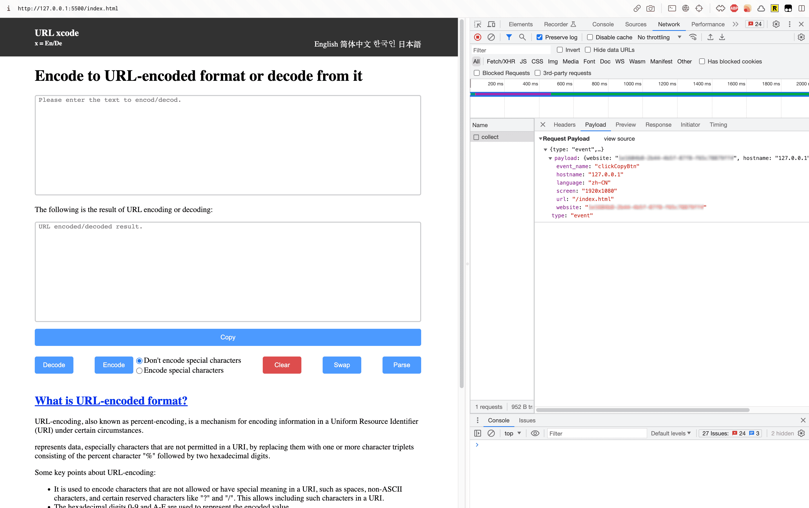

+++
title = "使用 JavaScript 配置 Umami Track Event"
description = "使用纯 JavaScript 方式实现 Umami Track Event 上报事件数据。"
slug = "umami-track-event"
tags = ["note"]
date = "2023-08-09"
draft = false
+++

当前（2023-08-09）我的 umami 部署版本为 Version 1.40.0，官方已经发布版本为 Version 2.4.1。

Umami Version 1.40 及以上版本支持 Tarck Event，即事件跟踪，简单的说就是可以跟踪用户在网页上面的事件操作，比如点击按钮。

在 [官方文档](https://umami.is/docs/track-events) 中提供了两种简单配置方案，根据当前（2023-08-09）文档显示可以通过给按钮添加数据属性或者使用 JavaScript 监听按钮的点击事件然后执行 `umami.track()` 方法上报事件数据。

**调试方法：**

按照官方文档提供的方案进行配置后，访问网页，打开 Chrome 开发者工具中的 Network，然后点击已经配置了 Track Event 的按钮，关注是否有新的名为 `collect` 的请求被发起，如果有，则关注 Request Payload 中传入的参数是否符合预期。

**问题：**

两种方案在我实践之后均无法成功上报数据，使用 JavaScript 方案时 Chrome 开发者工具 Console 中报错 `umami.track is not a function`，可能是由于我部署的 umami 版本不支持上述方案，

**解决方案：**

在不升级我部署的 umami 版本的基础上，我最终发现可以通过 JavaScript 监听按钮的点击事件然后执行 `umami()` 方法上报事件数据。

比如：

```javascript
document.getElementById("btn-copy").onclick = () => umami("clickCopyBtn");
```

除了使用 JavaScript 方案外，umami Version 1.40.0 应该还支持通过给按钮添加 Class 来配置 Track Event，类的命名格式要求为：

```html
umami--<event>--<event-name>
```

比如：

```html
<button id="btn-copy" class="umami--click--clickCopyBtn">Copy</button>
```

注：该方法（添加 Class）未经校验。